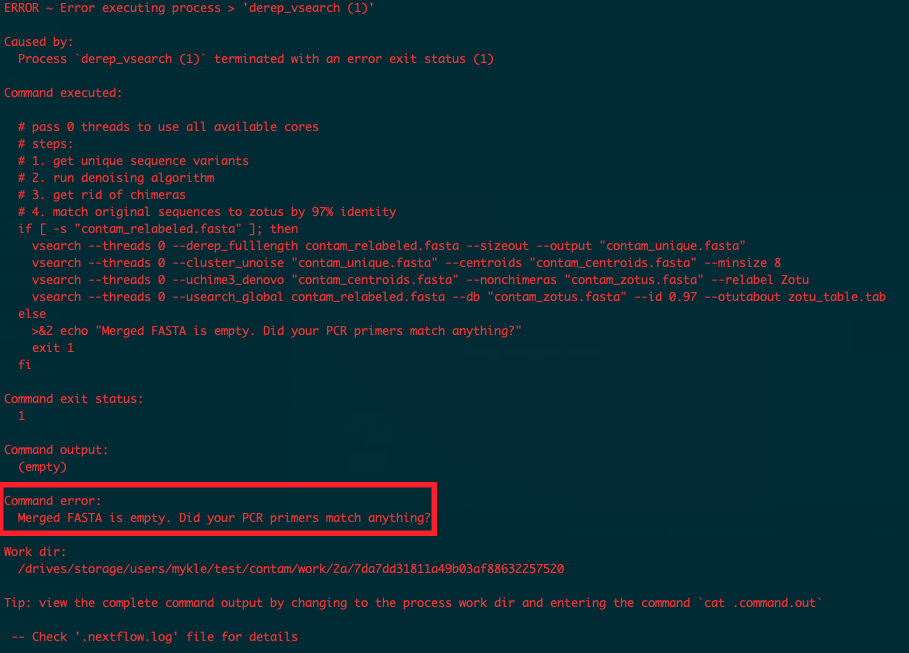

<!-- TOC start (generated with https://github.com/derlin/bitdowntoc) -->

- [About eDNAFlow](#about-ednaflow)
- [About this version](#about-this-version)
- [Setup and testing](#setup-and-testing)
- [Basic usage](#basic-usage)
   * [A note on globs/wildcards](#a-note-on-globswildcards)
   * [Usage examples](#usage-examples)
      + [For single-end runs (not previously demultiplexed)](#for-single-end-runs-not-previously-demultiplexed)
      + [For previously-demultiplexed single-end runs](#for-previously-demultiplexed-single-end-runs)
      + [For non-demultiplexed paired-end runs](#for-non-demultiplexed-paired-end-runs)
         - [Specifying reads by directory](#specifying-reads-by-directory)
         - [Specifying reads by forward/reverse filenames](#specifying-reads-by-forwardreverse-filenames)
      + [For previously-demultiplexed paired-end runs](#for-previously-demultiplexed-paired-end-runs)
   * [Contents of output directories](#contents-of-output-directories)
   * [When things go wrong (interpreting errors)](#when-things-go-wrong-interpreting-errors)
- [Description of run options](#description-of-run-options)
   * [Required options for processing fastq input (demultiplexed or not)](#required-options-for-processing-fastq-input-demultiplexed-or-not)
      + [Specifying sequencing run type](#specifying-sequencing-run-type)
      + [Specifying fastq files](#specifying-fastq-files)
   * [Required options](#required-options)
   * [Sample IDs](#sample-ids)
      + [Mapping of custom sample IDs](#mapping-of-custom-sample-ids)
   * [Other options](#other-options)
      + [General options](#general-options)
      + [Splitting input](#splitting-input)
      + [Length, quality, and merge settings](#length-quality-and-merge-settings)
      + [Demultiplexing and sequence matching](#demultiplexing-and-sequence-matching)
      + [BLAST settings](#blast-settings)
      + [Taxonomy assignment](#taxonomy-assignment)
         - [LCA assignment](#lca-assignment)
         - [Insect classification](#insect-classification)
      + [Generating phyloseq objects](#generating-phyloseq-objects)
      + [Denoising and zOTU inference](#denoising-and-zotu-inference)
      + [LULU zOTU curation](#lulu-zotu-curation)
      + [Resource allocation](#resource-allocation)
      + [Singularity options](#singularity-options)
- [Downloading the NCBI BLAST nucleotide database](#downloading-the-ncbi-blast-nucleotide-database)
- [LCA (Lowest Common Ancestor) script for assigning taxonomy](#lca-lowest-common-ancestor-script-for-assigning-taxonomy)
- [Specifying parameters in a parameter file](#specifying-parameters-in-a-parameter-file)
- [Notification](#notification)

<!-- TOC end -->

# About eDNAFlow
eDNAFlow is a fully automated pipeline that employs a number of state-of-the-art applications to process eDNA data from raw sequences (single-end or paired-end) to generation of curated and non-curated zero-radius operational taxonomic units (zOTUs) and their abundance tables. The pipeline also contains scripts (either python or R-based) to assign taxonomy to zOTUs based on user specified thresholds for assigning Lowest Common Ancestor (LCA). This pipeline is based on Nextflow and Singularity which enables a scalable, portable and reproducible workflow using software containers on a local computer, clouds and high-performance computing (HPC) clusters.

For more information on eDNAFlow and other software used as part of the workflow please read "eDNAFlow, an automated, reproducible and scalable workflow for analysis of environmental DNA (eDNA) sequences exploiting Nextflow and Singularity" in Molecular Ecology Resources with DOI: https://doi.org/10.1111/1755-0998.13356. If you use eDNAFlow, we appreciate if you could cite the eDNAFlow paper and the other papers describing the underlying software.


# About this version

This is an updated fork of eDNAFlow, rewritten to support nextflow's DSL2 and the newest version of nextflow. It also better supports parallel processing, both through splitting and simultaneously processing large files and the ability to process already-demultiplexed sequence files. In addition, it adds a few processing options, such as the ability to classify taxonomy using [insect](https://github.com/shaunpwilkinson/insect) and produce a [phyloseq](https://joey711.github.io/phyloseq/) object as output.

# Setup and testing

**Note: Below instruction was only tested on Ubuntu systems.**

To run the pipeline, first Nextflow and Singularity have to be installed or made available for loading as modules (e.g. in the case of running it on an HPC cluster) on your system. This version of the pipeline has been rewritten to support the newest versions of Nextflow DSL2 (currently 23.06.0) and Singularity (4.0.0).

In the install directory is a script to install the necessary dependencies. It should support Ubuntu 20.04 and 22.04. For other versions you can install the components manually following the authors' instructions.  

**Note: installation requires superuser privileges.**

For manual installation of Nextflow, follow the instructions at [nextflow installation](https://www.nextflow.io/docs/latest/getstarted.html). To install Singularity manually, follow the instructions at [singularity installation](https://sylabs.io/guides/3.5/admin-guide/installation.html). If working on HPC, you may need to contact your HPC helpdesk. The Singularity installation how-to is long and complicated, but if you're on Ubuntu 20/22.04, there are .deb packages that can be found at [https://github.com/sylabs/singularity/releases/latest](https://github.com/sylabs/singularity/releases/latest). 

**Follow the steps below:**

1. Clone the Git repository so that all the scripts and test data are downloaded and in one folder. To clone the repository to your directory, run this command: 
   ```bash
   $ git clone https://github.com/mhoban/eDNAFlow.git
   ```

2. Next, in your terminal go to the "install" directory which is located inside the "eDNAFlow" directory:
   ```bash
   $ cd eDNAFlow/install
   ```

3. Once inside the install directory, assuming you're on Ubuntu 20/22.04, run: 
   ```bash
   $ sudo ./install_dependencies.sh
   ```

   This will install nextflow and singularity to the system. If you are running on a different platform, follow the instructions given above.

4. To run the pipeline using test data, do some stuff that has't been fleshed out here yet.

# Basic usage

## A note on globs/wildcards
A number of eDNAFlow command-line options accept file globs (wildcards). This is used when you want to indicate more than one file. For an in-depth treatment of globs, have a look [here](https://www.baeldung.com/linux/bash-globbing). For the purposes of this pipeline though, you'll mostly use the following things:

(<small>**Note: when passing file globs as command-line options, make sure that you enclose them in quotes (e.g., `--barcode 'bc*.tab'`), If you don't, the glob will be interpreted by the shell and parameter values will be incorrect.**</small>)

**\***: a star means 'match anything of any length'  
For example, 'bc\*.tab' will match any filename that begins with 'bc', followed by a sequence of any characters, and finally ending with '.tab'  
This pattern will match 'bc1.tab', 'bc2.tab', and 'bc_one_two_three.tab', but it will not match 'bc1.tabx'

**{}**: curly braces are used for multiple possible matches.  
The contents can be exact strings or wildcards. Anything that matches any of the given strings using an or relationship (one OR the other) will be found.  
For example, 'seq_\*{R1,R2}\*.fastq' will match 'seq_', followed by any character sequence, followed by EITHER 'R1' OR 'R2', follwed by any characters, and finally ending with '.fastq'.  
This pattern will match 'seq_R1.fastq', 'seq_001_002_R2.fastq', and 'seq_123_456_R2_extra_info.fastq', among many others. It will NOT match 'seqR1.fastq' (because it's missing the initial underscore following 'seq').


## Usage examples
The eDNAFlow code tree does not need to be in the same folder as the data you're analyzing. The easiest way to deploy it is to add the directory where you cloned the git repsitory to your system $PATH and just call `eDNAFlow.nf` directly as an executable. Following are some examples of the basic command to run the pipeline on your local machine on single-end/paired-end data with multiple possible barcode files. For each of these examples, I assume `eDNAFlow.nf` is in the system path, you're working on a project called `example_project`, and your directory structure looks something like this:

```bash
example_project/            # base directory containing project files
example_project/fastq/      # directory to hold raw sequence reads
example_project/data/       # directory to hold other data (e.g., barcode and/or sample map file(s))
example_project/analysis/   # directory to hold eDNAFlow analysis output
```

Analysis is started from within the analysis directory.

### For single-end runs (not previously demultiplexed)

```bash
user@srv:~/example_project/analysis$ eDNAFlow.nf \
  --single \
  --reads ../fastq/sequence_reads.fastq \   # <-- reads denotes a single .fastq file
  --barcode '../data/*.tab'
  [options]
```

### For previously-demultiplexed single-end runs

```bash
user@srv:~/example_project/analysis$ eDNAFlow.nf \
  --single \
  --reads '../fastq/*.fastq' \    # <-- reads is a glob denoting multiple .fastq files
  --barcode '../data/*.tab'
  --illumina-demultiplexed        # <-- reads are already demultiplexed
  [options]
```

### For non-demultiplexed paired-end runs

In non-demultiplexed runs, the pipeline assumes you have exactly one forward read file and one reverse read. There are a few ways you can specify where these are found. Two are presented here and you can find a more detailed discussion [below](#description-of-run-options).

#### Specifying reads by directory
With this method, the `--reads` option points to the directory where .fastq reads can be found. By default, the eDNAFlow assumes forward reads are named with "R1" (\*R1\*.fastq\*) in the filename and reverse reads are named with "R2" (\*R2\*.fastq\*). For customization options, see [below](#specifying-fastq-files).

```bash
user@srv:~/example_project/analysis$ eDNAFlow.nf \
  --paired \
  --reads ../fastq/  
  --barcode '../data/*.tab'
  [options]
```

#### Specifying reads by forward/reverse filenames
With this method, you can specify the forward/reverse read files directly using the `--fwd` and `--rev` options. 

```bash
user@srv:~/example_project/analysis$ eDNAFlow.nf \
  --paired \
  --fwd ../fastq/sequencing_run_R1.fastq \
  --rev ../fastq/sequencing_run_R2.fastq \
  --barcode '../data/*.tab'
  [options]
```

### For previously-demultiplexed paired-end runs

For demultiplexed runs, the pipeline combines the values of the `--reads`, `--fwd`, `--rev`, `--r1`, and `--r2` options to make a [glob](#a-note-on-globswildcards) that is used to find sequence reads. A simple example is given here, but for a detailed discussion of how these things go together, see [below](#specifying-fastq-files).

```bash
user@srv:~/example_project/analysis$ eDNAFlow.nf \
  --paired \
  --reads ../fastq \   # Here, we're just specifying the directory where reads are found. 
  --barcode '../data/*.tab'  # Default options will look for <reads>/*R1*.fastq* and <reads>/*R2*.fastq*
  --illumina-demultiplexed
  [options]
```
## Contents of output directories

When the pipeline is run, output from each step can be found in directories corresponding to each process. All output will fall under one of two directories: `output` or `preprocess`. `Output` will contain things like QA/QC, zOTU tables, and taxonomy results. `Preprocess` will contain things like merged, filtered, and relabeled reads. The contents of output directories will by symlinked to files contained within the nextflow-generated internal `work` directory hierarchy (which you shouldn't have to access directly, except maybe in some case of error). Here is an exhaustive list of all possible output directories:


| Directory   | Subdirectory                        | Description                                                  | Condition                                                |
| ----------- | ----------------------------------- | ------------------------------------------------------------ | -------------------------------------------------------- |
| preprocess/ | trim_merge                          | Length/quality filtered and (for paired-end runs) merged reads |                                                          |
|             | index_filtered                      | Filtered/merged sequences with ambiguous indices filtered out | --remove-ambiguous-indices<br />--illumina-demultiplexed |
|             | ngsfilter                           | ngsfilter-processed reads: primer mismatch and sample annotation (if not previously demultiplexed) |                                                          |
|             | length_filtered                     | Length filtered                                              |                                                          |
|             | split_samples                       | Annotated samples split into individual files                | Sequencing run not previously demultiplexed              |
|             | relabeled                           | Relabeled combined FASTA files for denoiser (usearch/vsearch) input |                                                          |
|             | merged                              | Merged relabeled FASTA file for denoising                    |                                                          |
| output/     | fastqc_initial<br />fastqc_filtered | FastQC/MultiQC reports                                       | --fastqc                                                 |
|             | zotus                               | Dereplicated/denoised sequence results<br />(unique sequences, zOTU sequences, zOTU table) |                                                          |
|             | blast                               | BLAST results                                                |                                                          |
|             | lulu                                | LULU curation results                                        |                                                          |
|             | taxonomy/lca                        | Results of taxonomy collapser script(s)                      | --assign-taxonomy<br />--old-taxonomy                    |
|             | taxonomy/insect                     | Insect classification results                                | --insect                                                 |
|             | phyloseq                            | Phyloseq object                                              | --phyloseq and associated options                        |
| work/       | A bunch of nonsense                 | All internal and intermediate files processed by nextflow    |                                                          |
| .nextflow/  | various                             | Hidden nextflow-generated internal folder                    |                                                          |

## When things go wrong (interpreting errors)

Occasionally your pipeline run will encounter something it doesn't know how to handle and it will fail. There are two general failure modes: silent and loud. 

In some limited cases, the pipeline can fail silently. In this case it will appear to process various steps and then it will stop without any message. Sometimes you can tell something went wrong because all the status boxes are empty. We have done our best to avoid this failure mode but it's occasionally possible that you will encounter it. If you do, the best way to go about solving it is to make sure you have provided all the required command line options, your input files are all there and contain data, and any options that point to files actually point to the files you said they did. 

In most cases when something goes wrong, you will see something like this:



This can be a bit intimidating at first, but there are a few ways to use this information to figure out what went wrong. First, toward the bottom of the readout, you'll see the "Command error". This contains any error message that the failed process may have produced (technically, anything the script output to stderr). If that's empty, there may still be some output you can look at. To see any output the process may have produced (just note that sometimes it's empty), take a look at the "Work dir" and do the following (here we're using the work dir from the above example):

```bash
$ cat work/2a/7da7dd31811a49b03af88632257520/.command.out
$ cat work/2a/7da7dd31811a49b03af88632257520/.command.err # (though this will be empty if "Command error" was empty)
```

In the example above, there was error output but nothing in the `.command.out` file. Looking at the error output, we can see that the merged FASTA file was empty. This commonly occurs when your PCR primers fail to match any sequences in the raw reads. In this case, check your barcode file to make sure you're using the correct primers for the sequencing run you're processing. In general, once you've worked out what you think has gone wrong, you can simply run the pipeline again, adjusting any relevant command-line options to hopefully fix the issue.

# Description of run options
eDNAFlow allows for a good deal of customization with regard to which and how various elements of the pipeline are run. All command-line options can be either be passed as-is or saved in a parameters file. For information on file formats and calling convention, see [below](#specifying-parameters-in-a-parameter-file).

To see a detailed list of available options run:
```bash
$ eDNAFlow.nf --help
```

The pipeline accepts three main input formats:

- Raw data from the sequencer (i.e. non-demultiplexed). This typically consists of forward/reverse reads each in single large (optionally gzipped) fastq files. For this type of data, the demultiplexer assumes that you have used barcoded primers, such that sequence reads look like this:  
  ```
  <FWD_BARCODE><FWD_PRIMER><TARGET_SEQUENCE><REVERSE_PRIMER><REVERSER_BARCODE>
  ```

- Data that has been demultiplexed by the sequencer. This is typically done when you use Illumina indices to delineate samples. You will have fastq files for each individual sample, and sequences should still have primers attached, like this:  
  ```
  <FWD_PRIMER><TARGET_SEQUENCE><REVERSE_PRIMER>
  ```
  
  In many cases sequences like this have their Illumina indices included in the fastq header, like this:  
  <pre><code>@M02308:1:000000000-KVHGP:1:1101:17168:2066 1:N:0:<strong>CAATGTGG+TTCGAAGA</strong></pre></code>

- <a name="demux-fasta"></a>Data that has been demultiplexed to individual samples and concatenated into a FASTA file in usearch format. Use this option if you want to re-run the pipeline using demultiplexed data produced by a previous run. The expected format is a FASTA file with each sequence labled as `<samplename>.N` where `samplename` is the name of the sample and `N` is just a sequential number:
  
  ```fasta
  >sample1.1
  AGCGTCCGATGACTGACTGACTAGCT
  >sample1.2
  TACGTACGATCGACGAGTCTACGACTACTGAC
  >sample1.3
  TGACTGATCGTACTATCAGAGCTATCATCGACTATCATCGATC
  >sample2.1
  ATCGTACTACTAGCGACGAGTCATCACGACGTACTAGTCGA
  >sample2.2
  CATGCGACGTACGTACTATCATCATCGAGCAGCTATATATCGATGGTACTAGCTGAC
  >sample2.3
  TGACTGATCGTACTATCAGAGCTATCATCGACTATCATCGATC
  >sample3.1
  AGCGTCCGATGACTGACTGACTAGCT
  >sample3.2
  ATCGTACTACTAGCGACGAGTCATCACGACGTACTAGTCGA
  >sample3.3
  CATGCGACGTACGTACTATCATCATCGAGCAGCTATATATCGATGGTACTAGCTGAC
  ```
  
## Required options for processing fastq input (demultiplexed or not)

### Specifying sequencing run type
For fastq-based analyses, you must specify whether the sequencing run is single ended or paired-end.

<small>**`--single`**</small>: denotes single-end sequencing runs  
<small>**`--paired`**</small>: denotes paired-end sequencing runs  

<small>**Note: one of the above options is required (specifying both will throw an error)**</small>

### Specifying fastq files
In all cases, if you're processing fastq runs, you must specify the location of your sequence reads. Generally, if you're processing runs that have *not* been demultiplexed by the sequencer, you will have either one (single-end) or two (paired-end) fastq files. If your runs *have* been demultiplexed, you will have as many files as you have individual samples (twice that for paired-end runs).  

**Note: unless you are specifying forward/reverse reads directly (i.e. as individual files), it is generally best practice to keep readsd (fastq files) from different sequencing runs in separate directories. If you do not, because of the way the pipeline uses [globs](#a-note-on-globswildcards) to find files, you could end up with unexpected behavior.**

There are a few ways you can tell eDNAFlow where your reads are:

- For single-ended runs  
  - Non-demultiplexed  
    <small>**`--reads`**</small>: For non-demultiplexed runs, this points directly to your fastq reads, e.g., '../fastq/B1_S7_L001.fastq'.   
  - Demultiplexed  
    <small>**`--reads`**</small>: For demultiplexed runs, this is a [glob](#a-note-on-globswildcards) indicating where all the demultiplexed reads can be found, e.g., '../fastq/\*.fastq'  
- For paired-end runs  
  - Non-demultiplexed  
    <small>**`--fwd`**</small> and <small>**`--rev`**</small>: For non-demultiplexed runs, you may use these parameters to specify the forward (`--fwd`) and reverse (`--rev`) fastq files directly.  
  - Demultiplexed  
    Demultiplexed sequence reads are found using a [glob](#a-note-on-globswildcards) built internally with the `--reads`, `--fwd`, `--rev`, `--r1`, and `--r2` values.   
    
    <small>**`--reads`**</small>: This parameter specifies the base-*directory* where forward and reverse reads may be found. If no other option is specified,  the glob is built using the default values of `--fwd`, `--rev`, `--r1`, and `--r2` (see below)  
    <small>**`--r1`**</small> (default: 'R1'), <small>**`--r2`**</small> (default: 'R2'): these parameters specify the pattern that distinguishes forward from reverse reads. The default values ('R1' and 'R2') are typical of most files you will receive from the sequencer.  
    <small>**`--fwd`**</small> (default: empty), <small>**`--rev`**</small> (default: empty): these parameters optionally specify subdirectories where forward and reverse reads are stored. These subdirectories must be *within* the directory specified with `--reads`.  
    
    Using the above parameters, the following [glob](#a-note-on-globswildcards) is constructed:  
    If `fwd` and `rev` are specified: '\<reads\>/{\<fwd\>,\<rev\>}/\*{\<r1\>,\<r2\>}\*.fastq\*' \
    Otherwise: '\<reads\>/\*{\<r1\>,\<r2\>}\*.fastq\*'   
    
    <small>**Note the star after the final 'fastq'. This is included to allow for matching '.fastq.gz' files**</small>  
    
    For example, if eDNAFlow is invoked with the following options:   
    `--reads ../fastq --fwd forward --rev reverse`  
    fastq files will be looked for using the following [glob](#a-note-on-globswildcards):  
    '../fastq/{forward,reverse}/\*{R1,R2}\*.fastq\*'  

## Required options
<small>**`--barcode [barcode file(s)]`**</small>: Aside from specifying how to find your sequence reads, you must specify a barcode file using the `--barcode` option. The barcode file should comply with the [ngsfilter barcode file format](https://pythonhosted.org/OBITools/scripts/ngsfilter.html), which is a tab-delimited format used to specify sample barcodes and amplicon primers. It will vary slightly based on whether your runs have been demultiplexed or not. Note that the pipeline can perform a few standalone tasks that do not require barcode files (e.g. collapsing taxonomy).

- Non-demultiplexed runs: This format contains forward/reverse barcodes and forward/reverse primers to separate sequences into the appropriate samples. For example:
  #assay|sample|barcodes|forward_primer|reverse_primer|extra_information
  ---|---|---|---|---|---
  16S-Fish|B001|GTGTGACA:AGCTTGAC|CGCTGTTATCCCTADRGTAACT|GACCCTATGGAGCTTTAGAC|EFMSRun103_Elib90
  16S-Fish|B002|GTGTGACA:GACAACAC|CGCTGTTATCCCTADRGTAACT|GACCCTATGGAGCTTTAGAC|EFMSRun103_Elib90
- Demultiplexed runs: Since sequences are already separated into samples, this format omits the barcodes (using just a colon, ':' in their place) but includes the primers. For example:
  #assay|sample|barcodes|forward_primer|reverse_primer|extra_information
  ---|---|---|---|---|---
  primer|V9_18S|:|GTACACACCGCCCGTC|TGATCCTTCTGCAGGTTCACCTAC
  
  In this case, it's not super critical what you call your 'sample' since the files are already separated.

**BLAST database settings**: <a name="blast-settings"></a>For runs where you aer performing BLAST queries, you must specify the appropriate settings. This can be one or more of the following options:  
<small>**`--blast-db [blast dir]`**</small>: Location of the local BLAST nucleotide (nt) database *directory* (do NOT include the final "/nt"). This option may also be specified using the $BLASTDB environment variable.  
<small>**`--custom-db [db dir]`**</small>: Path to a custom BLAST database *directory*.  
<small>**`--custom-db-name [db name]`**</small>: Name of custom BLAST database (i.e., basename of .ndb, etc. files)  
<small>**Note that passing --custom-db and --blast-db directories with the same name (e.g., /dir1/blast and /dir2/blast) will result in an error!**</small>  
<small>**`--skip-blast`**</small>: Pass this if you don't want to run a BLAST query at all.   

## Sample IDs
For non-demultiplexed sequencing runs, samples will be named based on the sample IDs specified in the `sample` column of the barcode file. For demultiplexed runs, samples will by default be named based on the first part of the filename before the fwd/rev (R1/R2) pattern. For example, the following read files:

```
B1_S7_L001_R1_001.fastq, B1_S7_L001_R2_001.fastq
B2_S8_L001_R1_001.fastq, B2_S8_L001_R2_001.fastq
CL1_S2_L001_R1_001.fastq, CL1_S2_L001_R2_001.fastq
CL2_S3_L001_R1_001.fastq, CL2_S3_L001_R2_001.fastq
```

Will result in the following sample IDs:

```
B1_S7_L001
B2_S8_L001
CL1_S2_L001
CL2_S3_L001
```

### Mapping of custom sample IDs
By default, eDNAFlow interprets sample IDs from filenames. However, it is possible to specify a mapping file that will translate filenames into custom sample IDs.

<small>**`--sample-map [mapfile]`**</small>: A headerless tab-delimited file that maps sample names to sequence-read filenames.  
The specified map file should be a tab-delimited table (*without* headers) where the first column contains the sample ID, the second column contains the read filename (forward read for paired-end reads), and the third column (for paired-end reads only) contains the reverse read filename. Using the filenames from the example given [above](#sample-ids), a map file would look like this (spaces below must be tabs): 

```
sample_B1   B1_S7_L001_R1_001.fastq   B1_S7_L001_R2_001.fastq
sample_B2   B2_S8_L001_R1_001.fastq   B2_S8_L001_R2_001.fastq
sample_CL1  CL1_S2_L001_R1_001.fastq  CL1_S2_L001_R2_001.fastq
sample_CL2  CL2_S3_L001_R1_001.fastq  CL2_S3_L001_R2_001.fastq 
```

**NOTE: if your fastq files are gzipped, DO NOT include the .gz extension in your sample map file, because the files will be unzipped (and .gz extension stripped) BEFORE sample IDs are remapped**

## Other options

### General options
<small>**`--project [project]`**</small>:    Project name, applied to various output filenames (default: project directory name)  
<small>**`--publish-mode [mode]`**</small>:  Specify how nextflow places files in output directories (default: symlink)  
<small>**`--fastqc`**</small>:               Output FastQC reports for pre and post filter/merge steps. MultiQC is used for demultiplexed or split runs.  


### Splitting input
To improve performance, large input files can be split into multiple smaller files and processed in parallel. This option is only available for runs that have *not* previously been demultiplexed. With the `--split` option, eDNAFlow will break up the input reads into smaller files (with the number of reads per file customizable as explained below) and process them all in parallel in the same way that demultiplexed runs are processed. 

<small>**`--split`**</small>:    Split input fastq files and process in parallel   
<small>**`--split-by [num]`**</small>: Number of sequences per split fastq chunk (default: 100000)  

### Length, quality, and merge settings
These settings allow you to set values related to quality filtering and paired-end merging.

<small>**`--min-quality [num]`**</small>:     Minimum Phred score for sequence retention (default: 20)  
<small>**`--min-align-len [num]`**</small>:   Minimum sequence overlap when merging forward/reverse reads (default: 12)  
<small>**`--min-len [num]`**</small>:         Minimum overall sequence length (default: 50)  

### Demultiplexing and sequence matching
These settings controld demultiplexing and sequence matching (e.g., allowable PCR primer mismatch).

<small>**`--primer-mismatch [num]`**</small>:  Allowed number of mismatched primer bases (default: 2)  
<small>**`--illumina-demultiplexed`**</small>:  Required if sequencing run is already demultiplexed  
<small>**`--remove-ambiguous-indices`**</small>:  For previously-demultiplexed sequencing runs, remove reads that have ambiguous indices (i.e. they have bases other than AGCT). This assumes Illumina indices are included in fastq headers:  
    <pre><code>@M02308:1:000000000-KVHGP:1:1101:17168:2066 1:N:0:<strong>CAAWGTGG+TTCNAAGA</strong></code></pre>
<small>**`--demuxed-fasta [file]`**</small>:  Skip demultiplexing step and use supplied FASTA (must be in usearch/vsearch format). See [above](#demux-fasta).  
<small>**`--demuxed-example`**</small>:  Spit out example usearch/vsearch demultiplexed FASTA format  
<small>**`--demux-only`**</small>:  Stop after demultiplexing and splitting raw reads  

### BLAST settings
These settings allow you to customize BLAST searches. See [above](#blast-settings) for detailed information on specifying BLAST database location(s). Other options in this category allow you to control the BLAST search criteria directly (e.g., e-value, percent match, etc.). For further explanation of these options, see the [blast+ documentation](https://www.ncbi.nlm.nih.gov/books/NBK279690/).

<small>**`--blast-task [task]`**</small>:  Set blast+ task (default: "blastn")  
<small>**`--max-query-results [num]`**</small>:  Maximum number of BLAST results to return per zOTU (default: 10). See [here](https://academic.oup.com/bioinformatics/article/35/9/1613/5106166) for important information about this parameter.  
<small>**`--percent-identity [num]`**</small>:  Minimum percent identity of matches (default: 95)  
<small>**`--evalue [num]`**</small>:  BLAST e-value threshold (default: 0.001)  
<small>**`--qcov [num]`**</small>:  Minimum percent query coverage (default: 100)  

### Taxonomy assignment
These options relate to assignment/collapsing of taxonomic IDs. There are two different methods of collapsing taxonomy (see [below](#taxonomy) for details): the "old" way (using a python script) and the "new" way (using R). Both methods take essentially the same approach and can be customized using the same options. The old method is retained for completeness (and because the new method may still have bugs). In each case, top BLAST results for each zOTU are compared to one another and a decision is made whether or not to collapse to the next highest taxonomic rank based on how different those results are from one another. This is the so-called lowest common ancestor (LCA) approach. In addition to the taxonomy collapser scripts, eDNA can use [insect](https://github.com/shaunpwilkinson/insect) to assign taxonomic IDs to zOTUs. This is particularly useful for assigning higher-order (e.g. phylum, order) taxonomy to zOTUs that are otherwise unidentified. To run insect on your sequences, you must specify either one of the [pre-trained](https://github.com/shaunpwilkinson/insect#classifying-sequences) classifier models OR one that you've trained yourself. Insect also takes various parameters to tweak how it does its assignments.

#### LCA assignment
Options for the LCA method of taxonomy assignment/collapse. Note: it is also possible to run taxonomy assignment as a standalone process (i.e., separate from the rest of the pipeline). To do this, pass the `--standalone-taxonomy` option along with the `--blast-file` and `--zotu-table` options.

<small>**`--assign-taxonomy`**</small>: Perform taxonomy assignment & LCA collapse  
<small>**`--standalone-taxonomy`**</small>: Run LCA script standalone against user-supplied data  
<small>**`--blast-file [file]`**</small>: (Only applicable when running taxonomy assignment as standalone) BLAST result table (output from blast step of pipeline)  
<small>**`--zotu-table [file]`**</small>: (Only applicable when running taxonomy assignment as standalone) zOTU table file (output from denoising step of pipeline)  
<small>**`--old-taxonomy`**</small>:  Use the old (python-based) taxonomy script rather than the newer R-based one (use in combination with `--assign-taxonomy`)  
<small>**`--lineage [file]`**</small>: Specify previous-download NCBI rankedlineage.dmp file (leave blank to download latest)  
<small>**`--merged [file]`**</small>: Specify previous-download NCBI merged.dmp file (leave blank to download latest)  
<small>**`--dropped [str]`**</small>: Placeholder for dropped taxonomic levels (default: 'dropped'). Pass "NA" for blank/NA
<small>**`--lca-qcov [num]`**</small>:  Minimum query coverage for LCA taxonomy assignment (default: 100)  
<small>**`--lca-pid [num]`**</small>:  Minimum percent identity for LCA taxonomy assignment (default: 97)  
<small>**`--lca-diff [num]`**</small>:  Maximum difference between percent identities (when query coverage is identical) where species-level taxonomy is retained (default: 1)  
<small>**`--filter-uncultured`**</small>:  Optionally get rid of sequences that are listed as 'uncultured', 'environmental sample', 'clone', or 'synthetic'  

#### Insect classification
Options for taxonomy assignment using the insect algorithm. 

<small>**`--insect [classifier]`**</small>:  Perform taxonomy assignment using insect. Accepted values of [classifier] are:  

  - Filename of local .rds R object containing classifier model  
  - One of the following (case-insensitive) primer names:   
     MiFish, Crust16S, Fish16S, 18SUni, 18SV4, p23S, mlCOIint, SCL5.8S  
| Option value | Marker | Target                 | Primers                                                  | Date trained |
|--------------|--------|------------------------|----------------------------------------------------------|--------------|
| MiFish       | 12S    | Fish                   | MiFishUF/MiFishUR (Miya et al., 2015)                    | 11-11-2018   |
| Crust16S     | 16S    | Marine crustaceans     | Crust16S_F/Crust16S_R (Berry et al., 2017)               | 06-26-2018   |
| Fish16S      | 16S    | Marine fish            | Fish16sF/16s2R (Berry et al., 2017; Deagle et al., 2007) | 06-27-2018   |
| 18SUni       | 18S    | Marine eukaryotes      | 18S_1F/18S_400R (Pochon et al., 2017)                    | 07-09-2018   |
| 18SV4        | 18S    | Marine eukaryotes      | 18S_V4F/18S_V4R (Stat et al., 2017)                      | 05-25-2018   |
| p23S         | 23S    | Algae                  | p23SrV_f1/p23SrV_r1 (Sherwood & Presting 2007)           | 07-15-2018   |
| mlCOIint     | COI    | Metazoans              | mlCOIintF/jgHCO2198 (Leray et al., 2013)                 | 11-24-2018   |
| SCL5.8S      | ITS2   | Cnidarians and sponges | scl58SF/scl28SR (Brian et al., 2019)                     | 09-20-2018   |  

(see [here](https://github.com/shaunpwilkinson/insect#classifying-sequences) for more information on classifiers)  

<small>**`--insect-threshold [num]`**</small>:  Minimum Akaike weight for the recursive classification procedure to continue toward the leaves of the tree (default: 0.8)  
<small>**`--insect-offset [num]`**</small>: Log-odds score offset parameter governing whether the minimum score is met at each node (default: 0)  
<small>**`--insect-min-count [num]`**</small>:  Minimum number of training sequences belonging to a selected child node for the classification to progress (default: 5)  
<small>**`--insect-ping [num]`**</small>:  Numeric (between 0 and 1) indicating whether a nearest neighbor search should be carried out, and if so, what the minimum distance to the nearest neighbor should be for the the recursive classification algorithm to be skipped (default: 0.98)  

### Generating phyloseq objects
eDNAFlow supports generation of [phyloseq](https://joey711.github.io/phyloseq/) objects from pipeline output or user-supplied data. This will produce an RDS file that you can load directly into R and use for downstream analyses. There are a few options that can be specified for this process. Pipeline-generated (i.e., [insect](#insect) or [LCA](#lca)) or user-supplied taxonomic classifications can be used along with the required user-supplied sample metadata.

<small>**`--phyloseq`**</small>: Create a phyloseq object from pipeline output (requires the `--assign-taxonomy` option).  
<small>**`--metadata [file]`**</small>: A comma- or tab-separated sample metadata table (required). This can contain any arbitrary sample information, but it must have a header and the first column (preferably called 'sample') must contain sample IDs.  
<small>**`--taxonomy [taxonomy]`**</small>: Taxonomic classification scheme. This can be one of either `lca` (to use LCA taxonomy, the default), `insect` (for insect taxonomy), or the filename of a comma/tab-separated taxonomy table. If user-supplied, the first column of the taxonomy table must be named "OTU" (case-sensitive) and contain zOTU IDs. It may have any number of arbitrary columns of taxonomic classification (e.g., domain, kingdom, phylum, etc.) after that.  
<small>**`--no-tree`**</small>: Skip creation of phylogenetic tree.  
<small>**`--optimize-tree`**</small>: Attempt to optimize tree inference. This may take a long time, particularly if there are many zOTU sequences.

### Denoising and zOTU inference
These options control how (and by what tool) sequences are denoised and zOTUs are infered. By default, eDNAFlow uses the 32-bit (free) version of [usearch](https://www.drive5.com/usearch/). However, this version is limited to 4GB of memory and may fail for large sequence files, so it's also possible to specify either the 64-bit (commercial) version of usearch or [vsearch](https://github.com/torognes/vsearch) (a free 64-bit clone of usearch). 

<small>**`--min-abundance [num]`**</small>:  Minimum zOTU abundance; zOTUs below threshold will be discarded (default: 8)   
<small>**`--denoiser [tool/path]`**</small>:  Sets the tool used for denoising & chimera removal. Accepted options: 'usearch', 'usearch32', 'vsearch', path to 64-bit usearch executable  
<small>**`--vsearch`**</small>:  Alias for `--denoiser vsearch`  

### LULU zOTU curation
eDNAFlow includes the option to curate zOTUs using [lulu](https://github.com/tobiasgf/lulu). For a more detailed explantion of these parameters please see the LULU documentation.

<small>**`--skip-lulu`**</small>:  Skip LULU curation  
<small>**`--lulu-min-ratio-type [num]`**</small>: LULU minimum ratio type (accepted values: 'min', 'avg', default: 'min')  
<small>**`--lulu-min-ratio [num]`**</small>: LULU minimum ratio (default: 1)  
<small>**`--lulu-min-match [num]`**</small>: LULU minimum threshold of sequence similarity to consider zOTUs as spurious. Choose higher values when using markers with lower genetic variation and/or few expected PCR and sequencing errors (default: 84)  
<small>**`--lulu-min-rc [num]`**</small>: LULU minimum relative co-occurence rate (default: 0.95)  

### Resource allocation
These options allow you to allocate resources (CPUs and memory) to eDNAFlow processes.

<small>**`--max-memory [mem]`**</small>:  Maximum memory available to nextflow processes, e.g., '8.GB' (default: maximum available system memory)  
<small>**`--max-cpus [num]`**</small>:  Maximum cores available to nextflow processes default: maximum available system CPUs)  
<small>**`--max-time [time]`**</small>:  Maximum time allocated to each pipeline process, e.g., '2.h' (default: 10d)  

### Singularity options
Options to specify how singularity behaves. The `--bind-dir` option binds host directories to the internal containers and may be necessary if you're getting 'file not found' errors, although most options that specify filenames or directories will auto-bind.

<small>**`--bind-dir [dir]`**</small>:  Space-separated list of directories to bind within singularity images (must be surrounded by quotations if more than one directory)  
<small>**`--singularity-cache [dir]`**</small>:  Location to store downloaded singularity images. May also be specified with the environment variable $NXF_SINGULARITY_CACHEDIR. 


# Downloading the NCBI BLAST nucleotide database
Unless you pass the `--skip-blast` option, you'll need to provide a path to a local GenBank nucleotide (nt) and/or your custom BLAST database. To download the NCBI nucleotide database locally, follow the steps below:

1. Download the official [BLAST+ container](https://github.com/ncbi/blast_plus_docs#show-blast-databases-available-for-download-from-ncbi) with Singularity:
   ```bash
   $ singularity pull --dir $HOME/tmp docker://ncbi/blast:latest
   ```
   --dir can be any directory you want it to. It's just the place where the image (.sif file) is saved.

2. Create a directory where you want to keep the database (here, for example, /opt/storage/blast). From there use the `update_blastdb.pl` command to download the appropriate database (this is going to take a very long time so it's good to run it inside a screen session or on a computer you can walk away from):
   ```bash
   $ mkdir /opt/storage/blast
   $ cd /opt/storage/blast
   $ singularity run $HOME/tmp/blast_latest.sif update_blastdb.pl --decompress nt
   ```

# LCA (Lowest Common Ancestor) script for assigning taxonomy

The filtering applied in this script is based on a set of user specified thresholds, including query coverage (qcov), percentage identity (% identity) and the difference (Diff) between % identities of two hits when their query coverage is equal. Setting qcov and % identity thresholds ensures that only BLAST hits \>= to those thresholds will progress to the Diff comparison step. Setting Diff means that if the absolute value for the difference between % identity of hit1 and hit2 is \< Diff, then a species level taxonomy will be returned, otherwise taxonomy of that zOTU will be dropped to the lowest common ancestor. This script produces two files, a file in which the taxonomy is assigned (the final result), and an intermediate file which will give the user an idea of why some zOTUs may have had taxonomic levels dropped.

# Specifying parameters in a parameter file
All the options outlined in this document can either be passed as shown on the command line or specified using a parameter file in either YAML or json format using the command-line option `-params-file [file]` (**note the single dash before the option**). Option names in the parameter file must be converted from kebab-case to camelCase and leading dashes ('--') must be removed. Here is an example parameter file in YAML format:

```yaml
paired: true
reads: ../fastq/
fwd: forward
rev: reverse
illuminaDemultiplexed: true
removeAmbiguousIndices: true
assignTaxonomy: true
primerMismatch: 3
```

and in json format:

```json
{
  "paired": true,
  "reads": "../fastq/",
  "fwd": "forward",
  "rev": "reverse",
  "illuminaDemultiplexed": true,
  "removeAmbiguousIndices": true,
  "assignTaxonomy": true,
  "primerMismatch": 3
}
```

Assuming the first example above is called options.yml, eDNAFlow can be then executed like this:

```bash
$ eDNAFlow.nf -params-file options.yml
```

Which is equivalent to running it like this:

```bash
$ eDNAFlow.nf \
  --paired \
  --reads ../fastq/ \
  --fwd forward \
  --rev reverse \
  --illumina-demultipexed \
  --remove-ambiguous-indices \
  --assign-taxonomy \
  --primer-mismatch 3
```

# Notification
Nextflow enables the user to be notified upon completion or failure of the pipeline run. To do this, simply pass your email address with the `-N` option when running eDNAFlow.nf (again, note the single dash). For example, if you want to launch the pipeline using an options file and receive an email when the run completes:

```bash
$ eDNAFlow.nf -params-file options.yml -N someguy@nobody.com
```
