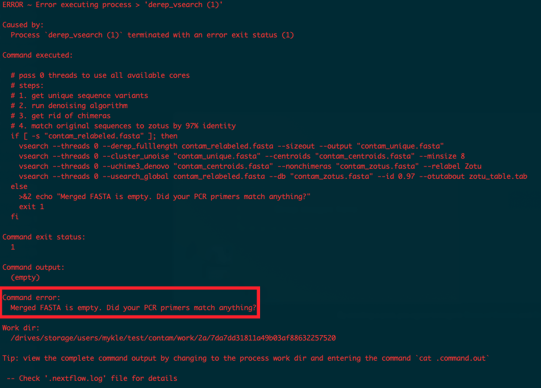
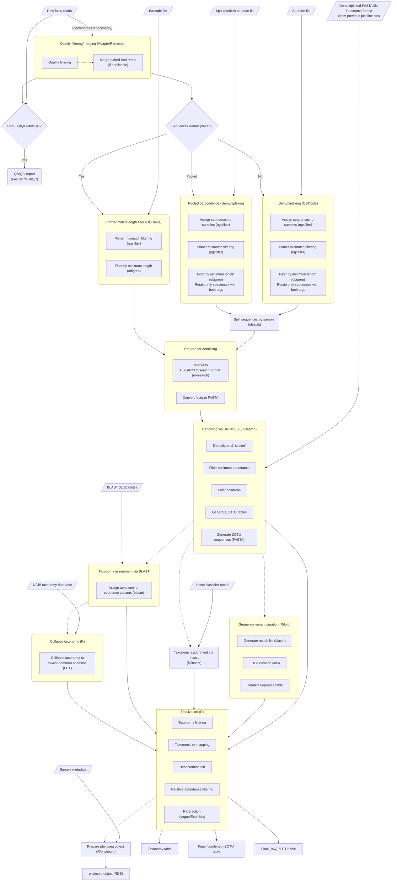

<pre>
-. .-.   .-. .-.   .-. .-.   .-. .-.   .-. .-.   .-. .-.   .
||\|||\ /|||\|||\ /|||\|||\ /|||\|||\ /|||\|||\ /|||\|||\ /|
|/ \|||\|||/ \|||\|||/ \|||\|||/ \|||\|||/ \|||\|||/ \|||\||
~   `-~ `-`   `-~ `-`   `-~ `-~   `-~ `-`   `-~ `-`   `-~ `-
</pre>

<br><br>

[](https://doi.org/10.5281/zenodo.8278073)

# rainbow_bridge

rainbow_bridge is an automated bioinformatic pipeline that processes eDNA and other metabarcoding data. Starting from raw sequences (single- or paired-end), rainbow_bridge generates curated sequence variants (ZOTUs or ASVs) and associated abundance tables. The pipeline will also assign taxonomy (via BLAST and/or insect) and collapse to lowest common ancestor (LCA) based on user-supplied threshold values as well as perform other finalization steps (e.g., taxon filtering/remapping, phyloseq object generation, decontamination, rarefaction, etc.). 

A flowchart of the rainbow_bridge workflow can be found [at the bottom of this document](#workflow).

This pipeline is built using [nextflow](https://www.nextflow.io/) and a containerized subsystem (e.g., [singularity](https://docs.sylabs.io/guides/3.5/user-guide/introduction.html), [podman](https://podman.io/), etc.) to enable a scalable, portable and reproducible workflow on a local server, cloud, or high-performance computing (HPC) cluster.

## Acknowledgements

This project began as a fork of [`eDNAFlow`](https://github.com/mahsa-mousavi/eDNAFlow), but has been more or less completely rewritten to support newer versions of nextflow. It is better at handling parallel processing, both through splitting and simultaneously processing large files and the ability to process reads demultiplexed by the sequencer. In addition, it adds various processing options, such as the ability to choose a sequence denoiser (usearch, vsearch, or DADA2), classify taxonomy using [insect](https://github.com/shaunpwilkinson/insect), and to produce a [phyloseq](https://joey711.github.io/phyloseq/) object as output, among others.

For more information on the original eDNAFlow pipeline and other software used as part of the workflow, please read "eDNAFlow, an automated, reproducible and scalable workflow for analysis of environmental DNA (eDNA) sequences exploiting Nextflow and Singularity" in Molecular Ecology Resources (DOI: <https://doi.org/10.1111/1755-0998.13356>). If you use rainbow_bridge, we appreciate if you could cite the eDNAFlow paper, the DOI for this project, and the papers describing the underlying software. For citation information, please see [CITATIONS.md](CITATIONS.md)

# Table of contents

<!-- TOC start (generated with https://github.com/derlin/bitdowntoc) -->

- [Basic usage](#basic-usage)
   * [Quick start](#quick-start)
   * [Running the pipeline](#running-the-pipeline)
   * [Input requirements](#input-requirements)
   * [Processing fastq input](#processing-fastq-input)
      + [Specifying fastq files](#specifying-fastq-files)
   * [Usage examples](#usage-examples)
      + [Non-demultiplexed single-end runs](#non-demultiplexed-single-end-runs)
      + [Previously-demultiplexed single-end runs](#previously-demultiplexed-single-end-runs)
      + [Non-demultiplexed paired-end runs](#non-demultiplexed-paired-end-runs)
      + [Previously-demultiplexed paired-end runs](#previously-demultiplexed-paired-end-runs)
   * [Contents of output directories](#contents-of-output-directories)
- [Setup and testing](#setup-and-testing)
   * [Installation](#installation)
      + [Manual dependency installation](#manual-dependency-installation)
         - [Nextflow](#nextflow)
         - [Singularity](#singularity)
         - [Podman](#podman)
   * [Testing installation](#testing-installation)
- [Description of rainbow_bridge command-line options](#description-of-rainbow_bridge-command-line-options)
   * [Required options](#required-options)
      + [Specifying sequencing run type](#specifying-sequencing-run-type)
      + [Specifying demultiplexing strategy](#specifying-demultiplexing-strategy)
      + [Specifying sequence denoiser](#specifying-sequence-denoiser)
      + [Other common options](#other-common-options)
         - [BLAST settings ](#blast-settings)
   * [General options](#general-options)
   * [Length, quality, and merge settings](#length-quality-and-merge-settings)
   * [PCR primer trimming](#pcr-primer-trimming)
   * [Denoising/dereplication and sequence variant inference](#denoisingdereplication-and-sequence-variant-inference)
      + [Options for usearch/vsearch](#options-for-usearchvsearch)
      + [Options for DADA2](#options-for-dada2)
   * [Sequence variant curation using LULU](#sequence-variant-curation-using-lulu)
   * [Assigning taxonomy](#assigning-taxonomy)
      + [General taxonomic assignment options](#general-taxonomic-assignment-options)
      + [BLAST settings](#blast-settings-1)
      + [Classification using insect](#classification-using-insect)
      + [LCA collapse](#lca-collapse)
         - [LCA options](#lca-options)
         - [LCA worked example](#lca-worked-example)
         - [Using LCA with custom taxonomy and/or BLAST databases](#using-lca-with-custom-taxonomy-andor-blast-databases)
      + [Standalone taxonomic assignment/collapse](#standalone-taxonomic-assignmentcollapse)
   * [Splitting fastq input for increased parallelization](#splitting-fastq-input-for-increased-parallelization)
   * [Resource allocation](#resource-allocation)
   * [Singularity options](#singularity-options)
   * [Output products and finalization](#output-products-and-finalization)
      + [Finalization options](#finalization-options)
         - [Data cleanup](#data-cleanup)
         - [Contamination / negative controls](#contamination--negative-controls)
         - [Abundance filtration and rarefaction](#abundance-filtration-and-rarefaction)
         - [Other finalization options](#other-finalization-options)
      + [Output products](#output-products)
         - [Generating phyloseq objects](#generating-phyloseq-objects)
   * [Miscellaneous options](#miscellaneous-options)
- [Useful examples and tips](#useful-examples-and-tips)
   * [Barcode file ](#barcode-file)
   * [Sample IDs](#sample-ids)
      + [Re-mapping custom sample IDs](#re-mapping-custom-sample-ids)
   * [A note on globs/wildcards](#a-note-on-globswildcards)
   * [When things go wrong (interpreting errors)](#when-things-go-wrong-interpreting-errors)
   * [Configuration profiles](#configuration-profiles)
   * [Downloading NCBI BLAST databases](#downloading-ncbi-blast-databases)
   * [Making a custom BLAST database](#making-a-custom-blast-database)
   * [Parameter files](#parameter-files)
      + [Setting multiple values for the same option](#setting-multiple-values-for-the-same-option)
   * [Notification](#notification)
- [Workflow](#workflow)

<!-- TOC end -->

# Basic usage

## Quick start

The following command can be used to analyze a dataset of paired-end sequences and assign taxonomy using a local version of the NCBI `core_nt` BLAST database. For this example, sequence reads have been previously demultiplexed by the sequencer and reside in a directory called `reads`, there is a barcode file called `barcode.tsv` that describes the PCR primers used, and read direction is determined by the presence of `R1`/`R2` in the filename. The pipeline is also being run directly from the github repository rather than cloned locally first.

```console
$ nextflow run mhoban/rainbow_bridge \
  --paired \
  --demultiplexed-by index \
  --reads 'reads/*{R1,R2}*.fastq.gz' \
  --barcode barcode.tsv \
  --blast \
  --blast-db /path/to/blast/core_nt \
  --lca
```

## Running the pipeline

There are two main ways the pipeline can be run: by cloning the repository and executing the script `rainbow_bridge.nf` or by using [nextflow's github support](https://www.nextflow.io/docs/latest/sharing.html#running-a-pipeline) and running directly from this repository. 

If you have cloned the repository and set `rainbow_bridge.nf` to be executable, just run the pipline like this (note that nextflow-specific options have a single dash while rainbow_bridge options have double dashes):

```console
$ /path/to/rainbow_bridge.nf -<nextflow-options> --<rainbow_bridge-options>
```

It can also be run using `nextflow run`:

```console
$ nextflow run -<nextflow-options> /path/to/rainbow_bridge.nf  --<rainbow_bridge-options>
```

To run the pipeline without locally cloning the repository, you can do it like this:

```console
$ nextflow run -<nextflow-options> mhoban/rainbow_bridge --<rainbow_bridge-options>
```

## Input requirements

The minimal requirements for a rainbow_bridge run are fastq-formatted sequence file(s). For most runs, you will also supply PCR primers (either via a [barcode file](#barcode-file) or command-line options) and (depending on whether sequences are demultiplexed) the barcodes used to separate sequence reads into individual samples. Sequences can be either single- or paired-end and may be raw (i.e., one fastq file per sequencing direction), already demultiplexed by the sequencer (i.e., one fastq file per sample per sequencing direction), a combination of the two, or demultiplexed by a previous run of the pipeline (in FASTA format). The demultiplexing strategy must be specified to rainbow_bridge using the `--demultiplexed-by` option. See [below](#specifying-demultiplexing-strategy) for more information.  

Details about the input formats the pipeline supports:

1. <a name="non-demuxed"></a>Raw data from the sequencer (i.e. non-demultiplexed). This typically consists of forward/reverse reads each in single large (optionally gzipped) fastq files. You will have one fastq file per sequencing direction, identified by some unique portion of the filename (typically R1/R2). For this type of data, the demultiplexer used in rainbow_bridge requires that you have used barcoded primers, such that sequence reads look like this:  
    ```
    <FWD_BARCODE><FWD_PRIMER><TARGET_SEQUENCE><REVERSE_PRIMER><REVERSE_BARCODE>
    ```
    For datasets using this input format, you will need a [barcode file](#barcode-file) that describes how barcode and primer combinations map to sample names.


1. <a name="demuxed"></a>Data that has already been demultiplexed by the sequencer using Illumina (i5/i7) indices to delineate samples. You will have fastq files for each individual sample and read direction (delineated by a filename pattern like R1/R2), and sequences may optionally still contain PCR primers, like this:  
    ```
    (<FWD_PRIMER>)?<TARGET_SEQUENCE>(<REVERSE_PRIMER>)?
    ```
    
    In many cases these sequences will have the Illumina indices used to separate samples included at the end of their fastq header, like this:  
    <pre><code>@M02308:1:000000000-KVHGP:1:1101:17168:2066 1:N:0:<strong><em>&lt;i5&gt;+&lt;i7&gt;</em></strong></pre></code>

    For this input format, PCR primers to be trimmed can be provided in a [barcode file](#barcode-file) or via command-line options.

1. <a name="pooled"></a>"Pooled" sequences, or a combination of barcoded primers and Illumina indices. For this input format, samples are delineated by barcoded primers, but barcode combinations are reused across different Illumina index pairs. Sequences will look like they do for non-demultiplexed datasets, but there will be multiple files with different i5/i7 Illumina index pairs, as for demultiplexed data:
    
    Sequence reads
    ```
    <FWD_BARCODE><FWD_PRIMER><TARGET_SEQUENCE><REVERSE_PRIMER><REVERSE_BARCODE>
    ```
    Sequence headers: 
    <pre><code>@M02308:1:000000000-KVHGP:1:1101:17168:2066 1:N:0:<strong>&lt;i5&gt;+&lt;i7&gt;</strong></pre></code>  
    For this input format, a [barcode file](#barcode-file) is required and must be specially formatted. [See below](#pooled-barcode) for details.

1. <a name="demux-fasta"></a>Data that has been demultiplexed to individual samples and concatenated into a FASTA file in usearch format, typically by a previous run of the pipeline on non-demultiplexed sequence data (as in case 1 above, although output from cases 2 or 3 will work as well). Use this option if you want to re-run the pipeline without repeating the lengthy demultiplexing/splitting/merging/quality filtering step(s). The expected input format is a single FASTA file with each sequence labled as `<samplename>.N` where `samplename` is the name of the sample and `N` is just a sequential number, for example:
  
    ```fasta
    >sample1.1
    AGCGTCCGATGACTGACTGACTAGCT
    >sample1.2
    TACGTACGATCGACGAGTCTACGACTACTGAC
    >sample1.3
    TGACTGATCGTACTATCAGAGCTATCATCGACTATCATCGATC
    >sample2.1
    ATCGTACTACTAGCGACGAGTCATCACGACGTACTAGTCGA
    >sample2.2
    CATGCGACGTACGTACTATCATCATCGAGCAGCTATATATCGATGGTACTAGCTGAC
    >sample2.3
    TGACTGATCGTACTATCAGAGCTATCATCGACTATCATCGATC
    >sample3.1
    AGCGTCCGATGACTGACTGACTAGCT
    >sample3.2
    ATCGTACTACTAGCGACGAGTCATCACGACGTACTAGTCGA
    >sample3.3
    CATGCGACGTACGTACTATCATCATCGAGCAGCTATATATCGATGGTACTAGCTGAC
    ```
## Processing fastq input

### Specifying fastq files
In all cases, if you're processing fastq runs, you must specify the location of your sequence reads. Generally, if you're processing runs that have *not* been demultiplexed by the sequencer, you will have either one (single-end) or two (paired-end) fastq files. If your runs *have* been demultiplexed or are pooled, you will have one fastq file per individual sample/pool per read direction. If fastq files are gzipped (i.e., they have a .gz extension), they will be decompressed automatically and the .gz extension will be stripped during processing.

<a name="shared-dirs"></a>In general, it is best practice to keep forward/reverse reads from the same sequencing run within the same directory. If you find it necessary to put forward/reverse reads in separate directories, then those directories should lie within the same parent directory. It may still work otherwise, but things might also go haywire and I won't be responsible. The exception to this is for non-demultiplexed runs where you're specifying indivual forward/reverse files directly.

For paired-end sequencing runs, sequence read filenames must be identical apart from the pattern delineating read direction and all read pairs within a sequencing run must use the same read direction pattern (e.g., 'R1', 'R2'). Thus the following read pairs are supported: `sample1_R1.fastq/sample1_R2.fastq`, `sample1.F.fastq/sample1.R.fastq`, `sample1.1.fastq/sample1.2.fastq`, but the following pairs will fail: `sample1.1.15_R1.fastq/sample1.1.17_R2.fastq`, `sample1.R1.fastq/sample1_R2.fastq`. There are no filename restrictions for single-end sequencing runs.

> [!NOTE]
> When passing file globs as command-line options, make sure that you enclose them in quotes (e.g., `--reads '/storage/sequences/run1/*{R1,R2}*.fastq.gz'`). If you don't, the glob will be expanded by the shell rather than rainbow_bridge and parameter values will be incorrect.


There are a few ways you can tell rainbow_bridge where your reads are:

- For single-ended runs  
  - Non-demultiplexed  
    <small>**`--reads [file]`**</small>: For non-demultiplexed runs, this points directly to your fastq reads, e.g., '../fastq/B1_S7_L001.fastq'.   
  - Demultiplexed  
    <small>**`--reads [glob/dir]`**</small>: For demultiplexed/pooled runs, this is either a [glob](#a-note-on-globswildcards) indicating where all the demultiplexed reads can be found, (e.g., '../fastq/\*.fastq') or a directory, which will be searched using the pattern '\*.f\*q\*'  
- For paired-end runs  
  - Non-demultiplexed  
    <small>**`--fwd [file]`**</small> and <small>**`--rev [file]`**</small>: For non-demultiplexed runs, you may use these parameters to specify the forward (`--fwd`) and reverse (`--rev`) fastq files directly.    
    <small>**`--reads [glob/dir]`**</small>: For demultiplexed/pooled runs, this is either a [glob](#a-note-on-globswildcards) indicating where all the demultiplexed reads can be found, (e.g., '../fastq/\*{R1,R2}\*.fastq') or a directory, which will be searched using the pattern '&lt;dir&gt;/\*{&lt;r1&gt;,&lt;r2&gt;}\*.f\*q\*' (see [below](#dirs) about using directories to find reads).
  - Demultiplexed/pooled  
    Demultiplexed/pooled sequence reads can be located directly using [globs](#a-note-on-globswildcards) or by specifying directories and (optionally) search patterns.  

    - <a name="globbo"></a>Using globs (preferred)

      <small>**`--reads [glob]`**</small>: A [glob](#a-note-on-globswildcards) directly indicating where all forward/reverse reads can be found. Typically, this will look something like `/dir/*{R1,R2}*.fastq`. This can be as simple or as complicated as you like, but it needs to be able to resolve all forward and reverse reads.  

      <a name="alphabet"></a>Note that nextflow assembles reads in alphabetical order so that if you pass a glob like `/dir/*{forward,backward}*.fastq`, read files matching the 'backward' part of the glob will be erroneously treated as forward reads (since 'backward' comes before 'forward' alphabetically). rainbow_bridge will throw an error if the read order can't be determined based on the parameter values given. If you encounter this issue, you can use the `--r1` and `--r2` options to specify patterns that delineate the sequencing directions (`--r1` indicates the forward directrion, `--r2` the reverse). Thus, for the 'forward'/'backward' example above, the following options would resolve the issue and return read files in the correct order: `--reads 'dir/*{forward,backward}*.fastq' --r1 forward --r2 backward`.  

      <small>**`--fwd [glob]`**</small>, <small>**`--rev [glob]`**</small> In lieu of passing a single glob to locate all reads, you may use separate globs for each read direction, e.g., `--fwd '/dir/r1/*R1*.fastq' --rev '/dir/r2/*R2*.fastq'`. The caveats mentioned above regarding [alphabetical order](#alphabet) and [directory structure](#shared-dirs) apply to these options as well.
    
    - <a name="dirs"></a>Using directories
    
      It's possible to specify the read file location(s) using various combinations of `--reads`, `--fwd`, `--rev`, `--r1`, and `--r2`. Internally, rainbow_bridge will use the values passed to these options to construct a [glob](#a-note-on-globswildcards) that nextflow will use to locate the files. Note that this method assumes that files will match the pattern '\*.f\*q\*', which includes files having the extensions .fq and .fastq (with an optional .gz). If your read files have other extensions, it is advisable to use the glob method outlined [above](#globbo). Read file order will not be an issue here, since the glob is explicitly constructed using the values of `--r1` and `--r2`, but pay attention to [directory structure](#shared-dirs), as above.  

      The internal search glob is constructed using the following options:  
      
      <small>**`--reads [dir]`**</small>: This parameter specifies the base-directory where forward and reverse reads may be found.   
      <small>**`--fwd [dir]`**</small> (default: empty), <small>**`--rev [dir]`**</small> (default: empty): these parameters optionally specify subdirectories where forward and reverse reads are stored. If `--reads` is omitted, the search path is constructed using the values of `--fwd` and `--rev` as base directories. If `--reads` is included, these subdirectories must be *within* the directory specified by `--reads`.   
      <small>**`--r1 [pattern]`**</small> (default: 'R1'), <small>**`--r2 [pattern]`**</small> (default: 'R2'): these parameters specify the pattern that distinguishes forward from reverse reads. The default values ('R1' and 'R2') are common to many sequencers.  
    
      Using the above parameters, the following [glob(s)](#a-note-on-globswildcards) are constructed:  

      If `reads`, `fwd`, and `rev` are included:  
      ```
      <reads>/{<fwd>,<rev>}/*{<r1>,<r2>}*.f*q*  
      ```
      If only `fwd` and `rev` are included:  
      ```
      {<fwd>,<rev>}/*{<r1>,<r2>}*.f*q*  
      ```
      If only `reads` is included:  
      ```
      <reads>/*{<r1>,<r2>}*.f*q*  
      ```
      
      <small>**The file exension glob is designed to capture .fastq, .fastq.gz, .fq, and .fq.gz**</small>  
      
      For example, if rainbow_bridge is invoked with the following options:   
      `--reads ../fastq --fwd forward --rev reverse`  

      read files will be located using the [glob](#a-note-on-globswildcards) '../fastq/{forward,reverse}/\*{R1,R2}\*.f\*q\*'


## Usage examples
Following are some examples of the basic command to run the pipeline on your local machine on single-end/paired-end data with multiple possible barcode files. For each of these examples, I assume you're working on a project called `example_project` and your directory structure looks something like this:

```bash
example_project/            # base directory containing project files
example_project/fastq/      # directory to hold raw sequence reads
example_project/data/       # directory to hold other data (e.g., barcode and/or sample map file(s))
example_project/analysis/   # directory to hold rainbow_bridge analysis output
```

The pipeline run is started from within the `analysis` directory. The options used to specify the location of your fastq files make exensive use of globs. For a discussion on how these are treated in the pipeline, see [here](#a-note-on-globswildcards). There are several ways you can specify where sequence reads are found. The below examples each present one way and a more detailed discussion can be found [above](#specifying-fastq-files).

### Non-demultiplexed single-end runs

In this case you will have one fastq file and one or more barcode files containing sample barcodes (forward/reverse) and PCR primers (forward/reverse).

```bash
$ nextflow run /path/to/rainbow_bridge.nf \
  --single \
  --reads ../fastq/sequence_reads.fastq \   # <-- reads denotes a single .fastq file
  --barcode '../data/*.tab'                 # <-- note the glob enclosed in single-quotes
  [further options]
```

### Previously-demultiplexed single-end runs

In this case, you will have multiple fastq files, each representing one sample and one or more barcode files denoting PCR primers only (i.e., no sample barcodes).

```bash
$ nextflow run /path/to/rainbow_bridge.nf \
  --single \
  --reads '../fastq/*.fastq' \    # <-- reads is a glob denoting multiple .fastq files
  --barcode '../data/*.tab'
  --demultiplexed-by index        # <-- specify that reads are already demultiplexed
  [further options]
```

### Non-demultiplexed paired-end runs

In non-demultiplexed runs, the pipeline assumes you have exactly one forward fastq file and one reverse fastq file. 

```bash
$ nextflow run /path/to/rainbow_bridge.nf \
  --paired \
  --reads ../fastq/    # <--- reads points to a directory containing *R1/R2*.fastq files
  --barcode '../data/*.tab'
  [further options]
```

### Previously-demultiplexed paired-end runs

For demultiplexed paired-end runs, you will have two fastq files per sample, each designated by a pattern indicating read direction (typically R1/R2, as in this example). 

```bash
$ nextflow run /path/to/rainbow_bridge.nf \
  --paired \
  --reads ../fastq \   # Here, reads indicates the directory where reads are found. 
  --barcode '../data/*.tab' # by default, the pipeline will search <reads>/*R1|R2*.f*q* 
  --demultiplexed-by index
  [further options]
```
## Contents of output directories

When the pipeline finishes, output from each step can be found in directories corresponding to each process in the analysis. All output will fall under one of two directories: `output` or `preprocess`. `output` will contain things like QA/QC results, sequence variant tables, and taxonomic assignments. `preprocess` contains the results of the various filtering, trimming, and merging steps (among others). The contents of output directories will by symlinked to files contained within the nextflow-generated internal `work` directory hierarchy (which you shouldn't have to access directly, except maybe in case of error). Here is an exhaustive list of all the possible output directories:


| Directory   | Subdirectory                        | Description                                                  | Condition                                                | Denoiser |
| ----------- | ----------------------------------- | ------------------------------------------------------------ | -------------------------------------------------------- | ---- |
| preprocess/ | trim_merge/                          | Length/quality filtered and (for paired-end runs) merged reads |                                                          |  usearch/vsearch  |
|             | index_filtered/                      | Filtered/merged sequences with ambiguous indices filtered out | --remove-ambiguous-indices<br />--demultiplexed-by index/combined |  usearch/vsearch  |
|             | ngsfilter/                           | ngsfilter-processed reads: primer mismatch and sample annotation (if not previously demultiplexed) |  --demultiplexed-by barcode<br>OR<br>primers trimmed via ngsfilter  |  usearch/vsearch  |
|             | length_filtered/                     | Sequence reads after length filtering  |                                                          |  usearch/vsearch/dada2  |
|             | split_samples/                       | Annotated samples split into individual files                | --demultiplexed-by barcode<br>OR<br>--demultiplexed-by combined |  usearch/vsearch  |
|             | relabeled/                           | Relabeled combined FASTA files for denoiser (usearch/vsearch) input |                                                          |  usearch/vsearch  |
|             | merged/                              | Merged relabeled FASTA file for denoising                    |                                                          |  usearch/vsearch  |
|             | quality_plots/                              | Sequence read quality profile plots (PDF)   | --plot-qualities |  dada2  |
|             | primers_trimmed/                              | Sequence reads after primer trimming      | --barcode &#91;file&#93;<br>OR<br>--fwd-primer/--reverse-primer |  dada2  |
|             | filtered_trimmed/                              | Filtered and trimmed sequence reads      |                                                          |  dada2  |
|             | error_plots/                              | Learned vs. expected error plots (PDF)      | --plot-errors |  dada2  |


| Directory   | Subdirectory                        | Description                                                  | Condition                                                | Denoiser |
| ----------- | ----------------------------------- | ------------------------------------------------------------ | -------------------------------------------------------- | ---- |
| output/     | fastqc/initial/<br />fastqc/filtered/ | FastQC/MultiQC reports                                       | --fastqc                                                 |  usearch/vsearch  |
|             | zotus/                               | Dereplicated/denoised sequence results (usearch/vsearch)<br />(unique sequences, ZOTU sequences, ZOTU table) |    |  usearch/vsearch  |
|             | asvs/                               | Dereplicated/denoised sequence results (DADA2)<br />(ASVs, ASV tables, sequence tracking) |                                                           |  dada2  |
|             | blast/\*                              | BLAST results. Directory names will reflect the options passed to the blast process as well as the names of the individual databases queried against. | --blast |  any  |
|             | lulu/                                | LULU curation results                                        | --lulu |  any  |
|             | taxonomy/lca/\*                       | Results of taxonomy collapser script(s). Directory name will reflect the options passed to the LCA process. | --lca                                      |  any  |
|             | taxonomy/insect/\*                    | Insect classification results. Directory name will reflect the options passed to the insect process. | --insect                                                 |  any  |
|             | taxonomy/ncbi/new_taxdump.zip        | Compressed NCBI taxonomy dumps. |                                                  |  any  |
|             | phyloseq/                            | Phyloseq object                                              | --phyloseq and associated options                        |  any  |
| work/       | A bunch of nonsense                 | All internal and intermediate files processed by nextflow    |                                                          |  any  |
| .nextflow/  | various                             | Hidden nextflow-generated internal folder                    |                                                          |  any  |

# Setup and testing

The pipeline has three basic external dependencies: a java runtime, [nextflow](https://www.nextflow.io/), and a container system that supports Docker containers. One place to find the java runtime is [here](https://www.java.com/en/download/manual.jsp), although the [openjdk](https://openjdk.org/) package (available on multiple operating systems) can often be simpler to install. The default container system is [singularity](https://sylabs.io/singularity/), although support for [podman](https://podman.io/) is also included (and in theory any other system [supported by nextflow](https://nextflow.io/docs/latest/container.html) that can run Docker containers will also work). To run the pipeline, nextflow and singularity (or podman, etc.) have to be installed or made available for loading as modules (e.g. in the case of running it on an HPC cluster) on your system. 

In the `install` directory of this repository is a script that will install nextflow and singularity. It should support Ubuntu 20.04 and 22.04. For other versions and systems, you can install the components [manually following the authors' instructions](#manual-dependency-installation). You will likely need superuser permissions to install most dependencies, although nextflow can be run from within a user account.

## Installation

These instructions are more or less generic, excluding dependency installation. If you are having trouble with that step, you may need to [install them manually](#manual-dependency-installation). There are essentially two ways that rainbow_bridge can be run: by cloning the [github repository](https://github.com/mhoban/rainbow_bridge/) and running the `rainbow_bridge.nf` script directly or by using nextflow's built-in [github support](https://www.nextflow.io/docs/latest/sharing.html#running-a-pipeline).

To clone the repository and and install dependencies (for running the .nf script):

1. Clone the git repository so that all the scripts and test data are downloaded and in one folder. To clone the repository to your directory, run this command in your terminal (remove the '$' if you copy and paste): 
   ```console
   $ git clone https://github.com/mhoban/rainbow_bridge.git
   ```
  
1. Add the directory where you cloned the respository to your system PATH. Assuming you downloaded it into `$HOME/rainbow_bridge` and you're using bash as your shell, one way you could do that is like this:
    ```console
    $ echo 'export PATH="$HOME/rainbow_bridge:$PATH"' >> $HOME/.bashrc
    ```

1. Next, for Ubuntu and Debian-based systems using singularity, go to the "install" directory which is located inside the "rainbow_bridge" directory and run the script `install_dependencies.sh`. Note that this script assumes your system uses the AMD64 architecture.
     ```console
     $ cd rainbow_bridge/install

     $ sudo ./install_dependencies.sh
     ```
     This will install nextflow and singularity to the system. If this fails, try the instructions given [below](#manual-dependency-installation).


To run the pipeline directly from github:

```console
$ nextflow run -<nextflow-options> mhoban/rainbow_bridge --<rainbow_bridge-options>
```
> [!NOTE]
> This method assumes you already have the necessary dependencies installed on the system
   
### Manual dependency installation

#### Nextflow
For manual installation of Nextflow, follow the instructions at [on the nextflow website](https://www.nextflow.io/docs/latest/getstarted.html). The simplest way to do it is to go to the [releases](https://github.com/nextflow-io/nextflow/releases/latest) page, download the latest version with the `-all` suffix (e.g., `nextflow-24.04.3-all`), and make that file executable (you'll need a functioning java runtime for this to work).

#### Singularity
To install Singularity manually, follow the instructions at [singularity installation](https://sylabs.io/guides/3.5/admin-guide/installation.html). If working on HPC, you may need to contact your HPC helpdesk. The Singularity installation how-to is long and complicated, but if you're on a RedHat or Debian-adjacent distro, there are .deb and .rpm packages that can be found at [https://github.com/sylabs/singularity/releases/latest](https://github.com/sylabs/singularity/releases/latest). 

#### Podman
Manual podman installation instructions can be found [here](https://podman.io/docs/installation). rainbow_bridge should work with podman out of the box, but you will have to specify a podman profile for it to function properly. There are two profiles built in: `podman_arm`, and `podman_intel`. These both tell nextflow to use podman for its container system, and the second half just specifies your CPU architecture. Most systems will probably use the `_intel` variant, but if you are on a newer Mac with Apple silicon, you'll want to use the `_arm` variant. See the section on [configuration profiles](#configuration-profiles) for information on using these named profiles.

## Testing installation

The [rainbow_bridge-test](https://github.com/mhoban/rainbow_bridge-test) github repository contains example data to test the various possible input scenarios:  

* Single-end sequencing runs
  * Demultiplexed
  * Undemultiplexed
* Paired-end sequencing runs
  * Demultiplexed
  * Undemultiplexed

To test the pipeline, clone the repository from <https://github.com/mhoban/rainbow_bridge-test.git> and see the README file there for more information.

# Description of rainbow_bridge command-line options

rainbow_bridge allows for a good deal of customization. All command-line options can be either be passed as-is or saved in a parameters file. For details on saving options in a parameters file, see [below](#specifying-parameters-in-a-parameter-file).

To see a detailed list of available command-line options, run:
```console
$ nextflow run /path/to/rainbow_bridge.nf --help
```

## Required options

### Specifying sequencing run type
For fastq-based analyses, you must specify whether the sequencing run is single ended or paired-end.

<small>**`--single`**</small>: denotes single-end sequencing runs  
<small>**`--paired`**</small>: denotes paired-end sequencing runs  

> [!NOTE]
> One of the above options is required (specifying both will throw an error)

### Specifying demultiplexing strategy

You must also specify the [demultiplexing strategy](#input-requirements) used when preparing your sequencing libraries. 

<small>**`--demultiplexed-by [strategy]`**</small>:  Specify sample demultiplexing strategy used when processing sequence reads. Accepted values are `index` (Illumina indices, previously-demultiplexed, the default), `barcode` (barcoded primers, not demultiplexed), or `combined` (pooled barcoded primers across Illumina index pairs).

### Specifying sequence denoiser

By default, rainbow_bridge uses [vsearch](https://github.com/torognes/vsearch) to denoise sequence reads to ZOTUs, but the pipeline also supports [usearch](https://github.com/rcedgar/usearch12) and [DADA2](https://benjjneb.github.io/dada2/). For more information, see the [section on denoising](#denoisingdereplication-and-sequence-variant-inference).

### Other common options

#### BLAST settings 

For pipeline runs in which BLAST queries are performed, the `--blast` argument is required and you must identify the database(s) being used. This is done using the `--blast-db` option. See [below](#blast-settings-1) for details on how to do this and how to configure BLAST searches. 

## General options
<small>**`--project [project]`**</small>:    Project name, applied as a prefix to various output filenames. (default: project directory name)  
<small>**`--single`**</small>:    Sequence runs are single-ended.  
<small>**`--paired`**</small>:    Sequence runs are paired-ed.  
<small>**`--demultiplexed-by [strategy]`**</small>:    Specify demultiplexing strategy (required)    
<small>**`--save-config [file (optional)]`**</small>:    Save current command-line options to a YAML file. With no argument, saves to `options.yml`, otherwise pass filename.  
<small>**`--publish-mode [mode]`**</small>:  Specify how nextflow places files in output directories. See [nextflow documentation](https://www.nextflow.io/docs/latest/process.html#publishdir) for supported values (default: symlink)  
<small>**`--fastqc`**</small>:               Output FastQC reports for pre and post filter/merge steps. MultiQC is used for demultiplexed or split runs.  

## Length, quality, and merge settings
These settings allow you to set values related to quality filtering and paired-end merging.

<small>**`--mate-separator [char]`**</small>: Forward/reverse read mate separator (passed to `AdapterRemoval`, default: '/')  
<small>**`--min-quality [num]`**</small>:     Minimum Phred score for sequence retention (default: 20)  
<small>**`--min-align-len [num]`**</small>:   Minimum sequence overlap when merging forward/reverse reads (default: 12)  
<small>**`--min-len [num]`**</small>:         Minimum overall sequence length (default: 50)  

## PCR primer trimming
These settings control how PCR primers are (optionally) trimmed from sequence reads. For non-demultiplexed and combined datasets (`--demultiplexed-by barcode/combined`), this will be done automatically during the demultiplexing step. For demultiplexed datasets processed with `usearch` or `vsearch`, this will optionally be done with `ngsfilter`. For demultiplexed datasets processed with `dada2`, it will be done using `cutadapt`.

<small>**`--barcode [file/glob]`**</small>: Barcode file containing PCR primers. When used for primer trimming (as opposed to demultiplexing), this file should be formatted as for [previously-demultiplexed sequencing runs](#demuxed-run).  
<small>**`--fwd-primer [primer sequence]`**</small>: Nucleotide sequence of forward PCR primer.  
<small>**`--reverse-primer [primer sequence]`**</small>: Nucleotide sequence of reverse PCR primer.  
<small>**`--primer-mismatch [num]`**</small>:  Allowed number of mismatched primer bases (default: 2)  
<small>**`--free-primers`**</small>: Do not anchor primer sequences to the beginning and/or end of fastq sequences when trimming with `cutadapt`.  

> ![NOTE]
> Only one of `--barcode` OR `--fwd-primer/--reverse-primer` may be passed. 

## Denoising/dereplication and sequence variant inference
These options control how (and with what tool) sequences are denoised and sequence variants are inferred. By default, rainbow_bridge uses [vsearch](https://github.com/torognes/vsearch), but [usearch](https://github.com/rcedgar/usearch12) and [DADA2](https://benjjneb.github.io/dada2/) are also supported.

<small>**`--denoiser [usearch/vsearch/dada2]`**</small>:  Sets the tool used for denoising & chimera removal. Accepted options: 'usearch', 'vsearch', 'dada2' (default: vsearch)    
### Options for usearch/vsearch

<small>**`--min-abundance [num]`**</small>:  Minimum sequence abundance for sequence variant determination; sequences with abundances below the specified threshold will be discarded during the denoising process (default: 8)   
<small>**`--alpha [num]`**</small>: Alpha parameter passed to the UNOISE3 algorithm (see the [unoise2 paper for more info](https://doi.org/10.1101/081257)) (default: 2.0)  
<small>**`--zotu-identity [num]`**</small>: Fractional pairwise identity used to match raw reads to ZOTUs, equivalent to `vsearch` `--id`/`usearch` `-id` parameters (default: 0.97)  
<small>**`--chimera-ref [file]`**</small>: FASTA file to use in reference-based chimera detection (if omitted, denovo chimera detection will be used). Only supported with `vsearch`.  

### Options for DADA2

> [!NOTE]
> Since the `dada` R package has a delay when loading, `dada2`-based runs tend to be slower than those using `usearch` or `vsearch`.

<small>**`--plot-qualities`**</small>: Plot quality score profiles per sample (fwd/rev for paired-end reads).  
<small>**`--plot-only`**</small>: Terminate pipeline after plotting quality scores.  
<small>**`--plot-errors`**</small>: Plot learned vs. expected errors.  
<small>**`--plot-qualities-n`**</small>: The number of records to sample from fastq files when plotting quality profiles (default: 500,000).  
<small>**`--dada-truncate [num]`**</small>: Truncate reads after specified number of bases. Values passed to this option will apply to both forward and reverse reads (default: no truncation).  
<small>**`--dada-trunc-f [num]`**</small>: Truncate forward reads after specified number of bases (default: no truncation).  
<small>**`--dada-trunc-r` [num]**</small>: Truncate reverse reads after specified number of bases (default: no truncation).  
<small>**`--dada-trunc-q [num]`**</small>: Truncate reads at the first instance of a quality score less than or equal to specified value (default: 2).  
<small>**`--dada-max-n [num]`**</small>: After truncation, sequences with more than specified number of Ns will be discarded (note thatdada does not allow Ns, default: 0).  
<small>**`--dada-max-ee [num]`**</small>: Discard reads with with higher than specified number of "expected errors". Values passed to this option will apply to both forward and reverse reads (default: no maximum).  
<small>**`--dada-max-ee-f [num]`**</small>: Discard forward reads with with higher than specified number of "expected errors" (default: no maximum).  
<small>**`--dada-max-ee-r [num]`**</small>: Discard reverse reads with with higher than specified number of "expected errors" (default: no maximum).  
<small>**`--dada-remove-phix`**</small>: Discard reads matching known phiX sequences.  
<small>**`--dada-trim-left [num]`**</small>: Remove specified number of nucleotides from the beginning of each read (default 0).  
<small>**`--dada-trim-right [num]`**</small>: Remove specified number of nucleotides from the end of each read (default 0).  
<small>**`--dada-max-len [num]`**</small>: Remove reads longer than specified length (default: no maximum).  
<small>**`--dada-min-len [num]`**</small>: Remove reads shorter than specified length (default: 20).  
<small>**`--dada-min-q [num]`**</small>: Remove post-truncation reads containing quality scores under specified value (default: 0).  
<small>**`--dada-chimera-method [consensus/pooled/per-sample]`**</small>: Chimera-detection method used (default: consensus). See DADA2 documentation for more information.  

## Sequence variant curation using LULU

rainbow_bridge includes the option to curate sequence variants using [lulu](https://github.com/tobiasgf/lulu). For a more detailed explantion of these parameters please see the [LULU documentation](https://github.com/tobiasgf/lulu).

<small>**`--lulu`**</small>:  Curate sequence variants using LULU  
<small>**`--lulu-min-ratio-type [num]`**</small>: LULU minimum ratio type (accepted values: 'min', 'avg', default: 'min')  
<small>**`--lulu-min-ratio [num]`**</small>: LULU minimum ratio (default: 1)  
<small>**`--lulu-min-match [num]`**</small>: LULU minimum threshold of sequence similarity to consider sequence variants as spurious. Choose higher values when using markers with lower genetic variation and/or few expected PCR and sequencing errors (default: 84)  
<small>**`--lulu-min-rc [num]`**</small>: LULU minimum relative co-occurence rate (default: 0.95)  

## Assigning taxonomy

These options relate to assignment/collapsing of taxonomy by sequence variant. Initial taxonomic assignment is performed using BLAST and/or insect and further refined using lowest common ancestor (LCA) collapse.  

BLAST is an alignment-based approach that uses a reference database (such as NCBI [GenBank](https://www.ncbi.nlm.nih.gov/genbank/)) to match sequence variants to sequences with known taxonomic identity. [insect](https://github.com/shaunpwilkinson/insect) is a phylogenetic (tree-based) approach to taxonomic assignment. It is particularly useful for assigning higher-order (e.g. phylum, order) taxonomy to sequence variants that are otherwise unidentified by BLAST. In the LCA method, BLAST results for each sequence variant are compared to one another and a decision is made whether or not to collapse to the next highest taxonomic rank based on a user-defined variability threshold among those results. 

### General taxonomic assignment options

<small>**`--standalone-taxonomy`**</small>: Run standalone insect classification/LCA (requires `--insect` or `--lca` option)  
<small>**`--ncbi-taxdump [file]`**</small>: Local copy of the NCBI new_taxdump.zip archive (default: downloaded from NCBI server)  
<small>**`--no-taxdump`**</small>: Suppress downloading of NCBI taxonomy dumps. If this option is passed with `--lca`, a custom lineage (`--lca-lineage`) is required.  


### BLAST settings

These settings allow you to control how BLAST searches are performed and specify the location of search databases. The only required option (unless BLAST queries are being skipped) is the location of a local BLAST database, which is set using the command line option `--blast-db`. Other options in this category allow you to control BLAST search criteria directly (e.g., e-value, percent match, etc.). For further explanation of these options beyond what is described here, see the [blast+ documentation](https://www.ncbi.nlm.nih.gov/books/NBK279690/).

First, the command-line option `--blast` must be given to tell rainbow_bridge to run a BLAST search.

The following options are available:  

Specifying your database:  
<small>**`--blast-db [blast db name]`**</small>: Location of a BLAST database (path *and* name). For example, if the NCBI `nt` database resides at `/usr/local/blast`, use `--blast-db /usr/local/blast/nt`. If you have a custom database called `custom_blast` in `/home/user/customblast`, pass `--blast-db /home/user/customblast/custom_blast`. The "name" of the database is the same as the value passed to the `-out` parameter of `makeblastdb`. If you are unsure of the name of a particular blast database, a good way to identify it is that it's the base name of the .ndb file. For example, if you have a directory with a `fishes.ndb` file, the name of the BLAST database will just be `fishes`.  

Taxonomic name resolution:  
BLAST databases use numerical NCBI taxonomy IDs (taxids) to assign taxonomy to sequences. In order for your results to contain the actual scientific names associated with those taxids, the NCBI BLAST taxonomy database (taxdb) must be available to the pipeline. This can be achieved in several ways:   

  - taxdb files (`taxdb.btd`, `taxdb.bti`, and `taxonomy4blast.sqlite3`) present alongside the database(s) passed using `--blast-db` will be used for queries of those supplied databases. 
    * If you're using one of the NCBI nucleotide databases (e.g., `nt`, `nt_core`, etc.), you most likely already have these files present and won't have to worry about any of this.
  - The BLAST taxonomy database can be loaded from a local file or downloaded from NCBI's serverse using the `--blast-taxdb` option. Pass with no argument to download or provide the path to `taxdb.tar.gz` to use a local version.

Requiring/excluding specific taxonomic groups from BLAST searches:  
NCBI BLAST queries can be limited so that only certain taxa are searched/returned or that certain taxa are excluded from the results. This works both for "terminal" taxa (species) and higher-level taxa like families or orders. Multiple taxa can be given in a comma-separated list.  
To limit searches to specific taxa, use the `--blast-taxa` option. For example, if you want a BLAST search to include only animals and red algae, pass the option `--blast-taxa metazoa,rhodophyta`.  
To exclude taxa from a search, use the `--blast-exclude-taxa` option. For example, `--blast-exclude-taxa bacteria` will exclude all bacteria from a search.   
Taxon names passed to either option are case-insensitive (i.e,. "Bacteria" and "bacteria" will both work).

> [!NOTE]
> If you pass a taxon to `--blast-taxa` that doesn't exist in the BLAST database you're using, you will get an error. In that case you'll see "BLAST Database error: Taxonomy ID(s) not found in the XXX database" in the "Command error" section of the pipeline output (where "XXX" is the name of the BLAST database). If you pass a taxon that just doesn't exist (e.g., "hamburger"), you won't get any errors, the BLAST query just won't be filtered.

Multiple BLAST databases:  
It is possible to query sequences against multiple BLAST databases. Nextflow does not support multiple values for the same option on the command line (e.g., `workflow.nf --opt val1 --opt val2`), but it *does* support them when using [parameter files](#specifying-parameters-in-a-parameter-file). Thus, if you want to use multiple custom databases, you'll need to pass them as a list in your parameter file ([see here](#setting-multiple-values-for-the-same-option) for an example). The pipeline will run BLAST queries against each database separately and merge the results into a common output file.    

All BLAST options:  
<small>**`--blast`**</small>: Query sequence variants against a provided BLAST database.  
<small>**`--blast-db [blastdb]`**</small>: Specify the location of a BLAST database. The value of this option must be the path and name of a blast database (the 'name' is the basename of the files with the .n\*\* extensions), e.g., /drives/blast/custom_db.  
<small>**`--blast-taxdb [archive]?`**</small>: Specify a local taxdb archive or download from NCBI servers. Pass with no argument to download or provide a path to `taxdb.tar.gz` to use a local copy. By default, rainbow_bridge assumes taxonomy database files exist alongside BLAST database files.  
<small>**`--blast-taxa [taxa]`**</small>: Limit your BLAST query to a specific taxon or taxa. The value of this option should be a taxon name (e.g., "Metazoa", "Actinopteri"). Multiple taxa can be passed if separated by commas (e.g., "Metazoa,Rhodophyta") and taxon names are case-insensitive.  
<small>**`--blast-exclude-taxa [taxa]`**</small>: Exclude taxa from BLAST search. Option values have the same requirements as `--blast-taxa`.  

BLAST options passed to the NCBI `blastn` tool:  
<small>**`--blastn-task [task]`**</small>:  Set blast+ task (default: "blastn"). NCBI `blastn` option: `-task`.  
<small>**`--max-query-results [num]`**</small>:  Maximum number of BLAST results to return per query sequence (default: 10). See [here](https://academic.oup.com/bioinformatics/article/35/9/1613/5106166) for important information about this parameter, but mayble also see [here](https://academic.oup.com/bioinformatics/article/35/15/2699/5259186) for a follow-up discussion. NCBI `blastn` option: `-max_target_seqs`.   
<small>**`--percent-identity [num]`**</small>:  Minimum percent identity of matches (default: 95). NCBI `blastn` option: `-perc_identity`.  
<small>**`--evalue [num]`**</small>:  BLAST e-value threshold (default: 0.001). NCBI `blastn` option: `-evalue`.   
<small>**`--qcov [num]`**</small>:  Minimum percent query coverage (default: 100). NCBI `blastn` option: `-qcov_hsp_perc`.     

Customizing other BLAST options:  
Any [supported command-line option](https://www.ncbi.nlm.nih.gov/books/NBK279684/#_appendices_Options_for_the_commandline_a_) can be passed to the NCBI `blastn` tool by prefacing the option name with `--blastn-` when calling rainbow_bridge:  
<small>**`--blastn-<blastn_option> [arg]`**</small>:  Pass `<blastn_option>` (and optional orgument) to `blastn` tool.    

For example, the following call:
```console
$ nextflow run /path/to/rainbow_bridge.nf --blastn-gapopen 15 --blastn-gapextend 25 --blastn-html
```
Will result in `blastn` being executed like this:
```console
$ blastn -gapopen 15 -gapextend 25 -html
```

### Classification using insect

These options control taxonomy assignment using the [insect](https://github.com/shaunpwilkinson/insect) algorithm. To run insect on your sequences, use either one of the [pre-trained](https://github.com/shaunpwilkinson/insect#classifying-sequences) classifier models or one that you've trained yourself. Insect also takes various parameters to tweak how it does its assignments.

<small>**`--insect [classifier]`**</small>:  Perform taxonomy assignment using insect. Accepted values of [classifier] are:  

  - Filename of local .rds R object containing classifier model  
  - One of the following (case-insensitive) primer names:   
     MiFish, Crust16S, Fish16S, 18SUni, 18SV4, p23S, mlCOIint, SCL5.8S  

| Option value | Marker | Target                 | Primers                                                  | Date trained |
|--------------|--------|------------------------|----------------------------------------------------------|--------------|
| MiFish       | 12S    | Fish                   | MiFishUF/MiFishUR (Miya et al., 2015)                    | 11-11-2018   |
| Crust16S     | 16S    | Marine crustaceans     | Crust16S_F/Crust16S_R (Berry et al., 2017)               | 06-26-2018   |
| Fish16S      | 16S    | Marine fish            | Fish16sF/16s2R (Berry et al., 2017; Deagle et al., 2007) | 06-27-2018   |
| 18SUni       | 18S    | Marine eukaryotes      | 18S_1F/18S_400R (Pochon et al., 2017)                    | 07-09-2018   |
| 18SV4        | 18S    | Marine eukaryotes      | 18S_V4F/18S_V4R (Stat et al., 2017)                      | 05-25-2018   |
| p23S         | 23S    | Algae                  | p23SrV_f1/p23SrV_r1 (Sherwood & Presting 2007)           | 07-15-2018   |
| mlCOIint     | COI    | Metazoans              | mlCOIintF/jgHCO2198 (Leray et al., 2013)                 | 11-24-2018   |
| SCL5.8S      | ITS2   | Cnidarians and sponges | scl58SF/scl28SR (Brian et al., 2019)                     | 09-20-2018   |  

(see [here](https://github.com/shaunpwilkinson/insect#classifying-sequences) for more information on classifiers)  

<small>**`--standalone-taxonomy`**</small>: Run standalone insect classification/LCA (requires `--insect` or `--lca` option)  
<small>**`--insect-sequences [file]`**</small>: (Only with --standalone-taxonomy) FASTA file containing sequences to be classified  
<small>**`--seq-table [file]`**</small>: (Only with --standalone-taxonomy) sequence table file (e.g., output from the denoising process)  
<small>**`--insect-threshold [num]`**</small>:  Minimum Akaike weight for the recursive classification procedure to continue toward the leaves of the tree (default: 0.8)  
<small>**`--insect-offset [num]`**</small>: Log-odds score offset parameter governing whether the minimum score is met at each node (default: 0)  
<small>**`--insect-min-count [num]`**</small>:  Minimum number of training sequences belonging to a selected child node for the classification to progress (default: 5)  
<small>**`--insect-ping [num]`**</small>:  Numeric value (0--1) indicating whether a nearest neighbor search should be carried out, and if so, what the minimum distance to the nearest neighbor should be for the the recursive classification algorithm to be skipped (default: 0.98)  

### LCA collapse

Options for the lowest common ancestor (LCA) method of taxonomy refinement.

The LCA method will selectively collapse BLAST assignments to their lowest common ancestor based on user-defined variability and certainty thresholds. This script first filters BLAST results according to minimum quality thresholds (percent identity: `--lca-pid`, query coverage: `--lca-qcov`, and e-value: `--lca-evalue`). For cases where there are multiple BLAST matches for the same sequence variant to the same NCBI sequence ID, the matches are summarized by the best combination of match scores. Then, results whose percent identity differs from the best result by more than a user-defined amount (`--lca-diff`) are discarded. Finally, sequence variants with taxonomic assignments that are consistent across remaining BLAST results will receive species-level taxonomy. Otherwise, the taxonomy of that sequence variant will be collapsed to the lowest common ancestor of remaining BLAST results (if using NCBI taxonomy, the NCBI taxid for the common ancestor will also be retrieved). Two files are produced: a collapsed taxonomy table and an intermediate table retaining all sequence variants passing minimum quality thresholds. The intermediate table may be useful in determining why particular variants were collapsed.

#### LCA options

The following command-line options are available for the LCA collapse method:

<small>**`--lca`**</small>: Collapse assigned BLAST results by lowest common ancestor (LCA)  
<small>**`--standalone-taxonomy`**</small>: Run standalone LCA / insect classification (requires `--insect` or `--lca` option)  
<small>**`--blast-file [file]`**</small>: (Only with --standalone-taxonomy) BLAST result table (e.g., output from the blast process)  
<small>**`--seq-table [file]`**</small>: (Only with --standalone-taxonomy) sequence table file (e.g., output from the denoising process)  
<small>**`--lca-lineage [file]`**</small>: Tabular file (TSV/CSV) matching taxonomic IDs (taxids) to taxonomic lineage (for use with custom BLAST db)  
<small>**`--lineage-priority`**</small>: Matches to taxa in the custom lineage file will receive priority over NCBI lineage when performing LCA collapse
<small>**`--dropped [str]`**</small>: Placeholder string for dropped taxonomic levels (default: 'dropped'). "NA" for blank/NA  
<small>**`--lca-qcov [num]`**</small>:  Minimum query coverage for LCA taxonomy refinement (default: 100)  
<small>**`--lca-pid [num]`**</small>:  Minimum percent identity for LCA taxonomy refinement (default: 97)  
<small>**`--lca-evalue [num]`**</small>:  Maximum e-value for LCA taxonomy refinement (default: 0.001)  
<small>**`--lca-diff [num]`**</small>:  Maximum difference between percent identities (with identical query coverage) where shared taxonomy is retained (default: 1)  
<small>**`--lca-taxon-filter [regex]`**</small>:  A regular expression used to remove unwanted taxa from BLAST results. Defaults to filtering uncultured/environmental/synthetic sequences ('uncultured|environmental sample|clone|synthetic').  
<small>**`--lca-case-insensitive`**</small>: Ignore case when applying the regex in `--lca-taxon-filter` (default: false).  
<small>**`--lca-filter-max-qcov`**</small>: During LCA collapse, retain only BLAST records having the highest query coverage (default: false).  

#### LCA worked example

Here is a brief worked example using default parameters (`--lca-pid 97`, `--lca-qcov 100`, `--lca-diff 1`) and BLAST results for two different ZOTUs. In this example, one ZOTU will be collapsed to LCA and the other will receive a species-level assignment. 

Here are the (abridged) BLAST results, sorted by ZOTU and descending percent identity and query coverage:

|zotu  |species                 |pident|evalue   |qcov|
|------|------------------------|------|---------|----|
|Zotu8 |Acanthurus nigricans    |99.505|4.86e-95 |100 |
|Zotu8 |Acanthurus achilles     |99.505|4.86e-95 |100 |
|Zotu8 |Acanthurus nigricans    |99.505|4.86e-95 |100 |
|Zotu8 |Acanthurus nigricans    |99.505|4.86e-95 |100 |
|Zotu8 |Ctenochaetus tominiensis|99.505|4.86e-95 |100 |
|Zotu8 |Acanthurus japonicus    |99.505|4.86e-95 |100 |
|Zotu8 |Acanthurus leucosternon |99.01 |5.92e-94 |100 |
|Zotu8 |Acanthurus leucosternon |98.515|2.52e-92 |100 |
|Zotu11|Halichoeres ornatissimus|100   |4.78e-95 |100 |
|Zotu11|Halichoeres ornatissimus|98.995|2.47e-92 |100 |
|Zotu11|Halichoeres ornatissimus|98.995|2.47e-92 |100 |
|Zotu11|Halichoeres cosmetus    |98.492|1.05e-90 |100 |
|Zotu11|Halichoeres cosmetus    |98.492|1.05e-90 |100 |
|Zotu11|Halichoeres cosmetus    |98.492|1.05e-90 |100 |
|Zotu11|Halichoeres ornatissimus|97.99 |8.63e-92 |100 |

First, the BLAST table is filtered by minimum query coverage and pecent identity, the original number of unique hits are recorded, and the difference in percent identity to the best match is calculated for each ZOTU (diff column). We lose several matches within both ZOTUs:

|zotu  |species                 |pident|evalue  |bitscore|qcov|unique_hits|diff|
|------|------------------------|------|--------|--------|----|-----------|----|
|Zotu11|Halichoeres ornatissimus|100   |4.78e-95|360     |100 |7          |0   |
|Zotu11|Halichoeres cosmetus    |98.492|1.05e-90|346     |100 |7          |1.5 |
|Zotu8 |Ctenochaetus tominiensis|99.505|4.86e-95|361     |100 |8          |0   |
|Zotu8 |Acanthurus nigricans    |99.505|4.86e-95|361     |100 |8          |0   |
|Zotu8 |Acanthurus japonicus    |99.505|4.86e-95|361     |100 |8          |0   |
|Zotu8 |Acanthurus leucosternon |99.01 |5.92e-94|356     |100 |8          |0.5 |
|Zotu8 |Acanthurus achilles     |99.505|4.86e-95|361     |100 |8          |0   |


Then, we retain only those hits with `diff` value below our threshold. We lose the match to *Halichoeres cosmetus*:

|zotu  |species                 |pident|evalue  |bitscore|qcov|unique_hits|diff|
|------|------------------------|------|--------|--------|----|-----------|----|
|Zotu11|Halichoeres ornatissimus|100   |4.78e-95|360     |100 |7          |0   |
|Zotu8 |Ctenochaetus tominiensis|99.505|4.86e-95|361     |100 |8          |0   |
|Zotu8 |Acanthurus nigricans    |99.505|4.86e-95|361     |100 |8          |0   |
|Zotu8 |Acanthurus japonicus    |99.505|4.86e-95|361     |100 |8          |0   |
|Zotu8 |Acanthurus leucosternon |99.01 |5.92e-94|356     |100 |8          |0.5 |
|Zotu8 |Acanthurus achilles     |99.505|4.86e-95|361     |100 |8          |0   |

Finally, we collapse ZOTUs with more than one species assignment to lowest common ancestor, with the final result of:

|zotu  |domain    |kingdom|phylum   |class|order|family|genus|species                 |unique_hits|
|------|----------|-------|---------|-----|-----|------|-----|------------------------|-----------|
|Zotu8 |Eukaryota |Metazoa|Chordata |Actinopteri|Acanthuriformes|Acanthuridae|dropped|dropped|8|
|Zotu11|Eukaryota |Metazoa|Chordata |Actinopteri|Labriformes|Labridae|Halichoeres|Halichoeres ornatissimus|7|

Note that Zotu8 matched both *Ctenochaetus* and *Acanthurus* and was collapsed to family level (Acanthuridae) while Zotu11 matched only *Halichoeres ornatissimus* and so retained its species-level ID.


#### Using LCA with custom taxonomy and/or BLAST databases

By default, rainbow_bridge assumes that taxonomy IDs (taxids) returned from BLAST searches are NCBI taxids. That is, it is assumed that they will match entries in the NCBI [taxonomy database](https://www.ncbi.nlm.nih.gov/taxonomy/). This is true for both NCBI and custom BLAST databases. However, since published reference databases (e.g., [PR2](https://pr2-database.org/)) frequently come with associated taxonomic lineage information that may not match NCBI databases, it is also possible to provide that custom lineage data to be used by rainbow_bridge (and the LCA process). In order for rainbow_bridge to use your custom taxonomic lineage, you must provide a custom blast database with taxids (see [below](#making-a-custom-blast-database)) that match entries in a custom lineage file. The taxids can be any integers you'd like, since if a custom lineage is given, the pipeline won't attempt to match them to the NCBI database. However, the taxids in the BLAST database *must* match the taxids in the lineage file. The lineage file is a tabular file (either comma- or tab-separated) in which the first column must contain the (numeric) taxid, and subsequent columns contain whatever taxonomic ranks you want associated with it. Each column (other than taxid) should be named for its taxonomic rank (e.g., species, family, etc.). An example lineage file with the ranks family, genus, and species might look like this:

|taxid|family|genus      |species|
|-----|------|-----------|-------|
|31343|Anguillidae|Anguilla   |Anguilla japonica|
|31344|Anguillidae|Anguilla   |Anguilla anguilla|
|31345|Anguillidae|Anguilla   |Anguilla australis|
|31346|Anguillidae|Anguilla   |Anguilla malgumora|


To use a custom taxonomic lineage, pass this tabular lineage file to rainbow_bridge using the `--lca-lineage` option.

### Standalone taxonomic assignment/collapse
rainbow_bridge can run the LCA collapse and/or insect classification processes independent of the rest of the pipeline (either or both processes may be run). This is useful for experimenting with different parameter valuess without having to re-run the entire pipeline. This can be done using the `--standalone-taxonomy` option alongside `--lca` and/or `--insect [option]` and any specific options you wish to pass to [LCA](#lca-collapse) or [insect](#classification-using-insect). 

When running LCA in standalone mode, in addition to `--standalone-taxonomy`, you must supply a BLAST result file with the `--blast-file` option. You may also optionally provide a sequence variant table using the `--seq-table` option. 

When running insect in standalone mode, in addition to `--standalone-taxonomy` you must supply a FASTA file with the `--insect-sequences` option. This file contains the sequences to classify using insect. As for standalone LCA, a sequence variant table is also accepted using the `--seq-table` option. 

In both cases, the output from the assignment/LCA operations can be found in the usual place (`output/taxonomy/<insect|lca>/<settings>`). If a sequence variant table is supplied, the finalized (combined) output can be found in `output/final/standalone`.

## Splitting fastq input for increased parallelization
To improve demultiplexing performance, large input files can be split into multiple smaller files and processed in parallel. This option is only available for either pooled runs or runs that have *not* previously been demultiplexed. With the `--split` option, rainbow_bridge will break up the input reads into smaller files (with the number of reads per file customizable as explained below) and process them in parallel the same way that demultiplexed runs are processed. 

<small>**`--split`**</small>:    Split input fastq files and process in parallel   
<small>**`--split-by [num]`**</small>: Number of sequences per split fastq chunk (default: 100000)  

## Resource allocation
These options allow you to allocate resources (CPUs and memory) to rainbow_bridge processes.

<small>**`--max-memory [mem]`**</small>:  Maximum memory available to nextflow processes, e.g., '8.GB' (default: 6 GB)  
<small>**`--max-cpus [num]`**</small>:  Maximum cores available to nextflow processes (default: 1 CPU)  
<small>**`--max-time [time]`**</small>:  Maximum time allocated to each pipeline process, e.g., '2.h' (default: 10d)  
<small>**`--max-retries [num]`**</small>:  The maxmimum number of times (default: 1) rainbow_bridge will attempt to re-execute a process that fails due to resource limitations. Resource allocation requests will be multiplied by the number of retry attempts.  

Within rainbow_bridge, different processes are allocated different amount of base resources, depending on how memory- or CPU-intensive they are. However, the pipeline will not exceed the values passed to `--max-cpus` or `--max-memory`. Thus, if a given process is allocated 6 CPUs by default but the user passes `--max-cpus 2`, it will only use 2 CPUs. 

## Singularity options

Options to control how singularity behaves. 

<small>**`--bind-dir [dir]`**</small>:  Space-separated list of directories to bind within singularity images (must be surrounded by quotations if more than one directory). This is passed to the -B option of `singularity run`. In most cases any filenames passed to the pipeline will be auto-bound within singularity instances, but you might try this option if you're getting 'file not found' errors.  
<small>**`--singularity-cache [dir]`**</small>:  Location to store downloaded singularity images. Defaults to the value of the environment variable $NXF_SINGULARITY_CACHEDIR. 

## Output products and finalization

### Finalization options

These options control the final output of the pipeline and include things like cleanup, abundance filtering, rarefaction, and production of a phyloseq object.

#### Data cleanup

<small>**`--taxon-remap [file]`**</small>: Manually re-map taxonomic classification using criteria in user-supplied table. Argument is a tabular data file (.csv or .tsv) with four columns: `original_level`, `original_value`, `new_level`, and `new_value`. Taxonomic levels are re-mapped by matching the taxonomic level (e.g., kingdom, phylum, etc.) in the `original_level` column with the value in the `original_value` column and assigning the value in `new_value` to the level in `new_level`. An example map file might look like this:  

|   original_level  |   original_value  |   new_level  |   new_value    |
|-------------------|-------------------|--------------|----------------|
|   phylum          |   Rhodophyta      |   kingdom    |   Plantae      |
|   class           |   Phaeophyceae    |   kingdom    |   Plantae      |
|   class           |   Ulvophyceae     |   kingdom    |   Plantae      |
|   class           |   Phaeophyceae    |   phylum     |   Brown algae  |
|   class           |   Ulvophyceae     |   phylum     |   Green algae  |

Using this map file, any sequences assigned to phylum 'Rhodophyta' or classes 'Phaeophyceae' or 'Ulvophyceae' will have their kingdoms assigned to 'Plantae'. Afterward, sequences assigned to class 'Phaeophyceae' will be placed in phylum 'Brown algae' and class 'Ulvophyceae' would be placed in phylum 'Green algae'.  

<small>**`--taxon-filter [file]`**</small>: Manually filter out or retain specified taxonomic groups or levels. Argument is a tabular data file with three columns: `level`, `value`, and `action`. The `level` and `value` column match taxonomic levels to a certain value (e.g., kingtom = 'Metazoa') and the `action` column determines whether that group is retained (column value = 'retain') or filtered (column value = 'filter'). For example:  

|   level    |   value    |   action  |
|------------|------------|-----------|
|   kingdom  |   Metazoa  |   retain  |
|   kingdom  |   Plantae  |   retain  |
|   family   |   Bovidae  |   filter  |
|   family   |   Canidae  |   filter  |

Using this filter map, all sequence variants assigned to kingdoms 'Metazoa' or 'Plantae' will be retained and all sequence variants assigned to families 'Bovidae' or 'Canidae' will be filtered out.  

<small>**`--taxon-priority [lca/insect]`**</small>: If both LCA and insect methods were used, the final taxonomic table will be merged. Use this option to specify which method should take priority if assignments disagree. Possible options: 'lca' or 'insect'.

#### Contamination / negative controls

These options provide different ways to deal with possible contaminates in your dataset. The pipeline currently supports the following methods:

 * Remove all taxa (sequence variants) found in negative control samples.
 * Subtract read counts of taxa found in negative control samples from all samples.
 * Use the R package [decontam](https://github.com/benjjneb/decontam) to control for potential decontamination. 

The first two options require a list of negative control sample IDs and the third optionally takes the DNA concentration of each sample before being pooled into the sequencing library.  

The following command line options are available:  

<small>**`--controls [file]`**</small>: Specify sample names of negative field/extraction/filtration controls. Argument is a text file containing one sample ID per line.  
<small>**`--control-action [action]`**</small>: Action to perform on negative controls. Available options are 'remove' (remove all sequence variants found in negative controls), 'subtract' (subtract read counts of sequence variants found in negative controls), and 'decontam' (use the R package [decontam](https://github.com/benjjneb/decontam) to control for possible contamination) (default: 'remove')  
<small>**`--control-threshold [num]`**</small>: For the `remove` action, the minimum read count at which to retain potential contaminates (i.e., for sequence variants found in negative controls, retain if fewer than specified number of reads). For the `decontam` action, this value is passed to the the `isContaminant` function in decontam. See [package documentation](https://benjjneb.github.io/decontam/vignettes/decontam_intro.html) for more information. (default: 0/0.1)  
<small>**`--decontam-method [method]`**</small>: (for action = 'decontam' only') Method used for determining contaminates. Value is passed to the `method` argument of the `isContaminant` function in decontam. See [package documentation](https://benjjneb.github.io/decontam/vignettes/decontam_intro.html) for more information. (default: 'auto')  
<small>**`--dna-concentration [file]`**</small>: (for action = 'decontam' only') Tabular file containing DNA concentrations of each sample in ng/ul. A file in .csv or .tsv format with two columns: `sample` and `concentration`. The first column contains sample IDs and the second column contains DNA concentrations. Passed to the `conc` argument of the `isContaminant` function in decontam. See [package documentation](https://benjjneb.github.io/decontam/vignettes/decontam_intro.html) for more information.  

#### Abundance filtration and rarefaction

These options provide the ability to filter output by absolute and relative sequence abundance as well as rarefy read counts to minimum depth.

<small>**`--abundance-filter`**</small>: Perform relative abundance filtration. If specified, read counts will be converted to relative abundances and read counts below a specified threshold will be set to zero. After zeroing, back-calculate counts to absolute numbers.  
<small>**`--abundance-threshold [num]`**</small>: If `--abundance-filter` is passed, the minimum relative abundance below which read counts will be set to zero (default: 0.0001)   
<small>**`--filter-minimum`**</small>: Remove samples with total read count below a supplied threshold (useful when results are rarefied).  
<small>**`--min-reads [num]`**</small>: If `--filter-minimum` is passed, the total read count below which samples will be removed (default: 1000)  
<small>**`--rarefy`**</small>: Rarefy read counts to minimum depth using specified method.  
<small>**`--rarefaction-method [method]`**</small>: Method by which to rarefy read counts. Available options are 'perm' and 'phyloseq'. For 'perm', perform permutational rarefaction using the `rrarefy.perm` function in the [EcolUtils](https://github.com/GuillemSalazar/EcolUtils) package. For 'phyloseq', use the `rarefy_even_depth` function in the [phyloseq](https://joey711.github.io/phyloseq/) package. (default: 'perm')  
<small>**`--permutations [num]`**</small>: Number of permutations to use in permutational rarefaction (only when `--rarefy` and `--rarefy-method perm` are passed). (default: 100)  

#### Other finalization options

<small>**`--lca-table`**</small>: Produce final sequence variant table merged with LCA taxonomy only.  
<small>**`--insect-table`**</small>: Produce final sequence variant table merged with insect taxonomy only.  

### Output products

#### Generating phyloseq objects

rainbow_bridge supports generation of [phyloseq](https://joey711.github.io/phyloseq/) objects from pipeline output or user-supplied data. This will produce an RDS file that you can load directly into R and use for downstream analyses. There are a few options that can be specified for this process. Pipeline-generated (i.e., [insect](#classification-using-insect) or [LCA](#lca-collapse)) or user-supplied taxonomic classifications can be used along with the required user-supplied sample metadata.

<small>**`--phyloseq`**</small>: Create a phyloseq object from pipeline output (requires the `--lca` option).  
<small>**`--metadata [file]`**</small>: A comma- or tab-separated sample metadata table (required). This can contain any arbitrary sample information, but it must have a header and the first column (preferably called 'sample') must contain sample IDs.  
<small>**`--taxonomy [taxonomy]`**</small>: Taxonomic classification scheme. This can be one of either `lca` (to use LCA taxonomy, the default), `insect` (for insect taxonomy), `combined` (for the finalized combined taxonomy table), or the filename of a comma/tab-separated taxonomy table. If user-supplied, the taxonomy table must consist of a column containing sequence variant IDs (e.g., 'Zotu1', 'Zotu2', etc.) followed by any number of arbitrary columns of taxonomic classification (e.g., domain, kingdom, phylum, etc.). The column headers can have any name you'd like, but the first column has to be sequence variant IDs.  
<small>**`--tree`**</small>: Generate a phylogenetic tree to include in the phyloseq object.  
<small>**`--optimize-tree`**</small>: Attempt to optimize tree inference. This may take a long time, particularly if there are many sequence variants.

## Miscellaneous options

<small>**`--remove-ambiguous-indices`**</small>:  For previously-demultiplexed or pooled sequencing runs, remove reads that have ambiguous indices (i.e. they have bases other than AGCT). Illumina indices must be included in fastq headers:  
    <pre><code>@M02308:1:000000000-KVHGP:1:1101:17168:2066 1:N:0:<strong>CAAWGTGG+TTCNAAGA</strong></code></pre>
<!-- <small>**`--trim-primers`**</small>: Skip primer/barcode match and removal (ngsfilter step) for sequencing runs where metabarcoding primers are already removed.  -->
<small>**`--demuxed-fasta [file]`**</small>:  Skip demultiplexing step and use supplied FASTA (must be in usearch/vsearch format). See [above](#demux-fasta).  \
<small>**`--demuxed-example`**</small>:  Spit out example usearch/vsearch demultiplexed FASTA format  
<small>**`--preprocess-only`**</small>:  Stop after preprocessing steps (but before denoising)  

# Useful examples and tips

## Barcode file 

For combined/barcoded sequencing runs (`--demultiplexed-by barcode/combined`), a barcode file is required. For demultiplexed runs (`--demultiplexed-by index`), a barcode file can optionally be supplied to trim PCR primers. 

<small>**`--barcode [file/glob]`**</small>: Location of a tab-separted barcode file (to be passed to ngsfilter or parsed for forward/reverse primer sequences). If the value passed to `--barcode` is a glob (enclosed in quotes!), rainbow_bridge will use all matching barcode files for demultiplexing/primer matching. Barcode files should comply with the [ngsfilter barcode file format](https://pythonhosted.org/OBITools/scripts/ngsfilter.html), which is a tab-delimited format used to define sample barcodes and amplicon primers. It will be different based on whether or not your reads are demultiplexed.

<small>**The barcode file does not require a header line (i.e., column names), but if one is included it must be prefaced with a '#'.**</small>

- **Non-demultiplexed runs**: This format includes forward/reverse sample barcodes and forward/reverse PCR primers to separate sequences into the appropriate samples. Barcodes are separated with a colon and combined in a single column while primers are given in separate columns. For example:
  #assay|sample|barcodes|forward_primer|reverse_primer|extra_information
  ---|---|---|---|---|---
  16S-Fish|B001|GTGTGACA:AGCTTGAC|CGCTGTTATCCCTADRGTAACT|GACCCTATGGAGCTTTAGAC|EFMSRun103_Elib90
  16S-Fish|B002|GTGTGACA:GACAACAC|CGCTGTTATCCCTADRGTAACT|GACCCTATGGAGCTTTAGAC|EFMSRun103_Elib90
  
- <a name="demuxed-run"></a>**Demultiplexed runs**: Since sequences have already been separated into samples, this format omits the barcodes (using just a colon, ':' in their place) but includes the primers. For example:
  #assay|sample|barcodes|forward_primer|reverse_primer|extra_information
  ---|---|---|---|---|---
  primer|V9_18S|:|GTACACACCGCCCGTC|TGATCCTTCTGCAGGTTCACCTAC
  
  In this case, it's not super critical what you call your 'sample' since the files are already separated.

- <a name="pooled-barcode"></a>**Pooled runs**: Because pooled runs reuse barcode/primer combinations across different index pairs (here referred to as "pools"), there must be a way to associate specific pools to those barcode/primer pairs. In order to do this, the value in the first column of your barcode file must match the underscore-delimited prefix of your read files.   

    For example, if your read files look like this:
    ```
    P1_R1.fastq       P1_R2.fastq
    P2_R1.fastq       P2_R2.fastq
    P3_R1.fastq       P3_R2.fastq
    ...               ...
    ```
    Your barcode file should look something like this (note that the first line is ignored since it begins with '#', so the names in the header don't affect the outcome, they're just included for ease of reading):
    #pool|sample|barcodes|forward_primer|reverse_primer|extra_information
    ---|---|---|---|---|---
    P1|P1_sample1|AGCT:TTGA|GTACACACCGCCCGTC|TGATCCTTCTGCAGGTTCACCTAC|barcode/primer combo 1
    P1|P1_sample2|TTAG:ATTG|GTACACACCGCCCGTC|TGATCCTTCTGCAGGTTCACCTAC|barcode/primer combo 2
    P1|P1_sample3|GATA:TAGA|GTACACACCGCCCGTC|TGATCCTTCTGCAGGTTCACCTAC|barcode/primer combo 3
    P2|P2_sample1|AGCT:TTGA|GTACACACCGCCCGTC|TGATCCTTCTGCAGGTTCACCTAC|barcode/primer combo 1
    P2|P2_sample2|TTAG:ATTG|GTACACACCGCCCGTC|TGATCCTTCTGCAGGTTCACCTAC|barcode/primer combo 2
    P2|P2_sample3|GATA:TAGA|GTACACACCGCCCGTC|TGATCCTTCTGCAGGTTCACCTAC|barcode/primer combo 3
    P3|P3_sample1|AGCT:TTGA|GTACACACCGCCCGTC|TGATCCTTCTGCAGGTTCACCTAC|barcode/primer combo 1
    P3|P3_sample2|TTAG:ATTG|GTACACACCGCCCGTC|TGATCCTTCTGCAGGTTCACCTAC|barcode/primer combo 2
    P3|P3_sample3|GATA:TAGA|GTACACACCGCCCGTC|TGATCCTTCTGCAGGTTCACCTAC|barcode/primer combo 3
    
    As you can see, each barcode/primer combination occurs three times, once for each sequence pool, and the first column indicates the specific pool where that sample name will be assigned.

    When `ngsfilter` is run, the provided barcode file is split into multiple files and each individual split is applied to a specific read file. *If the names/column values do not match, sample names will be incorrectly assigned* and there won't be any way to figure out the right ones without re-running the whole pipeline. Thus, make sure that the value in the first column of the barcode file matches the prefix (underscore-delimited) of the read files containing the pool of interest.

## Sample IDs

For non-demultiplexed sequencing runs (`--demultipexed-by barcode`), sample IDs are designated using the `sample` column of the barcode file. For demultiplexed runs (`--demultipexed-by index`), sample IDs are generated using the first (shared) part of the read filename(s) before the fwd/rev (R1/R2) pattern (if applicable). For example, the following read pairs:

```
B1_S7_L001_R1_001.fastq     B1_S7_L001_R2_001.fastq
B2_S8_L001_R1_001.fastq     B2_S8_L001_R2_001.fastq
CL1_S2_L001_R1_001.fastq    CL1_S2_L001_R2_001.fastq
CL2_S3_L001_R1_001.fastq    CL2_S3_L001_R2_001.fastq
```

Will result in the following sample IDs:

```
B1_S7_L001
B2_S8_L001
CL1_S2_L001
CL2_S3_L001
```

### Re-mapping custom sample IDs
By default for previously-demultiplexed runs, rainbow_bridge will interpret sample IDs from sequence read filenames as outlined above. However, you may also specify a mapping file to translate read filenames into custom sample IDs.

<small>**`--sample-map [mapfile]`**</small>: A headerless tab-delimited file that maps sample names to sequence-read filenames.  

The specified map file should be a tab-delimited table (*without* headers) where the first column contains the desired sample ID, the second column contains the read filename (forward read for paired-end reads), and the third column (for paired-end reads only) contains the reverse read filename. To map custom IDs to the read files in the example [above](#sample-ids), construct a map file as follows (columns are tab-separated, file has no header): 

```
sample_B1   B1_S7_L001_R1_001.fastq   B1_S7_L001_R2_001.fastq
sample_B2   B2_S8_L001_R1_001.fastq   B2_S8_L001_R2_001.fastq
sample_CL1  CL1_S2_L001_R1_001.fastq  CL1_S2_L001_R2_001.fastq
sample_CL2  CL2_S3_L001_R1_001.fastq  CL2_S3_L001_R2_001.fastq 
```

This results in the following sample IDs:

```
sample_B1 
sample_B2 
sample_CL1
sample_CL2
```

> ![NOTE]
> Make sure the filenames in your sample map match the complete filenames (base names) as they exist on-disk (e.g., if they are gzipped, be sure to include the '.gz' extension in your sample map). This differs from previous versions of the pipeline in which the .gz extension needed to be stripped from the sample ID map.

## A note on globs/wildcards

A number of rainbow_bridge command-line options accept file globs (wildcards). These are used when you want to indicate more than one file using a matching pattern. For an in-depth treatment of globs in the bash shell environment, have a look [here](https://www.baeldung.com/linux/bash-globbing). For the purposes of this pipeline though, you'll mostly use the following things:

> [!NOTE]
> When passing file globs as command-line options, make sure that you enclose them in quotes (e.g., `--reads '/storage/sequences/run1/*{R1,R2}*.fastq.gz'`). If you don't, the glob will be expanded by the shell rather than rainbow_bridge and parameter values will be incorrect.

**\***: a star means 'match any string of characters of any length'  
For example, the glob 'bc\*.tab' will match any filename that begins with 'bc', followed by a sequence of any characters, and finally ending with '.tab'  
This pattern will match 'bc1.tab', 'bc2.tab', and 'bc_one_two_three.tab', but it will not match 'bc1.tabx'

**{}**: curly braces are used for multiple possible matches.  
The contents can be exact strings or wildcards. Anything that matches any of the given comma-separated strings using an "or" relationship (one OR the other) will be found.  
For example, the glob 'seq\_\*{R1,R2}\*.fastq' will match 'seq_', followed by any characters, followed by EITHER 'R1' OR 'R2', followed by any characters, and finally ending with '.fastq'.  
This pattern will match 'seq\_R1.fastq', 'seq\_001\_002\_R2.fastq', and 'seq\_123\_456\_R2\_extra_info.fastq', among many others. It will NOT match 'seqR1.fastq' (because it's missing the initial underscore following 'seq').

## When things go wrong (interpreting errors)

Occasionally your pipeline run will encounter something it doesn't know how to handle and it will fail. There are two general failure modes: silent and loud. 

In some limited cases, the pipeline can fail silently. In this case it will appear to process various steps and then it will stop without any message. Sometimes you can tell something went wrong because all the status boxes are empty. We have done our best to avoid this failure mode but it's occasionally possible that you will encounter it. If you do, the best way to go about solving it is to make sure you have provided all the required command line options, your input files are all there and contain data, and any options that point to files actually point to the files you said they did. 

In most cases when something goes wrong the pipeline will fail loudly and you will see something like this:



This can be a bit intimidating at first, but there are a few ways to use this information to figure out what went wrong. First, toward the bottom of the readout, you'll see the "Command error" section (highlighted). This contains any error message that the failed process may have produced. If that's empty, there may still be some output you can look at. To see any output the process may have produced (just note that sometimes it's empty), take a look at the "Work dir" and do the following (here we're using the work dir from the above example):

```console
$ cat work/2a/7da7dd31811a49b03af88632257520/.command.out
$ cat work/2a/7da7dd31811a49b03af88632257520/.command.err # (though this will be empty if "Command error" was empty)
```

In the example above, there was error output but nothing in the `.command.out` file. Looking at the error output, we can see that the merged FASTA file was empty. This commonly occurs when your PCR primers fail to match any sequences in the raw reads. In this case, check your barcode file to make sure you're using the correct primers for the sequencing run you're processing. In general, once you've worked out what you think has gone wrong, you can simply run the pipeline again, adjusting any relevant command-line options to hopefully fix the issue.

## Configuration profiles

Resource availability, container subsystems, and various other aspects vary from computer to computer. To that end, nextflow allows the creation of custom named configuration profiles that can be loaded when running rainbow_bridge to customize various settings. Details about the creation of these profiles is beyond the scope of this documentations, but can be found in the [nextflow documentation](https://www.nextflow.io/docs/latest/config.html#config-profiles). By default, rainbow_bridge loads the `standard` profile, which uses the 'local' nextflow executor and limits its maximum CPUs and memory to the system limits or the values passed to the `--max-cpus` and `--max-memory` options (whichever is smaller). It also uses singularity as its default container engine. rainbow_bridge comes with the following built-in configuration profiles:

| Profile name | Description |
| ------------ | ----------- |
| standard (loaded automatically)  | Default profile: local executor, cpus/memory set to system limits or `--max-cpus`/`--max-memory`, singularity container engine |
| singularity  | Enables the singularity container engine |
| podman_intel  | Enables the podman container engine with intel architecture |
| podman_arm  | Enables the podman container engine with ARM architecture |

To use any named profile when running rainbow_bridge, simply pass it using the `-profile <profile name>` option (note again the single dash, since it's a nextflow option and not a rainbow_bridge option). Note that specifying any named profile will override the `standard` profile, so that container/executor settings may need to be redefined. 

rainbow_bridge will automatically load profiles found in files matching the pattern `conf/profiles/*.config` within the pipeline's installation directory. To create a custom profile, first define your profile in a file with the `.config` extension and copy it to `conf/profiles` subdirectory under the location of the rainbow_bridge script file. For example, if you've got a server called `bigiron` with 100 cpus and 700 GB of memory and you've installed rainbow_bridge to `/opt/pipelines/rainbow_bridge`, you could create a file called `bigiron.config`, and save it to `/opt/pipelines/rainbow_bridge/conf/profiles`. The `bigiron.config` file might look something like this:

```
bigiron {
  executor {
    name = 'local'
    cpus = 100
    memory = 700.GB
  }
}
```

As mentioned above, this profile will override the `standard` profile, and since a container system is not specified, nextflow will look for executables on the local filesystem. Fortunately, nextflow supports multiple profiles: just separate the names with a comma. For this example, if we wanted to use the `bigiron` profile with the singularity container system, we could launch rainbow_bridge using `-profile bigiron,singularity`, like this:

```console
$ nextflow run /path/to/rainbow_bridge.nf -profile bigiron,singularity <...further options...>
```

If you want to define a profile but don't have write access to the `<rainbow_bridge>/conf/profiles` directory, you can create a custom config file containing your profile, save it anywhere, and pass its filename to rainbow_bridge with the `-c` option (single dash again!). rainbow_bridge will still load any built-in profiles from `conf/profiles`. In this case, you will have to enclose your profile definition in the `profiles {}` scope, like this:

```
profiles {
  bigiron {
    executor {
      name = 'local'
      cpus = 100
      memory = 700.GB
    }
  }
}
```

And (assuming you've named the file `bigiron.config` and saved it in the directory where you're running your analysis), execute the pipeline like this:

```console
$ nextflow run /path/to/rainbow_bridge.nf -c bigiron.config -profile bigiron,singularity <...further options...>
```

## Downloading NCBI BLAST databases

If you choose to BLAST your sequence variants, you'll need to provide a path to a local BLAST database. This can be either a custom database made from your own sequences or one of the databases supplied by NCBI (e.g., 'nt', 'core_nt', etc.). Below is an example of how to download the nucleotide (nt) database from NCBI's servers. This applies to any database available from NCBI (just replace 'nt' with the name of the database you want to download). These examples use singularity, but the commands following 'singularity run' are universal:

1. Download the official [BLAST+ container](https://github.com/ncbi/blast_plus_docs#show-blast-databases-available-for-download-from-ncbi) with Singularity:
   ```console
   $ singularity pull blast_latest.sif --dir $HOME/tmp docker://ncbi/blast:latest
   ```
   --dir can be any directory you want it to. It's just the place where the image (.sif file) is saved.

1. Create a directory where you want to keep the database (here, for example, /opt/blast). From there use the `update_blastdb.pl` command to download the appropriate database (this is going to take a very long time so it's good to run it inside a screen session or on a computer you can walk away from):
   ```console
   $ mkdir -p /opt/blast
   $ cd /opt/blast
   $ singularity run $HOME/tmp/blast_latest.sif update_blastdb.pl --decompress nt
   ```
   
## Making a custom BLAST database

It's a well-known fact that DNA barcode reference libraries are incomplete, and you might want to augment them with your own sequencing efforts. Also, sometimes you don't need to query against the entire NCBI database. In those cases (and maybe some others), you'll probably benefit from using a custom BLAST database. There is plenty of information about this online, but a simple example is provided here. You'll need, at the very minimum, a FASTA file containing your known sequences. If you want those to be assigned taxonomy, you'll need to create a taxonomic ID mapping file. I'll assume you've pulled the blast singularity image [as shown in the previous example](#downloading-the-ncbi-blast-nucleotide-database). For this example, we've sequenced four taxa, which resulted in the following FASTA file (`seqs.fasta`):

```fasta
>seq1
CAAAGATTAAGCCATGCATGTCTAAGTACAAGCCTAATTAAGGTGAAACCGCGAATGGCTCATTAAATCACACCTAATCT
ACTGGATTGTTCCTGTTACTTGGATAACTGCGGTAATTCTGGAGCTAATACATGCGAAAAAGCCTCAACTCACGGCGAGG
CGCTTTTATTAGACCAAAACCAAACGGCTCTGCCGTTACTCTGGTGATTCTGAATAACTTTTTGCAGATCGCACGGATTA
ATTCCGGCGACAAATCCATCGAAGGTGTGCCCTATCAACTGTCGACTGTGGTATAGACGTCCACAGTGGTTTTGACGGGT
AACGGGGAATTAGGGTTCGATTCCGGAGAGGGAGCCTGAGAAACGGCTACCACTTCT
>seq2
CAAAGATTAAGCCATGCATGTCCAAGTACAAGCCTCACTAAGGTGAAACCGCGAATGGCTCATTAAATCACACCTAATCT
ACTGGATAGTCAACAGTTACTTGGATAACTGCGGTAATTCTGGAGCTAATACATGCGAAAAGATCCGAACTTACGTGAGG
ATCGCTTTTATTAGATCAAAACCAATCGGCCTCGGCTGTAATTTTTGGTGACTCTGAATAACTTTGGGCTGATCGTATAG
CCTTGCGCTGACGACATATCCTTCGAAGGTGTGCCCTATCAACTGTCGACTGTGGCATAGACGCCCACAGTGGTTTTGAC
GGGTAACGGGGAATCAGGGTTCGATTCCGGAGAGGGAGCCTTAAAAACGGCTACCACATCT
>seq3
CAAAGATTAAGCCATGCATGTCTAAGTACAAGCCTCACTAAGGTGAAACCGCGAATGGCTCATTAAATCACACCTAATCT
ACAGGATAATTCAAGTTACTTGGATAACTGCGGTAATTCTGGAGCTAATACATGCTACAAACTGCAACCTTACGGGAGCA
GTGCTTTTATTAGATCAAAACCAAACGTCGTAAGACGTACTCTTGGTGACTCTGAATAACTTTGTGCAGATCGTATAGCC
TAGTGCTGACGACATATCCTTCGAAGGTGTGCCCTATCAACTGTCGACTGTGGCATAGACGCCCACAGTGGTTTTGACGG
GTAACGGGGAATCAGGGTTCGATTCCGGAGAGGGAGCCTTAAAAACGGCTACCACATCT
>seq4
CAAAGATTAAGCCATGCATGTGTAAGTTCACACTGATTAACAGTAAAACTGCGGACGGCTCATTACAACAGTACTAACCT
ATTTGGATGTTCAACGCTAAAAGGATAACTGCCGCAATTCGGGAGCTAATACTTGCTAAAAGCGTCGTAAGACGTGTTTT
TCCTTTCCTTAAATCGATCACCTTTGGTGTCTTCTGAGGAGTCGAGGGAACTTAACGGACCGTATGCTTCGGCGACGGTC
GTCCATTCGGAGTACTGACTTATCAAATGTCGATGGTTCGGTATTGGCGAACCATGTTGGTAACGAGTAACGGGGAATCA
GGGTTCGATTCCGGAGAGGCAGCCTGAGAAACGGCTGGCACATCT
```

Since you want them to be assigned appropriate taxonomy, you've mapped each sequence to an [NCBI taxonomic ID](https://www.ncbi.nlm.nih.gov/taxonomy) (file can be tab- or space-separated). This file will be called `taxid_map`:

```
seq1	9593
seq2	9601
seq3	36314
seq4	352265
```

Now, to create the custom blast database, we run the following command and you should see something like the given output:

```console
$ singularity run -B $(readlink -m .) $HOME/tmp/blast_latest.sif makeblastdb \
  -in seqs.fasta \
  -parse_seqids \
  -dbtype nucl \
  -taxid_map taxid_map \
  -out custom_database
  
Building a new DB, current time: 03/15/2024 12:43:01
New DB name:   /home/justaguy/test/custom_database
New DB title:  seqs.fasta
Sequence type: Nucleotide
Keep MBits: T
Maximum file size: 3000000000B
```

If you list the files just created, you'll see something like this:

```console
$ ls -l
-rw-rw-r-- 1 justaguy justaguy 32768 Mar 15 12:44 custom_database.ndb
-rw-rw-r-- 1 justaguy justaguy   178 Mar 15 12:44 custom_database.nhr
-rw-rw-r-- 1 justaguy justaguy   156 Mar 15 12:44 custom_database.nin
-rw-rw-r-- 1 justaguy justaguy   588 Mar 15 12:44 custom_database.njs
-rw-rw-r-- 1 justaguy justaguy    48 Mar 15 12:44 custom_database.nog
-rw-rw-r-- 1 justaguy justaguy    60 Mar 15 12:44 custom_database.nos
-rw-rw-r-- 1 justaguy justaguy    56 Mar 15 12:44 custom_database.not
-rw-rw-r-- 1 justaguy justaguy   379 Mar 15 12:44 custom_database.nsq
-rw-rw-r-- 1 justaguy justaguy 16384 Mar 15 12:44 custom_database.ntf
-rw-rw-r-- 1 justaguy justaguy    32 Mar 15 12:44 custom_database.nto
-rw-rw-r-- 1 justaguy justaguy  1546 Mar 15 12:42 seqs.fasta
-rw-rw-r-- 1 justaguy justaguy    42 Mar 12 14:27 taxid_map
```

In order to use this custom database with rainbow_bridge, if these files reside in a directory called `/users/justaguy/blast`, the value you would pass to `--blast-db` would be `/users/justaguy/blast/custom_database`

## Parameter files

All of the command-line options outlined in this document can be defined in a parameter file in either YAML or json format for ease of reuse. With parameters defined in a file, launch the pipeline using the option `-params-file [file]` (**note the single dash before the option, this denotes a nextflow option rather than a rainbow_bridge option**). Option names can be entered as-is (they must be quoted if using json format), but **leading dashes need to be removed**. For example, the option `--demultiplexed-by` should be entered as `demultiplexed-by`. Boolean options (i.e., options with no parameter that are just on/off switches such as `--single` or `--paired`) should be assigned a value of 'true' or 'false'. Here is an example parameter file in YAML format:

```yaml
paired: true
reads: reads/*{R1,R2}*.fastq.gz
demultiplexed-by: index
barcode: data/barcode.tsv
remove-ambiguous-indices: true
lca: true
primer-mismatch: 3
blast: true
blast-db: /opt/blast/nt
```

and the same thing in json format:

```json
{
  "paired": true,
  "reads": "reads/*{R1,R2}*.fastq.gz",
  "demultiplexed-by": "index",
  "remove-ambiguous-indices": true,
  "lca": true,
  "primer-mismatch": 3,
  "blast": true,
  "blast-db": "/opt/blast/nt"
}
```

If the first example above is saved as options.yml, rainbow_bridge can be then executed like this:

```console
$ nextflow run /path/to/rainbow_bridge.nf -params-file options.yml
```
<small>**(again, note the single dash)**</small>

Which is equivalent to running it like this:

```console
$ nextflow run /path/to/rainbow_bridge.nf \
  --paired \
  --reads 'reads/*{R1,R2}*.fastq.gz' \
  --demultiplexed-by index \
  --barcode data/barcode.tsv \
  --remove-ambiguous-indices \
  --lca \
  --primer-mismatch 3 \
  --blast \
  --blast-db /opt/blast/nt
```

### Setting multiple values for the same option
One advantage of using a parameter file vs. just passing options on the command line is the ability to pass multiple values for the same option (something that isn't supported by nextflow otherwise). In practice, this is only useful for the `--blast-db` option, but if you've got multiple BLAST databases, it becomes critical. To pass multiple values to an option, simply put them in a parameter file and pass them as a list. 

This is what that looks like in YAML (using `--blast-db` as the example option):  

```yaml
blast-db:
  - /opt/blast/fishes
  - /opt/blast/crabs
  - /opt/blast/snails
```

And in json:

```json
{
  "blast-db": [
    "/opt/blast/fishes",
    "/opt/blast/crabs",
    "/opt/blast/snails"
  ]
}
```


## Notification
Nextflow allows the user to be notified upon completion or failure of the pipeline run. To do this, simply pass your email address with the `-N` option when running the pipeline (again, note the single dash for a nextflow option). For example, if you want to launch the pipeline using a parameter file and receive an email when the run completes:

```console
$ nextflow run /path/to/rainbow_bridge.nf -params-file options.yml -N someguy@nobody.com
```

# Workflow
This flowchart illustrates the general workflow of the rainbow_bridge pipeline. Note that the DADA2 steps aren't yet included in this flowchart, so that's why you don't see them here. If your browser doesn't support javascript or [mermaid](https://mermaid.js.org/) or some other necessary thing, you'll just see the code describing the flowchart rather than the flowchart itself.


```mermaid
flowchart TB
  raw[/"Raw fastq reads"/]
  %% samplemap[/"Filename --> sample ID map"/]
  qaqc{Run FastQC/MultiQC?}
  demuxed{Sequences demultiplexed?}
  fastqc("QA/QC report<br>(FastQC/MultiQC)")
  fasta[/"Demultiplexed FASTA file in usearch format<br>(from previous pipeline run)"/]
  barcode1[/"Barcode file"/]
  barcode2[/"Barcode file"/]
  pooledbarcode[/"Split (pooled) barcode file"/]

  subgraph filtering["Quality filtering/merging (AdapterRemoval)"]
    xxq["f"]:::hidden
    qa[Quality filtering]
    pe["Merge paired-end reads<br>(if applicable)"]
    qa -.-> pe
  end

  subgraph demuxing["Demultiplexing (OBITools)"]
    xxd["f"]:::hidden
    dm1["Assign sequences to samples (ngsfilter)"]
    dm2["Primer mismatch filtering (ngsfilter)"]
    dm3["Filter by minimum length (obigrep)<br>Retain only sequences with both tags"]
    %% dm1 --> dm2 --> dm3
  end

  subgraph primer["Primer match/length filter (OBITools)"]
    xxp["f"]:::hidden
    pm1["Primer mismatch filtering (ngsfilter)"]
    pm2["Filter by minimum length (obigrep)"]
    %% pm1 --> pm2
  end

  subgraph pooled["Pooled barcode/index demultiplexing"]
    xxxp["f"]:::hidden
    pp1["Assign sequences to samples (ngsfilter)"]
    pp2["Primer mismatch filtering (ngsfilter)"]
    pp3["Filter by minimum length (obigrep)<br>Retain only sequences with both tags"]
    %% pp1 --> pp2 --> pp3
  end

  subgraph prepare["Prepare for denoising"]
    xxxpp["f"]:::hidden
    p1["Relabel to USEARCH/vsearch format (u/vsearch)"]
    p2["Convert fastq to FASTA"]
  end

  subgraph denoising["Denoising via UNOISE3 (u/vsearch)"]
    xxdd["f"]:::hidden
    dn1["Dereplicate & 'cluster'"]
    dn2["Filter minimum abundance"]
    dn3["Filter chimeras"]
    dn4["Generate ZOTU tables"]
    dn5["Generate ZOTU sequences (FASTA)"]
  end

  %% blast("Taxonomy assignment via BLAST (blastn)")
  %% nt[/"NCBI nt BLAST database"/]
  customblast[/"BLAST database(s)"/]
  subgraph blast["Taxonomy assignment via BLAST"]
    xxxb1["f"]:::hidden
    b1["Assign taxonomy to sequence variants (blastn)"]
  end

  insect("Taxonomy assignment via insect<br>(R/insect)")

  taxdb[/"NCBI taxonomy database"/]

  subgraph taxonomy["Collapse taxonomy (R)"]
    xxxt["f"]:::hidden
    tax1["Collapse taxonomy to<br>lowest-common ancestor (LCA)"]
  end

  subgraph lulu["Sequence variant curation (R/lulu)"]
    xxxl["f"]:::hidden
    l1["Generate match list (blastn)"]
    l2["LULU curation (lulu)"]
    l3["Curated sequence table"]
  end

  subgraph finalization["Finalization (R)"]
    f1["Taxonomy filtering"]
    f2["Taxonomic re-mapping"]
    f3["Decontamination"]
    f4["Relative abundance filtering"]
    f5["Rarefaction (vegan/EcolUtils)"]
  end

  subgraph phyloseq["Prepare phyloseq object (R/phyloseq)"]
  end

  %% initial input and QC
  raw --> qaqc
  fasta ---------> denoising
  qaqc -->|Yes| fastqc
  filtering ---> qaqc
  raw -->|"(decompress if necessary)"| filtering:::sg
  %% raw -. "Initial QA/QC" .-> fastqc
  %% filtering -. "Filtered/merged QA/QC" .-> fastqc


  %% demultiplexing/initial primer mismatch check
  filtering ---> demuxed
  barcode1 ------> demuxing:::sg 
  barcode2 ------> primer:::sg   
  pooledbarcode ------> pooled:::sg
  demuxed --->|No| demuxing:::sg
  demuxed --->|Yes| primer:::sg  
  demuxed --->|Pooled| pooled:::sg

  demuxing --> split("Split sequences by sample (obisplit)")
  split --> prepare:::sg
  primer ---> prepare
  pooled --> split
  prepare --> denoising:::sg
  denoising -.-> blast:::sg & insect & lulu:::sg
  taxdb --> taxonomy:::sg
  blast -.-> taxonomy
  denoising & lulu & insect & blast & taxonomy --> finalization
  metadata[/"Sample metadata"/] --> phyloseq
  finalization -.-> phyloseq
  customblast --> blast
  model[/"insect classifier model"/] --> insect
  finalization --> taxtable
  finalization --> zotutab
  finalization --> zoturaw
  phyloseq --> ps

  taxtable["Taxonomy table"]
  zotutab["Final (combined) ZOTU table"]
  zoturaw["Final (raw) ZOTU table"]
  ps["phyloseq object (RDS)"]


  classDef hidden display: none, height: 0px, width: 0px, margi?worn: 0px;
  classDef sg rx:10,ry:10,margin:10px


```