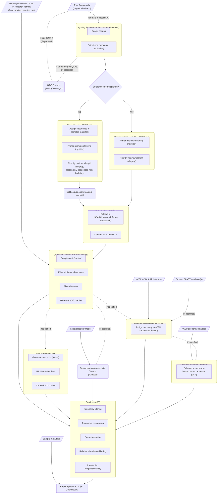

# rainbow_bridge
rainbow_bridge is a fully automated pipeline that employs a number of state-of-the-art applications to process eDNA and other metabarcoding data from raw sequences (single- or paired-end) to the generation of (optionally curated) zero-radius operational taxonomic units (zOTUs) and their abundance tables. The pipeline will also collapse assigned taxonomy (via BLAST and/or insect) to least common ancestor (LCA) based on user-supplied threshold values as well as perform other finalization steps (e.g., taxon filtering/remapping, decontamination, rarefaction, etc.). This pipeline uses [nextflow](https://www.nextflow.io/) and a containerized subsystem (e.g., [singularity](https://docs.sylabs.io/guides/3.5/user-guide/introduction.html), [podman](https://podman.io/), etc.) to enable a scalable, portable and reproducible workflow on a local computer, cloud (eventually) or high-performance computing (HPC) clusters.


<!-- # Overall workflow

<small>**Note: This flowchart applies to the original (published) version of the eDNAFLow pipeline. rainbow_bridge, pipeline described here, varies somewhat from that.**</small> -->

## About this version

This project is a fork of [`eDNAFlow`](https://github.com/mahsa-mousavi/eDNAFlow), rewritten to support the newest version of nextflow and DSL2. It also better supports parallel processing, both through splitting and simultaneously processing large files and the ability to process already-demultiplexed sequence files. In addition, it adds several processing options, such as the ability to classify taxonomy using [insect](https://github.com/shaunpwilkinson/insect) and to produce a [phyloseq](https://joey711.github.io/phyloseq/) object as output, among others.

For more information on the original eDNAFlow pipeline and other software used as part of the workflow, please read "eDNAFlow, an automated, reproducible and scalable workflow for analysis of environmental DNA (eDNA) sequences exploiting Nextflow and Singularity" in Molecular Ecology Resources (DOI: <https://doi.org/10.1111/1755-0998.13356>). If you use rainbow_bridge, we appreciate if you could cite the eDNAFlow paper, the DOI for this project, and the papers describing the underlying software.

# Workflow
This flowchart illustrates the general workflow of the rainbow_bridge pipeline (if your browser doesn't support javascript or [mermaid](https://mermaid.js.org/) or some other necessary thing, you'll just see the code describing the flowchart rather than the flowchart itself).



# Table of contents

<!-- TOC start (generated with https://github.com/derlin/bitdowntoc) -->

- [Setup and testing](#setup-and-testing)
   * [Installation](#installation)
      + [Manual dependency installation](#manual-dependency-installation)
         - [Nextflow](#nextflow)
         - [Singularity](#singularity)
         - [Podman](#podman)
      + [Testing installation](#testing-installation)
- [Basic usage](#basic-usage)
   * [Running the pipeline](#running-the-pipeline)
   * [Input requirements](#input-requirements)
   * [Usage examples](#usage-examples)
      + [For single-end runs (not previously demultiplexed)](#for-single-end-runs-not-previously-demultiplexed)
      + [For previously-demultiplexed single-end runs](#for-previously-demultiplexed-single-end-runs)
      + [For non-demultiplexed paired-end runs](#for-non-demultiplexed-paired-end-runs)
         - [Specifying reads by directory](#specifying-reads-by-directory)
      + [For previously-demultiplexed paired-end runs](#for-previously-demultiplexed-paired-end-runs)
   * [Contents of output directories](#contents-of-output-directories)
   * [When things go wrong (interpreting errors)](#when-things-go-wrong-interpreting-errors)
   * [A note on globs/wildcards](#a-note-on-globswildcards)
- [Description of run options](#description-of-run-options)
   * [Required options](#required-options)
      + [Specifying sequencing run type](#specifying-sequencing-run-type)
      + [Processing fastq input (demultiplexed or not)](#processing-fastq-input-demultiplexed-or-not)
         - [Specifying fastq files](#specifying-fastq-files)
      + [Other required options](#other-required-options)
         - [Barcode file (not required for demultiplexed runs with stripped primers)](#barcode-file-not-required-for-demultiplexed-runs-with-stripped-primers)
         - [BLAST settings ](#blast-settings)
   * [Sample IDs](#sample-ids)
      + [Mapping of custom sample IDs](#mapping-of-custom-sample-ids)
   * [Other options](#other-options)
      + [General ](#general)
      + [Splitting input](#splitting-input)
      + [Length, quality, and merge settings](#length-quality-and-merge-settings)
      + [Demultiplexing and sequence matching](#demultiplexing-and-sequence-matching)
      + [Assigning taxonomy](#assigning-taxonomy)
         - [BLAST settings](#blast-settings-1)
         - [Classification using insect](#classification-using-insect)
         - [LCA collapse](#lca-collapse)
      + [Denoising/dereplication and zOTU inference](#denoisingdereplication-and-zotu-inference)
      + [zOTU curation using LULU](#zotu-curation-using-lulu)
      + [Resource allocation](#resource-allocation)
      + [Singularity options](#singularity-options)
      + [Output products and finalization](#output-products-and-finalization)
         - [Finalization options](#finalization-options)
            * [Data cleanup](#data-cleanup)
            * [Contamination / negative controls](#contamination--negative-controls)
            * [Abundance filtration and rarefaction](#abundance-filtration-and-rarefaction)
         - [Output products](#output-products)
            * [Generating phyloseq objects](#generating-phyloseq-objects)
- [Useful examples and tips](#useful-examples-and-tips)
   * [Downloading the NCBI BLAST nucleotide database](#downloading-the-ncbi-blast-nucleotide-database)
   * [Making a custom BLAST database](#making-a-custom-blast-database)
   * [Specifying parameters in a parameter file](#specifying-parameters-in-a-parameter-file)
      + [Setting multiple values for the same option](#setting-multiple-values-for-the-same-option)
   * [Notification](#notification)

<!-- TOC end -->

# Setup and testing

The pipeline has only two (although technically three, if you include the java runtime) external dependencies: [nextflow](https://www.nextflow.io/) and a container system that supports Docker containers. Nextflow additionally requires a java runtime. One place to find that is [here](https://www.java.com/en/download/manual.jsp), although the [openjdk](https://openjdk.org/) package (available on multiple operating systems) can often be simpler to install. The default container system is [singularity](https://sylabs.io/singularity/), although support for [podman](https://podman.io/) is also included (and in theory any other system [supported by nextflow](https://nextflow.io/docs/latest/container.html) that can run Docker containers will also work). To run the pipeline, nextflow and singularity (or podman, etc.) have to be installed or made available for loading as modules (e.g. in the case of running it on an HPC cluster) on your system. 

In the `install` directory of this repository is a script that will install nextflow and singularity. It should support Ubuntu 20.04 and 22.04. For other versions and systems, you can install the components [manually following the authors' instructions](#manual-dependency-installation). You will likely need superuser permissions to install most dependencies, although nextflow can be run from within a user account.

## Installation

These instructions are more or less generic, excluding dependency installation. If you are having trouble with that step, you may need to [install them manually](#manual-dependency-installation). There are essentially two ways that rainbow_bridge can be run: by cloning the [github repository](https://github.com/mhoban/rainbow_bridge/) and running the `rainbow_bridge.nf` script directly or by using nextflow's built-in [github support](https://www.nextflow.io/docs/latest/sharing.html#running-a-pipeline).

To clone the repository and and install dependencies (for running the .nf script):

1. Clone the git repository so that all the scripts and test data are downloaded and in one folder. To clone the repository to your directory, run this command in your terminal (remove the '$' if you copy and paste): 
   ```console
   $ git clone https://github.com/mhoban/rainbow_bridge.git
   ```
  
1. Add the directory where you cloned the respository to your system PATH. Assuming you downloaded it into `$HOME/rainbow_bridge` and you're using bash as your shell, one way you could do that is like this:
    ```console
    $ echo 'export PATH="$HOME/rainbow_bridge:$PATH"' >> $HOME/.bashrc
    ```

1. Next, for Ubuntu and Debian-based systems using singularity, go to the "install" directory which is located inside the "rainbow_bridge" directory and run the script `install_dependencies.sh`:
     ```console
     $ cd rainbow_bridge/install

     $ sudo ./install_dependencies.sh
     ```
     This will install nextflow and singularity to the system. If this fails, try the instructions given [below](#manual-dependency-installation).


To run the pipeline directly from github (note: this method assumes you already have the necessary dependencies installed on the system):

```console
$ nextflow run -<nextflow-options> mhoban/rainbow_bridge -r main --<rainbow_bridge-options>
```
   
### Manual dependency installation

#### Nextflow
For manual installation of Nextflow, follow the instructions at [on the nextflow website](https://www.nextflow.io/docs/latest/getstarted.html). The simplest way to do it is to go to the [releases](https://github.com/nextflow-io/nextflow/releases/latest) page, download the latest version with the `-all` suffix (e.g., `nextflow-24.04.3-all`), and make that file executable (you'll need a functioning java runtime for this to work).

#### Singularity
To install Singularity manually, follow the instructions at [singularity installation](https://sylabs.io/guides/3.5/admin-guide/installation.html). If working on HPC, you may need to contact your HPC helpdesk. The Singularity installation how-to is long and complicated, but if you're on a RedHat or Debian-adjacent distro, there are .deb and .rpm packages that can be found at [https://github.com/sylabs/singularity/releases/latest](https://github.com/sylabs/singularity/releases/latest). 

#### Podman
Manual podman installation instructions can be found [here](https://podman.io/docs/installation). rainbow_bridge should work with podman out of the box, but you will have to specify a podman profile for it to function properly. There are two profiles built in: `podman_arm`, and `podman_intel`. These both tell nextflow to use podman for its container system, and the second half just specifies your CPU architecture. Most systems will probably use the `_intel` variant, but if you are on a newer Mac with Apple silicon, you'll want to use the `_arm` variant. To run the pipeline using podman as its container system, specify a profile with the following option (note the single dash in the '-profile' option):

```bash
# in this example, we're running on a Mac with the M3 processor
$ rainbow_bridge.nf -profile podman_arm <further options>
```

### Testing installation

The [rainbow_bridge-test](https://github.com/mhoban/rainbow_bridge-test) github repository contains example data to test the various possible input scenarios:  

* Single-end sequencing runs
  * Demultiplexed
  * Undemultiplexed
* Paired-end sequencing runs
  * Demultiplexed
  * Undemultiplexed

To test the pipeline, clone the repository from <https://github.com/mhoban/rainbow_bridge-test.git> and see the README file for more information.

# Basic usage

## Running the pipeline

As mentioned briefly above, there are two main ways the pipeline can be run: by cloning the repository and calling the main script `rainbow_bridge.nf` or by using [nextflow's github support](https://www.nextflow.io/docs/latest/sharing.html#running-a-pipeline) and running directly from this github repository. 

If you have cloned the repository and added its directory to your system PATH, just run the pipline like this (note that nextflow-specific options have a single dash while rainbow_bridge options have double dashes):

```console
$ rainbow_bridge.nf -<nextflow-options> --<rainbow_bridge-options>
```

You can also call it using a fully-qualified path (be careful if there are symlinks, because this can break the containerization in unexpected ways):

```console
$ /path/to/rainbow_bridge.nf -<nextflow-options> --<rainbow_bridge-options>
```

To run the pipeline without cloning the repository, you can call it like this (note that the option conventions are the same, but nextflow options typically come before the name of the pipeline repository AND that the `main` revision is specified with `-r`):

```console
$ nextflow run -<nextflow-options> mhoban/rainbow_bridge -r main --<rainbow_bridge-options>
```

## Input requirements

The most basic requirements for a rainbow_bridge run are fastq-formatted sequence file(s) and a file defining PCR primers (and where applicable, sample barcodes)<sup>\*</sup>. Sequences can be either single or paired-end and may be raw (i.e., one fastq file per sequencing direction), already demultiplexed by the sequencer (i.e., one fastq file per sample per sequencing direction), or demultiplexed by a previous run of the pipeline (in FASTA format).  

<sup>\*</sup>The barcode file can be omitted if your fastq files have already had their primers stripped and you pass the `--skip-primer-match` option.

Details about the three input formats the pipeline expects:

1. <a name="non-demuxed"></a>Raw data from the sequencer (i.e. non-demultiplexed). This typically consists of forward/reverse reads each in single large (optionally gzipped) fastq files. You will have one fastq file per sequencing direction, identified by some unique portion of the filename (typically R1/R2). For this type of data, the demultiplexer used in rainbow_bridge requires that you have barcoded primers, such that sequence reads look like this:  
    ```
    <FWD_BARCODE><FWD_PRIMER><TARGET_SEQUENCE><REVERSE_PRIMER><REVERSER_BARCODE>
    ```


1. <a name="demuxed"></a>Data that has already been demultiplexed by the sequencer. This is typically the case when you have used Illumina indices to delineate samples. You will have fastq files for each individual sample and read direction (delineated by a filename pattern like R1/R2), and sequences should still have primers attached, like this:  
    ```
    <FWD_PRIMER><TARGET_SEQUENCE><REVERSE_PRIMER>
    ```
    
    In most cases these sequences will have the Illumina indices you used to separate samples included at the end of their fastq header, like this:  
    <pre><code>@M02308:1:000000000-KVHGP:1:1101:17168:2066 1:N:0:<strong>CAATGTGG+TTCGAAGA</strong></pre></code>

1. <a name="demux-fasta"></a>Data that has been demultiplexed to individual samples and concatenated into a FASTA file in usearch format, typically by a previous run of the pipeline on non-demultiplexed sequence data (as in case 1 above, although output from case 2 will work as well). Use this option if you want to re-run the pipeline without repeating the lengthy demultiplexing/merging/quality filtering step(s). The expected input format is a FASTA file with each sequence labled as `<samplename>.N` where `samplename` is the name of the sample and `N` is just a sequential number, for example:
  
    ```fasta
    >sample1.1
    AGCGTCCGATGACTGACTGACTAGCT
    >sample1.2
    TACGTACGATCGACGAGTCTACGACTACTGAC
    >sample1.3
    TGACTGATCGTACTATCAGAGCTATCATCGACTATCATCGATC
    >sample2.1
    ATCGTACTACTAGCGACGAGTCATCACGACGTACTAGTCGA
    >sample2.2
    CATGCGACGTACGTACTATCATCATCGAGCAGCTATATATCGATGGTACTAGCTGAC
    >sample2.3
    TGACTGATCGTACTATCAGAGCTATCATCGACTATCATCGATC
    >sample3.1
    AGCGTCCGATGACTGACTGACTAGCT
    >sample3.2
    ATCGTACTACTAGCGACGAGTCATCACGACGTACTAGTCGA
    >sample3.3
    CATGCGACGTACGTACTATCATCATCGAGCAGCTATATATCGATGGTACTAGCTGAC
    ```

## Usage examples
Following are some examples of the basic command to run the pipeline on your local machine on single-end/paired-end data with multiple possible barcode files. For each of these examples, I assume `rainbow_bridge.nf` is in the system path, you're working on a project called `example_project`, and your directory structure looks something like this:

```bash
example_project/            # base directory containing project files
example_project/fastq/      # directory to hold raw sequence reads
example_project/data/       # directory to hold other data (e.g., barcode and/or sample map file(s))
example_project/analysis/   # directory to hold rainbow_bridge analysis output
```

The pipeline run is started from within the `analysis` directory. The options used to specify the location of your fastq files make exensive use of globs. For a discussion on how these are treated in the pipeline, see [here](#a-note-on-globswildcards).

### For single-end runs (not previously demultiplexed)

In this case you will have one fastq file and one or more barcode files containing sample barcodes (forward/reverse) and PCR primers (forward/reverse).

```bash
$ rainbow_bridge.nf \
  --single \
  --reads ../fastq/sequence_reads.fastq \   # <-- reads denotes a single .fastq file
  --barcode '../data/*.tab'                 # <-- note the glob enclosed in single-quotes
  [further options]
```

### For previously-demultiplexed single-end runs

In this case, you will have multiple fastq files, each representing one sample and one or more barcode files denoting PCR primers only (i.e., no sample barcodes).

```bash
$ rainbow_bridge.nf \
  --single \
  --reads '../fastq/*.fastq' \    # <-- reads is a glob denoting multiple .fastq files
  --barcode '../data/*.tab'
  --illumina-demultiplexed        # <-- specify that reads are already demultiplexed
  [further options]
```

### For non-demultiplexed paired-end runs

In non-demultiplexed runs, the pipeline assumes you have exactly one forward fastq file and one reverse fastq file. There are a few ways you can specify where these are found. One is presented here and you can find a more detailed discussion [below](#description-of-run-options).

#### Specifying reads by directory
With this method, the `--reads` option points to the directory where .fastq reads can be found. By default, rainbow_bridge assumes forward reads are designated with "R1" (\*R1\*.fastq\*) in the filename and reverse reads are named with "R2" (\*R2\*.fastq\*). For customization options, see [below](#specifying-fastq-files).

```bash
$ rainbow_bridge.nf \
  --paired \
  --reads ../fastq/  
  --barcode '../data/*.tab'
  [further options]
```

### For previously-demultiplexed paired-end runs

For demultiplexed paired-end runs, you will have two fastq files per sample, each designated by a pattern indicating read direction (typically R1/R2). The pipeline combines the values of the `--reads`, `--fwd`, `--rev`, `--r1`, and `--r2` options to make a [glob](#a-note-on-globswildcards) that is used to find sequence reads. A simple example is given here which relies on the default values of `--fwd`, `--rev`, `--r1`, and `--r2`, but for a detailed discussion of how these things can go together, see [below](#specifying-fastq-files).

```bash
$ rainbow_bridge.nf \
  --paired \
  --reads ../fastq \   # Here, we're just specifying the directory where reads are found. 
  --barcode '../data/*.tab'  # Default options will look for <reads>/*R1*.fastq* and <reads>/*R2*.fastq*
  --illumina-demultiplexed
  [further options]
```
## Contents of output directories

When the pipeline finishes, output from each step can be found in directories corresponding to each process in the analysis. All output will fall under one of two directories: `output` or `preprocess`. `output` will contain things like QA/QC results, zOTU tables, and taxonomic assignment. `preprocess` contains the results of the various filtering, trimming, and merging steps (among others). The contents of output directories will by symlinked to files contained within the nextflow-generated internal `work` directory hierarchy (which you shouldn't have to access directly, except maybe in some case of error). Here is an exhaustive list of all the possible output directories:


| Directory   | Subdirectory                        | Description                                                  | Condition                                                |
| ----------- | ----------------------------------- | ------------------------------------------------------------ | -------------------------------------------------------- |
| preprocess/ | trim_merge/                          | Length/quality filtered and (for paired-end runs) merged reads |                                                          |
|             | index_filtered/                      | Filtered/merged sequences with ambiguous indices filtered out | --remove-ambiguous-indices<br />--illumina-demultiplexed |
|             | ngsfilter/                           | ngsfilter-processed reads: primer mismatch and sample annotation (if not previously demultiplexed) |                                                          |
|             | length_filtered/                     | Length filtered                                              |                                                          |
|             | split_samples/                       | Annotated samples split into individual files                | Sequencing run not previously demultiplexed              |
|             | relabeled/                           | Relabeled combined FASTA files for denoiser (usearch/vsearch) input |                                                          |
|             | merged/                              | Merged relabeled FASTA file for denoising                    |                                                          |
| output/     | fastqc/initial/<br />fastqc/filtered/ | FastQC/MultiQC reports                                       | --fastqc                                                 |
|             | zotus/                               | Dereplicated/denoised sequence results<br />(unique sequences, zOTU sequences, zOTU table) |                                                          |
|             | blast/\*                              | BLAST results. Directory names will reflect the options passed to the blast process as well as the names of the individual databases queried against. | --skip-blast not passed |
|             | lulu/                                | LULU curation results                                        | --skip-lulu not passed |
|             | taxonomy/lca/\*                       | Results of taxonomy collapser script(s). Directory name will reflect the options passed to the LCA process. | --collapse-taxonomy                                      |
|             | taxonomy/insect/\*                    | Insect classification results. Directory name will reflect the options passed to the insect process. | --insect                                                 |
|             | phyloseq/                            | Phyloseq object                                              | --phyloseq and associated options                        |
| work/       | A bunch of nonsense                 | All internal and intermediate files processed by nextflow    |                                                          |
| .nextflow/  | various                             | Hidden nextflow-generated internal folder                    |                                                          |

## When things go wrong (interpreting errors)

Occasionally your pipeline run will encounter something it doesn't know how to handle and it will fail. There are two general failure modes: silent and loud. 

In some limited cases, the pipeline can fail silently. In this case it will appear to process various steps and then it will stop without any message. Sometimes you can tell something went wrong because all the status boxes are empty. We have done our best to avoid this failure mode but it's occasionally possible that you will encounter it. If you do, the best way to go about solving it is to make sure you have provided all the required command line options, your input files are all there and contain data, and any options that point to files actually point to the files you said they did. 

In most cases when something goes wrong the pipeline will fail loudly and you will see something like this:


This can be a bit intimidating at first, but there are a few ways to use this information to figure out what went wrong. First, toward the bottom of the readout, you'll see the "Command error" section (highlighted). This contains any error message that the failed process may have produced (technically, anything the script output to stderr). If that's empty, there may still be some output you can look at. To see any output the process may have produced (just note that sometimes it's empty), take a look at the "Work dir" and do the following (here we're using the work dir from the above example):

```console
$ cat work/2a/7da7dd31811a49b03af88632257520/.command.out
$ cat work/2a/7da7dd31811a49b03af88632257520/.command.err # (though this will be empty if "Command error" was empty)
```

In the example above, there was error output but nothing in the `.command.out` file. Looking at the error output, we can see that the merged FASTA file was empty. This commonly occurs when your PCR primers fail to match any sequences in the raw reads. In this case, check your barcode file to make sure you're using the correct primers for the sequencing run you're processing. In general, once you've worked out what you think has gone wrong, you can simply run the pipeline again, adjusting any relevant command-line options to hopefully fix the issue.

## A note on globs/wildcards

A number of rainbow_bridge command-line options accept file globs (wildcards). These are used when you want to indicate more than one file using a matching pattern. For an in-depth treatment of globs in the bash shell environment, have a look [here](https://www.baeldung.com/linux/bash-globbing). For the purposes of this pipeline though, you'll mostly use the following things:

(<small>**Note: when passing file globs as command-line options, make sure that you enclose them in quotes (e.g., `--barcode 'bc*.tab'`), If you don't, the glob will be interpreted by the shell rather than rainbow_bridge and parameter values will be incorrect.**</small>)

**\***: a star means 'match any string of characters of any length'  
For example, the glob 'bc\*.tab' will match any filename that begins with 'bc', followed by a sequence of any characters, and finally ending with '.tab'  
This pattern will match 'bc1.tab', 'bc2.tab', and 'bc_one_two_three.tab', but it will not match 'bc1.tabx'

**{}**: curly braces are used for multiple possible matches.  
The contents can be exact strings or wildcards. Anything that matches any of the given comma-separated strings using an "or" relationship (one OR the other) will be found.  
For example, the glob 'seq\_\*{R1,R2}\*.fastq' will match 'seq_', followed by any characters, followed by EITHER 'R1' OR 'R2', follwed by any characters, and finally ending with '.fastq'.  
This pattern will match 'seq\_R1.fastq', 'seq\_001\_002\_R2.fastq', and 'seq\_123\_456\_R2\_extra_info.fastq', among many others. It will NOT match 'seqR1.fastq' (because it's missing the initial underscore following 'seq').

# Description of run options

rainbow_bridge allows for a good deal of customization with regard to which and how various elements of the pipeline are run. All command-line options can be either be passed as-is or saved in a parameters file. For details on saving options in a parameters file, see [below](#specifying-parameters-in-a-parameter-file).

To see a detailed list of available command-line options run:
```console
$ rainbow_bridge.nf --help
```

## Required options

### Specifying sequencing run type
For fastq-based analyses, you must specify whether the sequencing run is single ended or paired-end.

<small>**`--single`**</small>: denotes single-end sequencing runs  
<small>**`--paired`**</small>: denotes paired-end sequencing runs  

<small>**Note: one of the above options is required (specifying both will throw an error)**</small>

### Processing fastq input (demultiplexed or not)

#### Specifying fastq files
In all cases, if you're processing fastq runs, you must specify the location of your sequence reads. Generally, if you're processing runs that have *not* been demultiplexed by the sequencer, you will have either one (single-end) or two (paired-end) fastq files. If your runs *have* been demultiplexed, you will have one fastq file per individual sample per read direction. If fastq files are gzipped (i.e., they have a .gz extension), they will be uncompressed automatically and the .gz extension will be stripped.

**Note: unless you are specifying forward/reverse reads directly (i.e. passing individual filenames), it is best practice to keep reads (fastq files) from different sequencing runs in separate directories. If you do not, because of the way the pipeline uses [globs](#a-note-on-globswildcards) to find files, you could end up with unexpected behavior (e.g., accidentally combining sequences from different sequencing runs in one analysis).**

There are a few ways you can tell rainbow_bridge where your reads are:

- For single-ended runs  
  - Non-demultiplexed  
    <small>**`--reads`**</small>: For non-demultiplexed runs, this points directly to your fastq reads, e.g., '../fastq/B1_S7_L001.fastq'.   
  - Demultiplexed  
    <small>**`--reads`**</small>: For demultiplexed runs, this is a [glob](#a-note-on-globswildcards) indicating where all the demultiplexed reads can be found, e.g., '../fastq/\*.fastq'  
- For paired-end runs  
  - Non-demultiplexed  
    <small>**`--fwd`**</small> and <small>**`--rev`**</small>: For non-demultiplexed runs, you may use these parameters to specify the forward (`--fwd`) and reverse (`--rev`) fastq files directly.  
  - Demultiplexed  
    Demultiplexed sequence reads are found using a [glob](#a-note-on-globswildcards) built internally with the values of  `--reads`, `--fwd`, `--rev`, `--r1`, and `--r2`.   
    
    <small>**`--reads`**</small>: This parameter specifies the base-*directory* where forward and reverse reads may be found. If no other option is specified,  the glob is built using the default values of `--fwd`, `--rev`, `--r1`, and `--r2` (see below)  
    <small>**`--r1`**</small> (default: 'R1'), <small>**`--r2`**</small> (default: 'R2'): these parameters specify the pattern that distinguishes forward from reverse reads. The default values ('R1' and 'R2') are typical of most files you will receive from the sequencer.  
    <small>**`--fwd`**</small> (default: empty), <small>**`--rev`**</small> (default: empty): these parameters optionally specify subdirectories where forward and reverse reads are stored. These subdirectories must be *within* the directory specified with `--reads`.  
    
    Using the above parameters, the following [glob](#a-note-on-globswildcards) is constructed:  
    If `fwd` and `rev` are specified:  
    ```
    <reads>/{<fwd>,<rev>}/*{<r1>,<r2>}*.fastq*  
    ```
    
    Otherwise:  
    ```
    <reads>/*{<r1>,<r2>}*.fastq*  
    ```
    
    <small>**Note the star after the final 'fastq'. This is included to allow for matching '.fastq.gz' files**</small>  
    
    For example, if rainbow_bridge is invoked with the following options:   
    `--reads ../fastq --fwd forward --rev reverse`  
    fastq files will be looked for using the following [glob](#a-note-on-globswildcards):  
    <pre><code>../fastq/{forward,reverse}/*{R1,R2}*.fastq*</code></pre>

### Other required options

#### Barcode file (not required for demultiplexed runs with stripped primers)
<small>**`--barcode [barcode file(s)]`**</small>: Aside from specifying how to find your sequence reads, you must specify barcode file(s) using the `--barcode` option. Barcode files should comply with the [ngsfilter barcode file format](https://pythonhosted.org/OBITools/scripts/ngsfilter.html), which is a tab-delimited format used to specify sample barcodes and amplicon primers. It will vary slightly based on whether your runs have been demultiplexed by the sequencer or not. Note that the pipeline can perform a few standalone tasks that do not require barcode files (e.g. collapsing taxonomy to LCA). Additionally, you won't need one if you are processing a previous-demultiplexed sequencing run where primers have been stripped.  

<small>**The barcode file does not require a header line (i.e., column names), but if one is included it must be prefaced with a '#' (i.e., commented out).**</small>

- **Non-demultiplexed runs**: This format includes forward/reverse sample barcodes and forward/reverse PCR primers to separate sequences into the appropriate samples. Barcodes are separated with a colon and combined in a single column while primers are given in separate columns. For example:
  #assay|sample|barcodes|forward_primer|reverse_primer|extra_information
  ---|---|---|---|---|---
  16S-Fish|B001|GTGTGACA:AGCTTGAC|CGCTGTTATCCCTADRGTAACT|GACCCTATGGAGCTTTAGAC|EFMSRun103_Elib90
  16S-Fish|B002|GTGTGACA:GACAACAC|CGCTGTTATCCCTADRGTAACT|GACCCTATGGAGCTTTAGAC|EFMSRun103_Elib90
  
- **Demultiplexed runs**: Since sequences have already been separated into samples, this format omits the barcodes (using just a colon, ':' in their place) but includes the primers. For example:
  #assay|sample|barcodes|forward_primer|reverse_primer|extra_information
  ---|---|---|---|---|---
  primer|V9_18S|:|GTACACACCGCCCGTC|TGATCCTTCTGCAGGTTCACCTAC
  
  In this case, it's not super critical what you call your 'sample' since the files are already separated.

#### BLAST settings 

For pipeline runs in which BLAST queries are performed, you must identify the database(s) being used. This can be done using the `--blast-db` option and/or the `$FLOW_BLAST` environment variable. See [below](#blast-settings-1) for more details on how to do this. 

## Sample IDs
For non-demultiplexed sequencing runs, samples will be named based on the sample IDs specified in the `sample` column of the barcode file. For demultiplexed runs, samples will by default be named based on the first part of the filename before the fwd/rev (R1/R2) pattern. For example, the following read files:

```
B1_S7_L001_R1_001.fastq, B1_S7_L001_R2_001.fastq
B2_S8_L001_R1_001.fastq, B2_S8_L001_R2_001.fastq
CL1_S2_L001_R1_001.fastq, CL1_S2_L001_R2_001.fastq
CL2_S3_L001_R1_001.fastq, CL2_S3_L001_R2_001.fastq
```

Will result in the following sample IDs:

```
B1_S7_L001
B2_S8_L001
CL1_S2_L001
CL2_S3_L001
```

### Mapping of custom sample IDs
By default for previously-demultiplexed runs, rainbow_bridge will interpret sample IDs from filenames. However, since this sometimes results in screwy sample IDs, it's possible to specify a mapping file that will translate filenames into custom IDs.

<small>**`--sample-map [mapfile]`**</small>: A headerless tab-delimited file that maps sample names to sequence-read filenames.  

The specified map file should be a tab-delimited table (*without* headers) where the first column contains the sample ID, the second column contains the read filename (forward read for paired-end reads), and the third column (for paired-end reads only) contains the reverse read filename. Using the filenames from the example given [above](#sample-ids), a map file would contain the following (columns are tab-separated, file has no header): 

```
sample_B1   B1_S7_L001_R1_001.fastq   B1_S7_L001_R2_001.fastq
sample_B2   B2_S8_L001_R1_001.fastq   B2_S8_L001_R2_001.fastq
sample_CL1  CL1_S2_L001_R1_001.fastq  CL1_S2_L001_R2_001.fastq
sample_CL2  CL2_S3_L001_R1_001.fastq  CL2_S3_L001_R2_001.fastq 
```

**NOTE: If your fastq files were gzipped, DO NOT include the .gz extension in your sample map file, because the files are unzipped (and .gz extension stripped) BEFORE sample IDs are remapped.**

## Other options

### General 
<small>**`--project [project]`**</small>:    Project name, applied as a prefix to various output filenames. (default: project directory name)  
<small>**`--publish-mode [mode]`**</small>:  Specify how nextflow places files in output directories. See [nextflow documentation](https://www.nextflow.io/docs/latest/process.html#publishdir) for supported values (default: symlink)  
<small>**`--fastqc`**</small>:               Output FastQC reports for pre and post filter/merge steps. MultiQC is used for demultiplexed or split runs.  


### Splitting input
To improve performance, large input files can be split into multiple smaller files and processed in parallel. This option is only available for runs that have *not* previously been demultiplexed. With the `--split` option, rainbow_bridge will break up the input reads into smaller files (with the number of reads per file customizable as explained below) and process them in parallel the same way that demultiplexed runs are processed. 

<small>**`--split`**</small>:    Split input fastq files and process in parallel   
<small>**`--split-by [num]`**</small>: Number of sequences per split fastq chunk (default: 100000)  

### Length, quality, and merge settings
These settings allow you to set values related to quality filtering and paired-end merging.

<small>**`--min-quality [num]`**</small>:     Minimum Phred score for sequence retention (default: 20)  
<small>**`--min-align-len [num]`**</small>:   Minimum sequence overlap when merging forward/reverse reads (default: 12)  
<small>**`--min-len [num]`**</small>:         Minimum overall sequence length (default: 50)  

### Demultiplexing and sequence matching
These settings control demultiplexing and sequence matching (e.g., allowable PCR primer mismatch).

<small>**`--primer-mismatch [num]`**</small>:  Allowed number of mismatched primer bases (default: 2)  
<small>**`--illumina-demultiplexed`**</small>:  Required if sequencing run is already demultiplexed  
<small>**`--remove-ambiguous-indices`**</small>:  For previously-demultiplexed sequencing runs, remove reads that have ambiguous indices (i.e. they have bases other than AGCT). This assumes Illumina indices are included in fastq headers:  
    <pre><code>@M02308:1:000000000-KVHGP:1:1101:17168:2066 1:N:0:<strong>CAAWGTGG+TTCNAAGA</strong></code></pre>
<small>**`--skip-primer-match`**</small>: Skip primer/barcode match and removal (ngsfilter step) for sequencing runs where metabarcoding primers are already removerd.   
<small>**`--demuxed-fasta [file]`**</small>:  Skip demultiplexing step and use supplied FASTA (must be in usearch/vsearch format). See [above](#demux-fasta).  \
<small>**`--demuxed-example`**</small>:  Spit out example usearch/vsearch demultiplexed FASTA format  
<small>**`--demux-only`**</small>:  Stop after demultiplexing and splitting raw reads  

### Assigning taxonomy

These options relate to assignment/collapsing of taxonomy by zOTU sequence. Initial taxonomic assignment is performed using BLAST and/or insect and further refined using least common ancestor (LCA) collapse.  

BLAST is an alignment-based approach that uses the NCBI [GenBank](https://www.ncbi.nlm.nih.gov/genbank/) database to match zOTUs to sequences with known taxonomic identity. [insect](https://github.com/shaunpwilkinson/insect) is a phylogenetic (tree-based) approach to taxonomic assignment. It is particularly useful for assigning higher-order (e.g. phylum, order) taxonomy to zOTUs that are otherwise unidentified by BLAST. In the LCA method, BLAST results for each zOTU are compared to one another and a decision is made whether or not to collapse to the next highest taxonomic rank based on a user-defined variability threshold among those results. 

#### BLAST settings

These settings allow you to control how BLAST searches are performed and specify the location of search databases. The only required option (unless BLAST queries are being skipped) is the location of a local BLAST database, which can be set using the command line option `--blast-db` and/or through the `$FLOW_BLAST` environment variable. Other options in this category allow you to control BLAST search criteria directly (e.g., e-value, percent match, etc.). For further explanation of these options beyond what is described here, see the [blast+ documentation](https://www.ncbi.nlm.nih.gov/books/NBK279690/).

The following options are available:  

Specifying your database:  
<small>**`--blast-db [blast db name]`**</small>: Location of a BLAST database (path *and* name). For example, if the NCBI `nt` database resides at `/usr/local/blast`, use `--blast-db /usr/local/blast/nt`. If you have a custom database called `custom_blast` in `/home/user/customblast`, pass `--blast-db /home/user/customblast/custom_blast`. The "name" of the database is the same as the value passed to the `-out` parameter of `makeblastdb`. If you are unsure of the name of a particular blast database, a good way to identify it is that it's the base name of the .ndb file. For example, if you have a directory with a `fishes.ndb` file, the name of the BLAST database will just be `fishes`.  

By default, `rainbow_bridge` will use the value of the `$FLOW_BLAST` environment variable as the primary BLAST database. If `$FLOW_BLAST` is set, the database it points to will be added in addition to any database(s) passed to `--blast-db`.  

Taxonomic name resolution:  
BLAST databases use numerical NCBI taxonomy IDs (taxids) to assign taxonomy to sequences. In order for your results to contain the actual scientific names associated with those taxids, the NCBI BLAST taxonomy database (taxdb) must be available to the pipeline. This can be achieved in several ways:   

  - If the taxdb files (`taxdb.btd` and `taxdb.bti`) are present in any of the databases passed through `--blast-db` or `$FLOW_BLAST`, they will be used for all of the supplied databases. 
    * If you are using the NCBI `nt` database, you most likely already have these files present and won't have to worry about any of this.
  - Taxonomy files can be explicitly specified using the `--blast-taxdb` option. The option value must point to the *directory* containaining the two taxdb files.
  - If the taxdb files are missing, they will be automatically downloaded from the NCBI website.

Multiple BLAST databases:  
It is possible to query your sequences agains multiple BLAST databases. As mentioned, the pipeline will, by default, use the value of the `$FLOW_BLAST` environment variable as its first BLAST database. If that variable is set, any value(s) passed to `--blast-db` will be added as additional databases. Nextflow does not support multiple values for the same option on the command line (e.g., `workflow.nf --opt val1 --opt val2`), but it *does* support them when using [parameter files](#specifying-parameters-in-a-parameter-file). Thus, if you're not using the `$FLOW_BLAST` variable and/or you want to use multiple custom databases, you'll need to pass them as a list in your parameter file ([see here](#setting-multiple-values-for-the-same-option) for an example). The pipeline will run BLAST queries agains each database separately and merge the results into a common output file.    

All BLAST options:  
<small>**`--skip-blast`**</small>: Pass this if you don't want to run a BLAST query at all.   
<small>**`--blast-db [blastdb]`**</small>: Specify the location of a BLAST database. The value of this option must be the path and name of a blast database (the 'name' is the basename of the files with the .n\*\* extensions), e.g., /drives/blast/custom_db. If the environment variable `$FLOW_BLAST` is set, its value will be added to the list of databases being searched.   
<small>**`--blast-taxdb [dir]`**</small>: Specify the location of the NCBI BLAST taxonomy database files (`taxdb.btd` and `taxdb.bti`). The value of this option must be the directory where these two files can be found. If these files already occur alongside any of the databases passed to `--blast-db`, they will be reused for all databases. If they are missing entirely, they will be downloaded from the NCBI servers.  
<small>**`--ignore-blast-env`**</small>: Ignore the value of the `$FLOW_BLAST` environment variable set on the host system when running the pipeline.   
<small>**`--blast-task [task]`**</small>:  Set blast+ task (default: "blastn")  
<small>**`--max-query-results [num]`**</small>:  Maximum number of BLAST results to return per query sequence (default: 10). See [here](https://academic.oup.com/bioinformatics/article/35/9/1613/5106166) for important information about this parameter, but mayble also see [here](https://academic.oup.com/bioinformatics/article/35/15/2699/5259186) for a follow-up discussion.  
<small>**`--percent-identity [num]`**</small>:  Minimum percent identity of matches (default: 95)  
<small>**`--evalue [num]`**</small>:  BLAST e-value threshold (default: 0.001)  
<small>**`--qcov [num]`**</small>:  Minimum percent query coverage (default: 100)  

#### Classification using insect

These options control taxonomy assignment using the [insect](https://github.com/shaunpwilkinson/insect) algorithm. To run insect on your sequences, you must specify either one of the [pre-trained](https://github.com/shaunpwilkinson/insect#classifying-sequences) classifier models OR one that you've trained yourself. Insect also takes various parameters to tweak how it does its assignments.

<small>**`--insect [classifier]`**</small>:  Perform taxonomy assignment using insect. Accepted values of [classifier] are:  

  - Filename of local .rds R object containing classifier model  
  - One of the following (case-insensitive) primer names:   
     MiFish, Crust16S, Fish16S, 18SUni, 18SV4, p23S, mlCOIint, SCL5.8S  

| Option value | Marker | Target                 | Primers                                                  | Date trained |
|--------------|--------|------------------------|----------------------------------------------------------|--------------|
| MiFish       | 12S    | Fish                   | MiFishUF/MiFishUR (Miya et al., 2015)                    | 11-11-2018   |
| Crust16S     | 16S    | Marine crustaceans     | Crust16S_F/Crust16S_R (Berry et al., 2017)               | 06-26-2018   |
| Fish16S      | 16S    | Marine fish            | Fish16sF/16s2R (Berry et al., 2017; Deagle et al., 2007) | 06-27-2018   |
| 18SUni       | 18S    | Marine eukaryotes      | 18S_1F/18S_400R (Pochon et al., 2017)                    | 07-09-2018   |
| 18SV4        | 18S    | Marine eukaryotes      | 18S_V4F/18S_V4R (Stat et al., 2017)                      | 05-25-2018   |
| p23S         | 23S    | Algae                  | p23SrV_f1/p23SrV_r1 (Sherwood & Presting 2007)           | 07-15-2018   |
| mlCOIint     | COI    | Metazoans              | mlCOIintF/jgHCO2198 (Leray et al., 2013)                 | 11-24-2018   |
| SCL5.8S      | ITS2   | Cnidarians and sponges | scl58SF/scl28SR (Brian et al., 2019)                     | 09-20-2018   |  

(see [here](https://github.com/shaunpwilkinson/insect#classifying-sequences) for more information on classifiers)  

<small>**`--insect-threshold [num]`**</small>:  Minimum Akaike weight for the recursive classification procedure to continue toward the leaves of the tree (default: 0.8)  
<small>**`--insect-offset [num]`**</small>: Log-odds score offset parameter governing whether the minimum score is met at each node (default: 0)  
<small>**`--insect-min-count [num]`**</small>:  Minimum number of training sequences belonging to a selected child node for the classification to progress (default: 5)  
<small>**`--insect-ping [num]`**</small>:  Numeric value (0--1) indicating whether a nearest neighbor search should be carried out, and if so, what the minimum distance to the nearest neighbor should be for the the recursive classification algorithm to be skipped (default: 0.98)  

#### LCA collapse

Options for the LCA method of taxonomy refinement. This method will selectively collapse assignments to higher taxonomic levels based on user-defined variability and certainty thresholds. The filtering applied in this method is based on a set of user specified thresholds, including query coverage (`qcov`), percentage identity (`pid`), and the difference between percent identities of two BLAST hits when their query coverage is equal (`diff`). Setting `qcov` and `pid` thresholds ensures that only BLAST hits greater than or equal to those thresholds will progress to the `diff` comparison step. Setting `diff` means that if the absolute value of the difference in `pid` between two BLAST results is \< `diff`, then a species level taxonomy will be returned. Otherwise, taxonomy of that zOTU will be collapsed to the least common ancestor of all the available BLAST results. Two files are produced: a file with assigned taxonomy, and an intermediate file which may give the user some idea of why zOTUs may have had taxonomic levels dropped.

<small>**`--collapse-taxonomy`**</small>: Collapse assigned BLAST results by least common ancestor (LCA)  
<small>**`--standalone-taxonomy`**</small>: Run LCA script standalone (i.e., separate from the pipeline) against user-supplied data  
<small>**`--blast-file [file]`**</small>: (Only with --standalone-taxonomy) BLAST result table (e.g., output from the blast process)  
<small>**`--zotu-table [file]`**</small>: (Only with --standalone-taxonomy) zOTU table file (e.g., output from the denoising process)  
<small>**`--lineage [file]`**</small>: Previously-download NCBI [rankedlineage.dmp](https://ftp.ncbi.nlm.nih.gov/pub/taxonomy/new_taxdump/taxdump_readme.txt) file (leave blank to download latest)  
<small>**`--merged [file]`**</small>: Previously-download NCBI [merged.dmp](https://ftp.ncbi.nlm.nih.gov/pub/taxonomy/new_taxdump/taxdump_readme.txt) file (leave blank to download latest)  
<small>**`--dropped [str]`**</small>: Placeholder string for dropped taxonomic levels (default: 'dropped'). Pass "NA" for blank/NA  
<small>**`--lca-qcov [num]`**</small>:  Minimum query coverage for LCA taxonomy refinement (default: 100)  
<small>**`--lca-pid [num]`**</small>:  Minimum percent identity for LCA taxonomy refinement (default: 97)  
<small>**`--lca-diff [num]`**</small>:  Maximum difference between percent identities (with identical query coverage) where shared taxonomy is retained (default: 1)  
<small>**`--keep-uncultured`**</small>:  Keep sequences that are listed as 'uncultured', 'environmental sample', 'clone', or 'synthetic' (these are filtered by default).  

### Denoising/dereplication and zOTU inference
These options control how (and by what tool) sequences are denoised and zOTUs are inferred By default, rainbow_bridge uses [vsearch](https://github.com/torognes/vsearch) (a free 64-bit clone of usearch), which does not suffer from the 4GB memory limit of the free version of [usearch](https://www.drive5.com/usearch/). You still retain the option of using either the free (32 bit) or commercial (64 bit) versions of usearch, if you really want to. 

<small>**`--denoiser [tool/path]`**</small>:  Sets the tool used for denoising & chimera removal. Accepted options: 'usearch', 'usearch32', 'vsearch', path to 64-bit usearch executable (default: vsearch)    
<small>**`--min-abundance [num]`**</small>:  Minimum sequence abundance for zOTU determination; sequences with abundances below the specified threshold will be discarded during the denoising process (default: 8)   
<small>**`--alpha [num]`**</small>: Alpha parameter passed to the UNOISE3 algorithm (see the [unoise2 paper for more info](https://doi.org/10.1101/081257)) (default: 2.0)  
<small>**`--usearch`**</small>:  Alias for `--denoiser usearch`  

### zOTU curation using LULU

rainbow_bridge includes the option to curate zOTUs using [lulu](https://github.com/tobiasgf/lulu). For a more detailed explantion of these parameters please see the LULU documentation.

<small>**`--skip-lulu`**</small>:  Skip LULU curation  
<small>**`--lulu-min-ratio-type [num]`**</small>: LULU minimum ratio type (accepted values: 'min', 'avg', default: 'min')  
<small>**`--lulu-min-ratio [num]`**</small>: LULU minimum ratio (default: 1)  
<small>**`--lulu-min-match [num]`**</small>: LULU minimum threshold of sequence similarity to consider zOTUs as spurious. Choose higher values when using markers with lower genetic variation and/or few expected PCR and sequencing errors (default: 84)  
<small>**`--lulu-min-rc [num]`**</small>: LULU minimum relative co-occurence rate (default: 0.95)  

### Resource allocation
These options allow you to allocate resources (CPUs and memory) to rainbow_bridge processes.

<small>**`--max-memory [mem]`**</small>:  Maximum memory available to nextflow processes, e.g., '8.GB' (default: maximum available system memory)  
<small>**`--max-cpus [num]`**</small>:  Maximum cores available to nextflow processes (default: maximum available system CPUs)  
<small>**`--max-time [time]`**</small>:  Maximum time allocated to each pipeline process, e.g., '2.h' (default: 10d)  

### Singularity options

Options to control how singularity behaves. 

<small>**`--bind-dir [dir]`**</small>:  Space-separated list of directories to bind within singularity images (must be surrounded by quotations if more than one directory). This is passed to the -B option of `singularity run`. In most cases any filenames passed to the pipeline will be auto-bound within singularity instances, but you might try this option if you're getting 'file not found' errors.  
<small>**`--singularity-cache [dir]`**</small>:  Location to store downloaded singularity images. May also be specified with the environment variable $NXF_SINGULARITY_CACHEDIR. 

### Output products and finalization

#### Finalization options

These options control the final output of the pipeline and include things like cleanup, abundance filtering, rarefaction, and production of a phyloseq object.

##### Data cleanup

<small>**`--taxon-remap [file]`**</small>: Manually re-map taxonomic classification using criteria in user-supplied table. Argument is a tabular data file (.csv or .tsv) with four columns: `original_level`, `original_value`, `new_level`, and `new_value`. Taxonomic levels are re-mapped by matching the taxonomic level (e.g., kingdom, phylum, etc.) in the `original_level` column with the value in the `original_value` column and assigning the value in `new_value` to the level in `new_level`. An example map file might look like this:  

|   original_level  |   original_value  |   new_level  |   new_value    |
|-------------------|-------------------|--------------|----------------|
|   phylum          |   Rhodophyta      |   kingdom    |   Plantae      |
|   class           |   Phaeophyceae    |   kingdom    |   Plantae      |
|   class           |   Ulvophyceae     |   kingdom    |   Plantae      |
|   class           |   Phaeophyceae    |   phylum     |   Brown algae  |
|   class           |   Ulvophyceae     |   phylum     |   Green algae  |

Using this map file, any sequences assigned to phylum 'Rhodophyta' or classes 'Phaeophyceae' or 'Ulvophyceae' will have their kingdoms assigned to 'Plantae'. Afterward, sequences assigned to class 'Phaeophyceae' will be placed in phylum 'Brown algae' and class 'Ulvophyceae' would be placed in phylum 'Green algae'.  

<small>**`--taxon-filter [file]`**</small>: Manually filter out or retain specified taxonomic groups or levels. Argument is a tabular data file with three columns: `level`, `value`, and `action`. The `level` and `value` column match taxonomic levels to a certain value (e.g., kingtom = 'Metazoa') and the `action` column determines whether that group is retained (column value = 'retain') or filtered (column value = 'filter'). For example:  

|   level    |   value    |   action  |
|------------|------------|-----------|
|   kingdom  |   Metazoa  |   retain  |
|   kingdom  |   Plantae  |   retain  |
|   family   |   Bovidae  |   filter  |
|   family   |   Canidae  |   filter  |

Using this filter map, all zOTUs assigned to kingdoms 'Metazoa' or 'Plantae' will be retained and all zOTUs assigned to families 'Bovidae' or 'Canidae' will be filtered out.  

<small>**`--taxon-priority [lca/insect]`**</small>: If both LCA and insect methods were used, the final taxonomic table will be merged. Use this option to specify which method should take priority if assignments disagree. Possible options: 'lca' or 'insect'.

##### Contamination / negative controls

These options provide different ways to deal with possible contaminates in your dataset. The pipeline currently supports the following methods:

 * Remove all taxa (zOTUs) found in negative control samples.
 * Subtract read counts of taxa found in negative control samples from all samples.
 * Use the R package [decontam](https://github.com/benjjneb/decontam) to control for potential decontamination. 

The first two options require a list of negative control sample IDs and the third optionally takes the DNA concentration of each sample before being pooled into the sequencing library.  

The following command line options are available:  

<small>**`--controls [file]`**</small>: Specify sample names of negative field/extraction/filtration controls. Argument is a text file containing one sample ID per line.  
<small>**`--control-action [action]`**</small>: Action to perform on negative controls. Available options are 'remove' (remove all zOTUs found in negative controls), 'subtract' (subtract read counts of zOTUs found in negative controls), and 'decontam' (use the R package [decontam](https://github.com/benjjneb/decontam) to control for possible contamination) (default: 'remove')  
<small>**`--control-threshold [num]`**</small>: For the `remove` action, the minimum read count at which to retain potential contaminates (i.e., for zOTUs found in negative controls, retain if fewer than specified number of reads). For the `decontam` action, this value is passed to the the `isContaminant` function in decontam. See package documentation for more information. (default: 0/0.1)  
<small>**`--decontam-method [method]`**</small>: (for action = 'decontam' only') Method used for determining contaminates. Value is passed to the `method` argument of the `isContaminant` function in decontam. See package documentation for more information. (default: 'auto')  
<small>**`--dna-concentration [file]`**</small>: (for action = 'decontam' only') Tabular file containing DNA concentrations of each sample in ng/ul. A file in .csv or .tsv format with two columns: `sample` and `concentration`. The first column contains sample IDs and the second column contains DNA concentrations. Passed to the `conc` argument of the `isContaminant` function in decontam. See package documentation for more information.  

##### Abundance filtration and rarefaction

These options provide the ability to filter output by absolute and relative sequence abundance as well as rarefy read counts to minimum depth.

<small>**`--abundance-filter`**</small>: Perform relative abundance filtration. If specified, read counts will be converted to relative abundances and read counts below a specified threshold will be set to zero. After zeroing, back-calculate counts to absolute numbers.  
<small>**`--abundance-threshold [num]`**</small>: If `--abundance-filter` is passed, the minimum relative abundance below which read counts will be set to zero (default: 0.0001)   
<small>**`--filter-minimum`**</small>: Remove samples with total read count below a supplied threshold (useful when results are rarefied).  
<small>**`--min-reads [num]`**</small>: If `--filter-minimum` is passed, the total read count below which samples will be removed (default: 1000)  
<small>**`--rarefy`**</small>: Rarefy read counts to minimum depth using specified method.  
<small>**`--rarefaction-method [method]`**</small>: Method by which to rarefy read counts. Available options are 'perm' and 'phyloseq'. For 'perm', perform permutational rarefaction using the `rrarefy.perm` function in the [EcolUtils](https://github.com/GuillemSalazar/EcolUtils) package. For 'phyloseq', use the `rarefy_even_depth` function in the [phyloseq](https://joey711.github.io/phyloseq/) package. (default: 'perm')  
<small>**`--permutations [num]`**</small>: Number of permutations to use in permutational rarefaction (only when `--rarefy` and `--rarefy-method perm` are passed). (default: 100)  

#### Output products

##### Generating phyloseq objects

rainbow_bridge supports generation of [phyloseq](https://joey711.github.io/phyloseq/) objects from pipeline output or user-supplied data. This will produce an RDS file that you can load directly into R and use for downstream analyses. There are a few options that can be specified for this process. Pipeline-generated (i.e., [insect](#classification-using-insect) or [LCA](#lca-collapse)) or user-supplied taxonomic classifications can be used along with the required user-supplied sample metadata.

<small>**`--phyloseq`**</small>: Create a phyloseq object from pipeline output (requires the `--collapse-taxonomy` option).  
<small>**`--metadata [file]`**</small>: A comma- or tab-separated sample metadata table (required). This can contain any arbitrary sample information, but it must have a header and the first column (preferably called 'sample') must contain sample IDs.  
<small>**`--taxonomy [taxonomy]`**</small>: Taxonomic classification scheme. This can be one of either `lca` (to use LCA taxonomy, the default), `insect` (for insect taxonomy), or the filename of a comma/tab-separated taxonomy table. If user-supplied, the first column of the taxonomy table must be named "OTU" (case-sensitive) and contain zOTU IDs. It may have any number of arbitrary columns of taxonomic classification (e.g., domain, kingdom, phylum, etc.) after that.  
<small>**`--no-tree`**</small>: Skip creation of phylogenetic tree.  
<small>**`--optimize-tree`**</small>: Attempt to optimize tree inference. This may take a long time, particularly if there are many zOTU sequences.

# Useful examples and tips

## Downloading the NCBI BLAST nucleotide database
Unless you pass the `--skip-blast` option, you'll need to provide a path to a local GenBank nucleotide (nt) and/or your custom BLAST database. To download the NCBI nucleotide database locally, follow the steps below (these examples all use singularity, but the commands following 'singularity run' are universal):

1. Download the official [BLAST+ container](https://github.com/ncbi/blast_plus_docs#show-blast-databases-available-for-download-from-ncbi) with Singularity:
   ```console
   $ singularity pull blast_latest.sif --dir $HOME/tmp docker://ncbi/blast:latest
   ```
   --dir can be any directory you want it to. It's just the place where the image (.sif file) is saved.

1. Create a directory where you want to keep the database (here, for example, /opt/storage/blast). From there use the `update_blastdb.pl` command to download the appropriate database (this is going to take a very long time so it's good to run it inside a screen session or on a computer you can walk away from):
   ```console
   $ mkdir /opt/storage/blast
   $ cd /opt/storage/blast
   $ singularity run $HOME/tmp/blast_latest.sif update_blastdb.pl --decompress nt
   ```
   
## Making a custom BLAST database

It's a well-known fact that DNA barcode reference libraries are incomplete, and you might want to augment them with your own sequencing efforts. Also, sometimes you don't need to query agains the entire NCBI database. In those cases (and maybe some others), you'll probably benefit from using a custom BLAST database. There is plenty of information about this online, but a simple example is provided here. You'll need, at the very minimum, a FASTA file containing your known sequences. If you want those to be assigned taxonomy, you'll need to create a taxonomic ID mapping file. I'll assume you've pulled the blast singularity image [as shown in the previous example](#downloading-the-ncbi-blast-nucleotide-database). For this example, we've sequenced four taxa, which resulted in the following FASTA file (`seqs.fasta`):

```fasta
>seq1
CAAAGATTAAGCCATGCATGTCTAAGTACAAGCCTAATTAAGGTGAAACCGCGAATGGCTCATTAAATCACACCTAATCT
ACTGGATTGTTCCTGTTACTTGGATAACTGCGGTAATTCTGGAGCTAATACATGCGAAAAAGCCTCAACTCACGGCGAGG
CGCTTTTATTAGACCAAAACCAAACGGCTCTGCCGTTACTCTGGTGATTCTGAATAACTTTTTGCAGATCGCACGGATTA
ATTCCGGCGACAAATCCATCGAAGGTGTGCCCTATCAACTGTCGACTGTGGTATAGACGTCCACAGTGGTTTTGACGGGT
AACGGGGAATTAGGGTTCGATTCCGGAGAGGGAGCCTGAGAAACGGCTACCACTTCT
>seq2
CAAAGATTAAGCCATGCATGTCCAAGTACAAGCCTCACTAAGGTGAAACCGCGAATGGCTCATTAAATCACACCTAATCT
ACTGGATAGTCAACAGTTACTTGGATAACTGCGGTAATTCTGGAGCTAATACATGCGAAAAGATCCGAACTTACGTGAGG
ATCGCTTTTATTAGATCAAAACCAATCGGCCTCGGCTGTAATTTTTGGTGACTCTGAATAACTTTGGGCTGATCGTATAG
CCTTGCGCTGACGACATATCCTTCGAAGGTGTGCCCTATCAACTGTCGACTGTGGCATAGACGCCCACAGTGGTTTTGAC
GGGTAACGGGGAATCAGGGTTCGATTCCGGAGAGGGAGCCTTAAAAACGGCTACCACATCT
>seq3
CAAAGATTAAGCCATGCATGTCTAAGTACAAGCCTCACTAAGGTGAAACCGCGAATGGCTCATTAAATCACACCTAATCT
ACAGGATAATTCAAGTTACTTGGATAACTGCGGTAATTCTGGAGCTAATACATGCTACAAACTGCAACCTTACGGGAGCA
GTGCTTTTATTAGATCAAAACCAAACGTCGTAAGACGTACTCTTGGTGACTCTGAATAACTTTGTGCAGATCGTATAGCC
TAGTGCTGACGACATATCCTTCGAAGGTGTGCCCTATCAACTGTCGACTGTGGCATAGACGCCCACAGTGGTTTTGACGG
GTAACGGGGAATCAGGGTTCGATTCCGGAGAGGGAGCCTTAAAAACGGCTACCACATCT
>seq4
CAAAGATTAAGCCATGCATGTGTAAGTTCACACTGATTAACAGTAAAACTGCGGACGGCTCATTACAACAGTACTAACCT
ATTTGGATGTTCAACGCTAAAAGGATAACTGCCGCAATTCGGGAGCTAATACTTGCTAAAAGCGTCGTAAGACGTGTTTT
TCCTTTCCTTAAATCGATCACCTTTGGTGTCTTCTGAGGAGTCGAGGGAACTTAACGGACCGTATGCTTCGGCGACGGTC
GTCCATTCGGAGTACTGACTTATCAAATGTCGATGGTTCGGTATTGGCGAACCATGTTGGTAACGAGTAACGGGGAATCA
GGGTTCGATTCCGGAGAGGCAGCCTGAGAAACGGCTGGCACATCT
```

Since you want them to be assigned appropriate taxonomy, you've mapped each sequence to an [NCBI taxonomic ID](https://www.ncbi.nlm.nih.gov/taxonomy) (file can be tab- or space-separated).This file will be called `taxid_map`:

```
seq1	9593
seq2	9601
seq3	36314
seq4	352265
```

Now, to create the custom blast database, we run the following command and you should see something like the given output:

```console
$ singularity run -B $(readlink -m .) $HOME/tmp/blast_latest.sif makeblastdb \
  -in seqs.fasta \
  -parse_seqids \
  -dbtype nucl \
  -taxid_map taxid_map \
  -out custom_database
  
Building a new DB, current time: 03/15/2024 12:43:01
New DB name:   /home/justaguy/test/custom_database
New DB title:  seqs.fasta
Sequence type: Nucleotide
Keep MBits: T
Maximum file size: 3000000000B
```

If you list the files just created, you'll see something like this:

```console
$ ls -l
-rw-rw-r-- 1 justaguy justaguy 32768 Mar 15 12:44 custom_database.ndb
-rw-rw-r-- 1 justaguy justaguy   178 Mar 15 12:44 custom_database.nhr
-rw-rw-r-- 1 justaguy justaguy   156 Mar 15 12:44 custom_database.nin
-rw-rw-r-- 1 justaguy justaguy   588 Mar 15 12:44 custom_database.njs
-rw-rw-r-- 1 justaguy justaguy    48 Mar 15 12:44 custom_database.nog
-rw-rw-r-- 1 justaguy justaguy    60 Mar 15 12:44 custom_database.nos
-rw-rw-r-- 1 justaguy justaguy    56 Mar 15 12:44 custom_database.not
-rw-rw-r-- 1 justaguy justaguy   379 Mar 15 12:44 custom_database.nsq
-rw-rw-r-- 1 justaguy justaguy 16384 Mar 15 12:44 custom_database.ntf
-rw-rw-r-- 1 justaguy justaguy    32 Mar 15 12:44 custom_database.nto
-rw-rw-r-- 1 justaguy justaguy  1546 Mar 15 12:42 seqs.fasta
-rw-rw-r-- 1 justaguy justaguy    42 Mar 12 14:27 taxid_map
```

In order to use this custom database with the pipeline, if these files reside in a directory called `/users/justaguy/blast`, the value you would pass to `--blast-db` would be `/users/justaguy/blast/custom_database`

## Specifying parameters in a parameter file

All the command-line options outlined in this document can either be passed as shown or, for convenience and repeatability, they may be defined in a parameter file in either YAML or json format. Then, launch the pipeline using the option `-params-file [file]` (**note the single dash before the option, this denotes a nextflow option rather than a rainbow_bridge option**). Option names can be entered as-is (they must be quoted if using json format), but **leading dashes need to be removed**. For example, the option `--illumina-demultiplexed` should be entered as `illumina-demultipexed`. Boolean options (i.e., options with no parameter that are just on/off switches such as `--single` or `--paired`) should be assigned a value of 'true' or 'false'. Here is an example parameter file in YAML format:

```yaml
paired: true
reads: ../fastq/
fwd: forward
rev: reverse
illumina-demultipexed: true
remove-ambiguous-indices: true
collapse-taxonomy: true
primer-mismatch: 3
```

and in json format:

```json
{
  "paired": true,
  "reads": "../fastq/",
  "fwd": "forward",
  "rev": "reverse",
  "illumina-demultipexed": true,
  "remove-ambiguous-indices": true,
  "collapse-taxonomy": true,
  "primer-mismatch": 3
}
```

If the first example above is saved as options.yml, rainbow_bridge can be then executed like this:

```console
$ rainbow_bridge.nf -params-file options.yml
```
<small>**(again, note the single dash)**</small>

Which is equivalent to running it like this:

```console
$ rainbow_bridge.nf \
  --paired \
  --reads ../fastq/ \
  --fwd forward \
  --rev reverse \
  --illumina-demultipexed \
  --remove-ambiguous-indices \
  --collapse-taxonomy \
  --primer-mismatch 3
```

### Setting multiple values for the same option
One advantage of using a parameter file vs. just passing options on the command line is the ability to pass multiple values for the same option (something that isn't supported by nextflow otherwise). In practice, this is only useful for the `--blast-db` option, but if you've got multiple BLAST databases, it becomes critical. To pass multiple values to an option, simply put them in a parameter file and pass them as a list. 

This is what that looks like in YAML (using `--blast-db` as the example option):  

```yaml
blast-db:
  - /opt/blast/fish_blast/fishes
  - /opt/blast/crab_blast/crabs
  - /opt/blast/snail_blast/snails
```

And in json:

```json
{
  "blast-db": [
    "/opt/blast/fish_blast/fishes",
    "/opt/blast/crab_blast/crabs",
    "/opt/blast/snail_blast/snails"
  ]
}
```


## Notification
Nextflow allows the user to be notified upon completion or failure of the pipeline run. To do this, simply pass your email address with the `-N` option when running rainbow_bridge.nf (again, note the single dash). For example, if you want to launch the pipeline using an options file and receive an email when the run completes:

```console
$ rainbow_bridge.nf -params-file options.yml -N someguy@nobody.com
```
